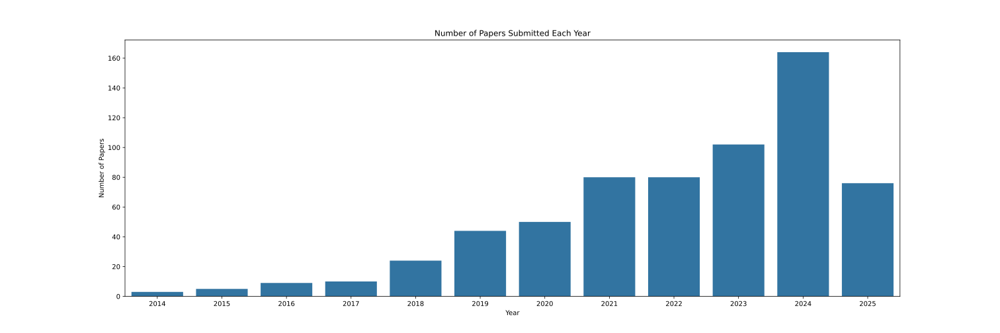
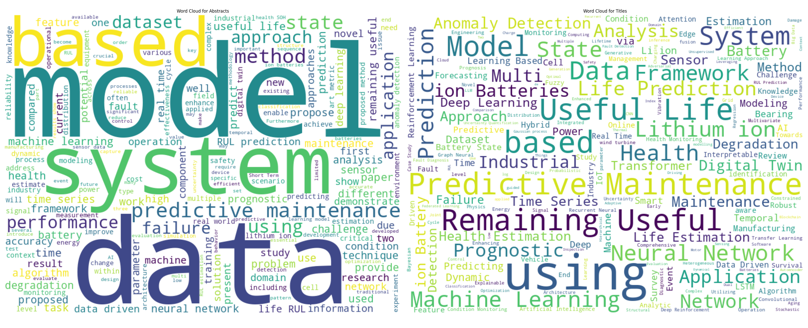

# [Remaining Useful Life Prediction Papers](https://ramtinmoslemi.github.io/RUL-Papers/)
A complete list of papers on **Remaining Useful Life (RUL) Prediction** submitted to arXiv over the past decade.

You can find the papers and their titles, abstracts, authors, links, and dates stored in [this csv file](https://github.com/RamtinMoslemi/RUL-Papers/blob/main/rul_papers.csv).

## Paper Counts by Year
Number of papers submitted to arXiv by year.

## Word Clouds
Word clouds of paper titles and abstracts.

## Notebook
You can play with the notebook:

 

# 2016
## August
### [Resiliency in Distributed Sensor Networks for PHM of the Monitoring Targets](https://arxiv.org/abs/1608.05844)

**Authors:**
Jacques Bahi, Wiem Elghazel, Christophe Guyeux, Mohammed Haddad, Mourad Hakem, Kamal Medjaher, Nourredine Zerhouni

**Abstract:**
In condition-based maintenance, real-time observations are crucial for on-line health assessment. When the monitoring system is a wireless sensor network, data loss becomes highly probable and this affects the quality of the remaining useful life prediction. In this paper, we present a fully distributed algorithm that ensures fault tolerance and recovers data loss in wireless sensor networks. We first theoretically analyze the algorithm and give correctness proofs, then provide simulation results and show that the algorithm is (i) able to ensure data recovery with a low failure rate and (ii) preserves the overall energy for dense networks.
       

### [Multi-Sensor Prognostics using an Unsupervised Health Index based on LSTM Encoder-Decoder](https://arxiv.org/abs/1608.06154)

**Authors:**
Pankaj Malhotra, Vishnu TV, Anusha Ramakrishnan, Gaurangi Anand, Lovekesh Vig, Puneet Agarwal, Gautam Shroff

**Abstract:**
Many approaches for estimation of Remaining Useful Life (RUL) of a machine, using its operational sensor data, make assumptions about how a system degrades or a fault evolves, e.g., exponential degradation. However, in many domains degradation may not follow a pattern. We propose a Long Short Term Memory based Encoder-Decoder (LSTM-ED) scheme to obtain an unsupervised health index (HI) for a system using multi-sensor time-series data. LSTM-ED is trained to reconstruct the time-series corresponding to healthy state of a system. The reconstruction error is used to compute HI which is then used for RUL estimation. We evaluate our approach on publicly available Turbofan Engine and Milling Machine datasets. We also present results on a real-world industry dataset from a pulverizer mill where we find significant correlation between LSTM-ED based HI and maintenance costs.
       

# 2017
## March
### [Gaussian process regression for forecasting battery state of health](https://arxiv.org/abs/1703.05687)

**Authors:**
Robert R. Richardson, Michael A. Osborne, David A. Howey

**Abstract:**
Accurately predicting the future capacity and remaining useful life of batteries is necessary to ensure reliable system operation and to minimise maintenance costs. The complex nature of battery degradation has meant that mechanistic modelling of capacity fade has thus far remained intractable; however, with the advent of cloud-connected devices, data from cells in various applications is becoming increasingly available, and the feasibility of data-driven methods for battery prognostics is increasing. Here we propose Gaussian process (GP) regression for forecasting battery state of health, and highlight various advantages of GPs over other data-driven and mechanistic approaches. GPs are a type of Bayesian non-parametric method, and hence can model complex systems whilst handling uncertainty in a principled manner. Prior information can be exploited by GPs in a variety of ways: explicit mean functions can be used if the functional form of the underlying degradation model is available, and multiple-output GPs can effectively exploit correlations between data from different cells. We demonstrate the predictive capability of GPs for short-term and long-term (remaining useful life) forecasting on a selection of capacity vs. cycle datasets from lithium-ion cells.
       

## June
### [Dependability of Sensor Networks for Industrial Prognostics and Health Management](https://arxiv.org/abs/1706.08129)

**Authors:**
Wiem Elghazel, Jacques M. Bahi, Christophe Guyeux, Mourad Hakem, Kamal Medjaher, Noureddine Zerhouni

**Abstract:**
Maintenance is an important activity in industry. It is performed either to revive a machine/component or to prevent it from breaking down. Different strategies have evolved through time, bringing maintenance to its current state: condition-based and predictive maintenances. This evolution was due to the increasing demand of reliability in industry. The key process of condition-based and predictive maintenances is prognostics and health management, and it is a tool to predict the remaining useful life of engineering assets. Nowadays, plants are required to avoid shutdowns while offering safety and reliability. Nevertheless, planning a maintenance activity requires accurate information about the system/component health state. Such information is usually gathered by means of independent sensor nodes. In this study, we consider the case where the nodes are interconnected and form a wireless sensor network. As far as we know, no research work has considered such a case of study for prognostics. Regarding the importance of data accuracy, a good prognostics requires reliable sources of information. This is why, in this paper, we will first discuss the dependability of wireless sensor networks, and then present a state of the art in prognostic and health management activities.
       

## September
### [Semi-supervised Learning with Deep Generative Models for Asset Failure Prediction](https://arxiv.org/abs/1709.00845)

**Authors:**
Andre S. Yoon, Taehoon Lee, Yongsub Lim, Deokwoo Jung, Philgyun Kang, Dongwon Kim, Keuntae Park, Yongjin Choi

**Abstract:**
This work presents a novel semi-supervised learning approach for data-driven modeling of asset failures when health status is only partially known in historical data. We combine a generative model parameterized by deep neural networks with non-linear embedding technique. It allows us to build prognostic models with the limited amount of health status information for the precise prediction of future asset reliability. The proposed method is evaluated on a publicly available dataset for remaining useful life (RUL) estimation, which shows significant improvement even when a fraction of the data with known health status is as sparse as 1% of the total. Our study suggests that the non-linear embedding based on a deep generative model can efficiently regularize a complex model with deep architectures while achieving high prediction accuracy that is far less sensitive to the availability of health status information.
       

### [Predicting Remaining Useful Life using Time Series Embeddings based on Recurrent Neural Networks](https://arxiv.org/abs/1709.01073)

**Authors:**
Narendhar Gugulothu, Vishnu TV, Pankaj Malhotra, Lovekesh Vig, Puneet Agarwal, Gautam Shroff

**Abstract:**
We consider the problem of estimating the remaining useful life (RUL) of a system or a machine from sensor data. Many approaches for RUL estimation based on sensor data make assumptions about how machines degrade. Additionally, sensor data from machines is noisy and often suffers from missing values in many practical settings. We propose Embed-RUL: a novel approach for RUL estimation from sensor data that does not rely on any degradation-trend assumptions, is robust to noise, and handles missing values. Embed-RUL utilizes a sequence-to-sequence model based on Recurrent Neural Networks (RNNs) to generate embeddings for multivariate time series subsequences. The embeddings for normal and degraded machines tend to be different, and are therefore found to be useful for RUL estimation. We show that the embeddings capture the overall pattern in the time series while filtering out the noise, so that the embeddings of two machines with similar operational behavior are close to each other, even when their sensor readings have significant and varying levels of noise content. We perform experiments on publicly available turbofan engine dataset and a proprietary real-world dataset, and demonstrate that Embed-RUL outperforms the previously reported state-of-the-art on several metrics.
       

# 2018
## February
### [Parsimonious Network based on Fuzzy Inference System (PANFIS) for Time Series Feature Prediction of Low Speed Slew Bearing Prognosis](https://arxiv.org/abs/1802.09332)

**Authors:**
Wahyu Caesarendra, Mahardhika Pratama, Tegoeh Tjahjowidodo, Kiet Tieud, Buyung Kosasih

**Abstract:**
In recent years, the utilization of rotating parts, e.g. bearings and gears, has been continuously supporting the manufacturing line to produce consistent output quality. Due to their critical role, the breakdown of these components might significantly impact the production rate. A proper condition based monitoring (CBM) is among a few ways to maintain and monitor the rotating systems. Prognosis, as one of the major tasks in CBM that predicts and estimates the remaining useful life of the machine, has attracted significant interest in decades. This paper presents a literature review on prognosis approaches from published papers in the last decade. The prognostic approaches are described comprehensively to provide a better idea on how to select an appropriate prognosis method for specific needs. An advanced predictive analytics, namely Parsimonious Network Based on Fuzzy Inference System (PANFIS), was proposed and tested into the low speed slew bearing data. PANFIS differs itself from conventional prognostic approaches in which it supports for online lifelong prognostics without the requirement of retraining or reconfiguration phase. The method is applied to normal-to-failure bearing vibration data collected for 139 days and to predict the time-domain features of vibration slew bearing signals. The performance of the proposed method is compared to some established methods such as ANFIS, eTS, and Simp_eTS. From the results, it is suggested that PANFIS offers outstanding performance compared to those of other methods.
       

## April
### [Anomaly Detection for Industrial Big Data](https://arxiv.org/abs/1804.02998)

**Authors:**
Neil Caithness, David Wallom

**Abstract:**
As the Industrial Internet of Things (IIoT) grows, systems are increasingly being monitored by arrays of sensors returning time-series data at ever-increasing 'volume, velocity and variety' (i.e. Industrial Big Data). An obvious use for these data is real-time systems condition monitoring and prognostic time to failure analysis (remaining useful life, RUL). (e.g. See white papers by Senseye.io, and output of the NASA Prognostics Center of Excellence (PCoE).) However, as noted by Agrawal and Choudhary 'Our ability to collect "big data" has greatly surpassed our capability to analyze it, underscoring the emergence of the fourth paradigm of science, which is data-driven discovery.' In order to fully utilize the potential of Industrial Big Data we need data-driven techniques that operate at scales that process models cannot. Here we present a prototype technique for data-driven anomaly detection to operate at industrial scale. The method generalizes to application with almost any multivariate dataset based on independent ordinations of repeated (bootstrapped) partitions of the dataset and inspection of the joint distribution of ordinal distances.
       

## July
### [Prognostics Estimations with Dynamic States](https://arxiv.org/abs/1807.06093)

**Authors:**
Rong-Jing Bao, Hai-Jun Rong, Zhi-Xin Yang, Badong Chen

**Abstract:**
The health state assessment and remaining useful life (RUL) estimation play very important roles in prognostics and health management (PHM), owing to their abilities to reduce the maintenance and improve the safety of machines or equipment. However, they generally suffer from this problem of lacking prior knowledge to pre-define the exact failure thresholds for a machinery operating in a dynamic environment with a high level of uncertainty. In this case, dynamic thresholds depicted by the discrete states is a very attractive way to estimate the RUL of a dynamic machinery. Currently, there are only very few works considering the dynamic thresholds, and these studies adopted different algorithms to determine the discrete states and predict the continuous states separately, which largely increases the complexity of the learning process. In this paper, we propose a novel prognostics approach for RUL estimation of aero-engines with self-joint prediction of continuous and discrete states, wherein the prediction of continuous and discrete states are conducted simultaneously and dynamically within one learning framework.
       

## October
### [Temporal Convolutional Memory Networks for Remaining Useful Life Estimation of Industrial Machinery](https://arxiv.org/abs/1810.05644)

**Authors:**
Lahiru Jayasinghe, Tharaka Samarasinghe, Chau Yuen, Jenny Chen Ni Low, Shuzhi Sam Ge

**Abstract:**
Accurately estimating the remaining useful life (RUL) of industrial machinery is beneficial in many real-world applications. Estimation techniques have mainly utilized linear models or neural network based approaches with a focus on short term time dependencies. This paper, introduces a system model that incorporates temporal convolutions with both long term and short term time dependencies. The proposed network learns salient features and complex temporal variations in sensor values, and predicts the RUL. A data augmentation method is used for increased accuracy. The proposed method is compared with several state-of-the-art algorithms on publicly available datasets. It demonstrates promising results, with superior results for datasets obtained from complex environments.
       

### [Mechanisms for Integrated Feature Normalization and Remaining Useful Life Estimation Using LSTMs Applied to Hard-Disks](https://arxiv.org/abs/1810.08985)

**Authors:**
Sanchita Basak, Saptarshi Sengupta, Abhishek Dubey

**Abstract:**
With emerging smart communities, improving overall system availability is becoming a major concern. In order to improve the reliability of the components in a system we propose an inference model to predict Remaining Useful Life (RUL) of those components. In this paper we work with components of backend data servers such as hard disks, that are subject to degradation. A Deep Long-Short Term Memory (LSTM) Network is used as the backbone of this fast, data-driven decision framework and dynamically captures the pattern of the incoming data. In the article, we discuss the architecture of the neural network and describe the mechanisms to choose the various hyper-parameters. Further, we describe the challenges faced in extracting effective training sets from highly unorganized and class-imbalanced big data and establish methods for online predictions with extensive data pre-processing, feature extraction and validation through online simulation sets with unknown remaining useful lives of the hard disks. Our algorithm performs especially well in predicting RUL near the critical zone of a device approaching failure. With the proposed approach we are able to predict whether a disk is going to fail in next ten days with an average precision of 0.8435. We also show that the architecture trained on a particular model can be used to predict RUL for devices in different models from same manufacturer through transfer learning.
       

### [Post-prognostics decision in Cyber-Physical Systems](https://arxiv.org/abs/1810.11732)

**Authors:**
Safa Meraghni, Labib Sadek Terrissa, Soheyb Ayad, Noureddine Zerhouni, Christophe Varnier

**Abstract:**
Prognostics and Health Management (PHM) offers several benefits for predictive maintenance. It predicts the future behavior of a system as well as its Remaining Useful Life (RUL). This RUL is used to planned the maintenance operation to avoid the failure, the stop time and optimize the cost of the maintenance and failure. However, with the development of the industry the assets are nowadays distributed this is why the PHM needs to be developed using the new IT. In our work we propose a PHM solution based on Cyber physical system where the physical side is connected to the analyze process of the PHM which are developed in the cloud to be shared and to benefit of the cloud characteristics
       

## December
### [A deep learning-based remaining useful life prediction approach for bearings](https://arxiv.org/abs/1812.03315)

**Authors:**
Cheng Cheng, Guijun Ma, Yong Zhang, Mingyang Sun, Fei Teng, Han Ding, Ye Yuan

**Abstract:**
In industrial applications, nearly half the failures of motors are caused by the degradation of rolling element bearings (REBs). Therefore, accurately estimating the remaining useful life (RUL) for REBs are of crucial importance to ensure the reliability and safety of mechanical systems. To tackle this challenge, model-based approaches are often limited by the complexity of mathematical modeling. Conventional data-driven approaches, on the other hand, require massive efforts to extract the degradation features and construct health index. In this paper, a novel online data-driven framework is proposed to exploit the adoption of deep convolutional neural networks (CNN) in predicting the RUL of bearings. More concretely, the raw vibrations of training bearings are first processed using the Hilbert-Huang transform (HHT) and a novel nonlinear degradation indicator is constructed as the label for learning. The CNN is then employed to identify the hidden pattern between the extracted degradation indicator and the vibration of training bearings, which makes it possible to estimate the degradation of the test bearings automatically. Finally, testing bearings' RULs are predicted by using a $ε$-support vector regression model. The superior performance of the proposed RUL estimation framework, compared with the state-of-the-art approaches, is demonstrated through the experimental results. The generality of the proposed CNN model is also validated by transferring to bearings undergoing different operating conditions.
       

### [Two Birds with One Network: Unifying Failure Event Prediction and Time-to-failure Modeling](https://arxiv.org/abs/1812.07142)

**Authors:**
Karan Aggarwal, Onur Atan, Ahmed Farahat, Chi Zhang, Kosta Ristovski, Chetan Gupta

**Abstract:**
One of the key challenges in predictive maintenance is to predict the impending downtime of an equipment with a reasonable prediction horizon so that countermeasures can be put in place. Classically, this problem has been posed in two different ways which are typically solved independently: (1) Remaining useful life (RUL) estimation as a long-term prediction task to estimate how much time is left in the useful life of the equipment and (2) Failure prediction (FP) as a short-term prediction task to assess the probability of a failure within a pre-specified time window. As these two tasks are related, performing them separately is sub-optimal and might results in inconsistent predictions for the same equipment. In order to alleviate these issues, we propose two methods: Deep Weibull model (DW-RNN) and multi-task learning (MTL-RNN). DW-RNN is able to learn the underlying failure dynamics by fitting Weibull distribution parameters using a deep neural network, learned with a survival likelihood, without training directly on each task. While DW-RNN makes an explicit assumption on the data distribution, MTL-RNN exploits the implicit relationship between the long-term RUL and short-term FP tasks to learn the underlying distribution. Additionally, both our methods can leverage the non-failed equipment data for RUL estimation. We demonstrate that our methods consistently outperform baseline RUL methods that can be used for FP while producing consistent results for RUL and FP. We also show that our methods perform at par with baselines trained on the objectives optimized for either of the two tasks.
       

# 2019
## February
### [Seismic Damage Assessment of Instrumented Wood-frame Buildings: A Case-study of NEESWood Full-scale Shake Table Tests](https://arxiv.org/abs/1902.09955)

**Authors:**
Milad Roohi, Eric M. Hernandez, David Rosowsky

**Abstract:**
The authors propose a methodology to perform seismic damage assessment of instrumented wood-frame buildings using response measurements. The proposed methodology employs a nonlinear model-based state observer that combines sparse acceleration measurements and a nonlinear structural model of a building to estimate the complete seismic response including displacements, velocity, acceleration and internal forces in all structural members. From the estimated seismic response and structural characteristics of each shear wall of the building, element-by-element seismic damage indices are computed and remaining useful life (pertaining to seismic effects) is predicted. The methodology is illustrated using measured data from the 2009 NEESWood Capstone full-scale shake table tests at the E-Defense facility in Japan.
       

## March
### [Data-driven Prognostics with Predictive Uncertainty Estimation using Ensemble of Deep Ordinal Regression Models](https://arxiv.org/abs/1903.09795)

**Authors:**
Vishnu TV, Diksha, Pankaj Malhotra, Lovekesh Vig, Gautam Shroff

**Abstract:**
Prognostics or Remaining Useful Life (RUL) Estimation from multi-sensor time series data is useful to enable condition-based maintenance and ensure high operational availability of equipment. We propose a novel deep learning based approach for Prognostics with Uncertainty Quantification that is useful in scenarios where: (i) access to labeled failure data is scarce due to rarity of failures (ii) future operational conditions are unobserved and (iii) inherent noise is present in the sensor readings. All three scenarios mentioned are unavoidable sources of uncertainty in the RUL estimation process often resulting in unreliable RUL estimates. To address (i), we formulate RUL estimation as an Ordinal Regression (OR) problem, and propose LSTM-OR: deep Long Short Term Memory (LSTM) network based approach to learn the OR function. We show that LSTM-OR naturally allows for incorporation of censored operational instances in training along with the failed instances, leading to more robust learning. To address (ii), we propose a simple yet effective approach to quantify predictive uncertainty in the RUL estimation models by training an ensemble of LSTM-OR models. Through empirical evaluation on C-MAPSS turbofan engine benchmark datasets, we demonstrate that LSTM-OR is significantly better than the commonly used deep metric regression based approaches for RUL estimation, especially when failed training instances are scarce. Further, our uncertainty quantification approach yields high quality predictive uncertainty estimates while also leading to improved RUL estimates compared to single best LSTM-OR models.
       

## April
### [Remaining Useful Life Estimation Using Functional Data Analysis](https://arxiv.org/abs/1904.06442)

**Authors:**
Qiyao Wang, Shuai Zheng, Ahmed Farahat, Susumu Serita, Chetan Gupta

**Abstract:**
Remaining Useful Life (RUL) of an equipment or one of its components is defined as the time left until the equipment or component reaches its end of useful life. Accurate RUL estimation is exceptionally beneficial to Predictive Maintenance, and Prognostics and Health Management (PHM). Data driven approaches which leverage the power of algorithms for RUL estimation using sensor and operational time series data are gaining popularity. Existing algorithms, such as linear regression, Convolutional Neural Network (CNN), Hidden Markov Models (HMMs), and Long Short-Term Memory (LSTM), have their own limitations for the RUL estimation task. In this work, we propose a novel Functional Data Analysis (FDA) method called functional Multilayer Perceptron (functional MLP) for RUL estimation. Functional MLP treats time series data from multiple equipment as a sample of random continuous processes over time. FDA explicitly incorporates both the correlations within the same equipment and the random variations across different equipment's sensor time series into the model. FDA also has the benefit of allowing the relationship between RUL and sensor variables to vary over time. We implement functional MLP on the benchmark NASA C-MAPSS data and evaluate the performance using two popularly-used metrics. Results show the superiority of our algorithm over all the other state-of-the-art methods.
       

## May
### [A Neural Network-Evolutionary Computational Framework for Remaining Useful Life Estimation of Mechanical Systems](https://arxiv.org/abs/1905.05918)

**Authors:**
David Laredo, Zhaoyin Chen, Oliver Schütze, Jian-Qiao Sun

**Abstract:**
This paper presents a framework for estimating the remaining useful life (RUL) of mechanical systems. The framework consists of a multi-layer perceptron and an evolutionary algorithm for optimizing the data-related parameters. The framework makes use of a strided time window to estimate the RUL for mechanical components. Tuning the data-related parameters can become a very time consuming task. The framework presented here automatically reshapes the data such that the efficiency of the model is increased. Furthermore, the complexity of the model is kept low, e.g. neural networks with few hidden layers and few neurons at each layer. Having simple models has several advantages like short training times and the capacity of being in environments with limited computational resources such as embedded systems. The proposed method is evaluated on the publicly available C-MAPSS dataset, its accuracy is compared against other state-of-the art methods for the same dataset.
       

## July
### [Forecasting remaining useful life: Interpretable deep learning approach via variational Bayesian inferences](https://arxiv.org/abs/1907.05146)

**Authors:**
Mathias Kraus, Stefan Feuerriegel

**Abstract:**
Predicting the remaining useful life of machinery, infrastructure, or other equipment can facilitate preemptive maintenance decisions, whereby a failure is prevented through timely repair or replacement. This allows for a better decision support by considering the anticipated time-to-failure and thus promises to reduce costs. Here a common baseline may be derived by fitting a probability density function to past lifetimes and then utilizing the (conditional) expected remaining useful life as a prognostic. This approach finds widespread use in practice because of its high explanatory power. A more accurate alternative is promised by machine learning, where forecasts incorporate deterioration processes and environmental variables through sensor data. However, machine learning largely functions as a black-box method and its forecasts thus forfeit most of the desired interpretability. As our primary contribution, we propose a structured-effect neural network for predicting the remaining useful life which combines the favorable properties of both approaches: its key innovation is that it offers both a high accountability and the flexibility of deep learning. The parameters are estimated via variational Bayesian inferences. The different approaches are compared based on the actual time-to-failure for aircraft engines. This demonstrates the performance and superior interpretability of our method, while we finally discuss implications for decision support.
       

### [Online Subspace Tracking for Damage Propagation Modeling and Predictive Analytics: Big Data Perspective](https://arxiv.org/abs/1907.11477)

**Author:**
Farhan Khan

**Abstract:**
We analyze damage propagation modeling of turbo-engines in a data-driven approach. We investigate subspace tracking assuming a low dimensional manifold structure and a static behavior during the healthy state of the machines. Our damage propagation model is based on the deviation of the data from the static behavior and uses the notion of health index as a measure of the condition. Hence, we incorporate condition-based maintenance and estimate the remaining useful life based on the current and previous health indexes. This paper proposes an algorithm that adapts well to the dynamics of the data and underlying system, and reduces the computational complexity by utilizing the low dimensional manifold structure of the data. A significant performance improvement is demonstrated over existing methods by using the proposed algorithm on CMAPSS Turbo-engine datasets.
       

### [Recurrent Neural Networks with Long Term Temporal Dependencies in Machine Tool Wear Diagnosis and Prognosis](https://arxiv.org/abs/1907.11848)

**Authors:**
Jianlei Zhang, Binil Starly

**Abstract:**
Data-driven approaches to automated machine condition monitoring are gaining popularity due to advancements made in sensing technologies and computing algorithms. This paper proposes the use of a deep learning model, based on Long Short-Term Memory (LSTM) architecture for a recurrent neural network (RNN) which captures long term dependencies for modeling sequential data. In the context of estimating cutting tool wear amounts, this LSTM based RNN approach utilizes a system transition and system observation function based on a minimally intrusive vibration sensor signal located near the workpiece fixtures. By applying an LSTM based RNN, the method helps to avoid building an analytic model for specific tool wear machine degradation, overcoming the assumptions made by Hidden Markov Models, Kalman filter, and Particle filter based approaches. The proposed approach is tested using experiments performed on a milling machine. We have demonstrated one-step and two-step look ahead cutting tool state prediction using online indirect measurements obtained from vibration signals. Additionally, the study also estimates remaining useful life (RUL) of a machine cutting tool insert through generative RNN. The experimental results show that our approach, applying the LSTM to model system observation and transition function is able to outperform the functions modeled with a simple RNN.
       

## September
### [Artificial Neural Networks and Adaptive Neuro-fuzzy Models for Prediction of Remaining Useful Life](https://arxiv.org/abs/1909.02115)

**Authors:**
Razieh Tavakoli, Mohammad Najafi, Ali Sharifara

**Abstract:**
The U.S. water distribution system contains thousands of miles of pipes constructed from different materials, and of various sizes, and age. These pipes suffer from physical, environmental, structural and operational stresses, causing deterioration which eventually leads to their failure. Pipe deterioration results in increased break rates, reduced hydraulic capacity, and detrimental impacts on water quality. Therefore, it is crucial to use accurate models to forecast deterioration rates along with estimating the remaining useful life of the pipes to implement essential interference plans in order to prevent catastrophic failures. This paper discusses a computational model that forecasts the RUL of water pipes by applying Artificial Neural Networks (ANNs) as well as Adaptive Neural Fuzzy Inference System (ANFIS). These models are trained and tested acquired field data to identify the significant parameters that impact the prediction of RUL. It is concluded that, on average, with approximately 10\% of wall thickness loss in existing cast iron, ductile iron, asbestos-cement, and steel water pipes, the reduction of the remaining useful life is approximately 50%
       

### [Transfer learning for Remaining Useful Life Prediction Based on Consensus Self-Organizing Models](https://arxiv.org/abs/1909.07053)

**Authors:**
Yuantao Fan, Sławomir Nowaczyk, Thorsteinn Rögnvaldsson

**Abstract:**
The traditional paradigm for developing machine prognostics usually relies on generalization from data acquired in experiments under controlled conditions prior to deployment of the equipment. Detecting or predicting failures and estimating machine health in this way assumes that future field data will have a very similar distribution to the experiment data. However, many complex machines operate under dynamic environmental conditions and are used in many different ways. This makes collecting comprehensive data very challenging, and the assumption that pre-deployment data and post-deployment data follow very similar distributions is unlikely to hold. Transfer Learning (TL) refers to methods for transferring knowledge learned in one setting (the source domain) to another setting (the target domain). In this work, we present a TL method for predicting Remaining Useful Life (RUL) of equipment, under the assumption that labels are available only for the source domain and not the target domain. This setting corresponds to generalizing from a limited number of run-to-failure experiments performed prior to deployment into making prognostics with data coming from deployed equipment that is being used under multiple new operating conditions and experiencing previously unseen faults. We employ a deviation detection method, Consensus Self-Organizing Models (COSMO), to create transferable features for building the RUL regression model. These features capture how different target equipment is in comparison to its peers. The efficiency of the proposed TL method is demonstrated using the NASA Turbofan Engine Degradation Simulation Data Set. Models using the COSMO transferable features show better performance than other methods on predicting RUL when the target domain is more complex than the source domain.
       

### [A deep adversarial approach based on multi-sensor fusion for remaining useful life prognostics](https://arxiv.org/abs/1909.10246)

**Authors:**
David Verstraete, Enrique Droguett, Mohammad Modarres

**Abstract:**
Multi-sensor systems are proliferating the asset management industry and by proxy, the structural health management community. Asset managers are beginning to require a prognostics and health management system to predict and assess maintenance decisions. These systems handle big machinery data and multi-sensor fusion and integrate remaining useful life prognostic capabilities. We introduce a deep adversarial learning approach to damage prognostics. A non-Markovian variational inference-based model incorporating an adversarial training algorithm framework was developed. The proposed framework was applied to a public multi-sensor data set of turbofan engines to demonstrate its ability to predict remaining useful life. We find that using the deep adversarial based approach results in higher performing remaining useful life predictions.
       

## October
### [False Data Injection Attacks in Internet of Things and Deep Learning enabled Predictive Analytics](https://arxiv.org/abs/1910.01716)

**Authors:**
Gautam Raj Mode, Prasad Calyam, Khaza Anuarul Hoque

**Abstract:**
Industry 4.0 is the latest industrial revolution primarily merging automation with advanced manufacturing to reduce direct human effort and resources. Predictive maintenance (PdM) is an industry 4.0 solution, which facilitates predicting faults in a component or a system powered by state-of-the-art machine learning (ML) algorithms and the Internet-of-Things (IoT) sensors. However, IoT sensors and deep learning (DL) algorithms, both are known for their vulnerabilities to cyber-attacks. In the context of PdM systems, such attacks can have catastrophic consequences as they are hard to detect due to the nature of the attack. To date, the majority of the published literature focuses on the accuracy of DL enabled PdM systems and often ignores the effect of such attacks. In this paper, we demonstrate the effect of IoT sensor attacks on a PdM system. At first, we use three state-of-the-art DL algorithms, specifically, Long Short-Term Memory (LSTM), Gated Recurrent Unit (GRU), and Convolutional Neural Network (CNN) for predicting the Remaining Useful Life (RUL) of a turbofan engine using NASA's C-MAPSS dataset. The obtained results show that the GRU-based PdM model outperforms some of the recent literature on RUL prediction using the C-MAPSS dataset. Afterward, we model two different types of false data injection attacks (FDIA) on turbofan engine sensor data and evaluate their impact on CNN, LSTM, and GRU-based PdM systems. The obtained results demonstrate that FDI attacks on even a few IoT sensors can strongly defect the RUL prediction. However, the GRU-based PdM model performs better in terms of accuracy and resiliency. Lastly, we perform a study on the GRU-based PdM model using four different GRU networks with different sequence lengths. Our experiments reveal an interesting relationship between the accuracy, resiliency and sequence length for the GRU-based PdM models.
       

### [Software Framework for Tribotronic Systems](https://arxiv.org/abs/1910.13764)

**Authors:**
Jarno Kansanaho, Tommi Kärkkäinen

**Abstract:**
Increasing the capabilities of sensors and computer algorithms produces a need for structural support that would solve recurring problems. Autonomous tribotronic systems self-regulate based on feedback acquired from interacting surfaces in relative motion. This paper describes a software framework for tribotronic systems. An example of such an application is a rolling element bearing (REB) installation with a vibration sensor. The presented plug-in framework offers functionalities for vibration data management, feature extraction, fault detection, and remaining useful life (RUL) estimation. The framework was tested using bearing vibration data acquired from NASA's prognostics data repository, and the evaluation included a run-through from feature extraction to fault detection to remaining useful life estimation. The plug-in implementations are easy to update and new implementations are easily deployable, even in run-time. The proposed software framework improves the performance, efficiency, and reliability of a tribotronic system. In addition, the framework facilitates the evaluation of the configuration complexity of the plug-in implementation.
       

## November
### [A Comparative Study between Bayesian and Frequentist Neural Networks for Remaining Useful Life Estimation in Condition-Based Maintenance](https://arxiv.org/abs/1911.06256)

**Author:**
Luca Della Libera

**Abstract:**
In the last decade, deep learning (DL) has outperformed model-based and statistical approaches in predicting the remaining useful life (RUL) of machinery in the context of condition-based maintenance. One of the major drawbacks of DL is that it heavily depends on a large amount of labeled data, which are typically expensive and time-consuming to obtain, especially in industrial applications. Scarce training data lead to uncertain estimates of the model's parameters, which in turn result in poor prognostic performance. Quantifying this parameter uncertainty is important in order to determine how reliable the prediction is. Traditional DL techniques such as neural networks are incapable of capturing the uncertainty in the training data, thus they are overconfident about their estimates. On the contrary, Bayesian deep learning has recently emerged as a promising solution to account for uncertainty in the training process, achieving state-of-the-art performance in many classification and regression tasks. In this work Bayesian DL techniques such as Bayesian dense neural networks and Bayesian convolutional neural networks are applied to RUL estimation and compared to their frequentist counterparts from the literature. The effectiveness of the proposed models is verified on the popular C-MAPSS dataset. Furthermore, parameter uncertainty is quantified and used to gain additional insight into the data.
       

## December
### [An Attribute Oriented Induction based Methodology for Data Driven Predictive Maintenance](https://arxiv.org/abs/1912.00662)

**Authors:**
Javier Fernandez-Anakabe, Ekhi Zugasti Uriguen, Urko Zurutuza Ortega

**Abstract:**
Attribute Oriented Induction (AOI) is a data mining algorithm used for extracting knowledge of relational data, taking into account expert knowledge. It is a clustering algorithm that works by transforming the values of the attributes and converting an instance into others that are more generic or ambiguous. In this way, it seeks similarities between elements to generate data groupings. AOI was initially conceived as an algorithm for knowledge discovery in databases, but over the years it has been applied to other areas such as spatial patterns, intrusion detection or strategy making. In this paper, AOI has been extended to the field of Predictive Maintenance. The objective is to demonstrate that combining expert knowledge and data collected from the machine can provide good results in the Predictive Maintenance of industrial assets. To this end we adapted the algorithm and used an LSTM approach to perform both the Anomaly Detection (AD) and the Remaining Useful Life (RUL). The results obtained confirm the validity of the proposal, as the methodology was able to detect anomalies, and calculate the RUL until breakage with considerable degree of accuracy.
       

### [Survey of prognostics methods for condition-based maintenance in engineering systems](https://arxiv.org/abs/1912.02708)

**Authors:**
Ehsan Taheri, Ilya Kolmanovsky, Oleg Gusikhin

**Abstract:**
It is not surprising that the idea of efficient maintenance algorithms (originally motivated by strict emission regulations, and now driven by safety issues, logistics and customer satisfaction) has culminated in the so-called condition-based maintenance program. Condition-based program/monitoring consists of two major tasks, i.e., \textit{diagnostics} and \textit{prognostics} each of which has provided the impetus and technical challenges to the scientists and engineers in various fields of engineering. Prognostics deals with the prediction of the remaining useful life, future condition, or probability of reliable operation of an equipment based on the acquired condition monitoring data. This approach to modern maintenance practice promises to reduce the downtime, spares inventory, maintenance costs, and safety hazards. Given the significance of prognostics capabilities and the maturity of condition monitoring technology, there have been an increasing number of publications on machinery prognostics in the past few years. These publications cover a wide range of issues important to prognostics. Fortunately, improvement in computational resources technology has come to the aid of engineers by presenting more powerful onboard computational resources to make some aspects of these new problems tractable. In addition, it is possible to even leverage connected vehicle information through cloud-computing. Our goal is to review the state of the art and to summarize some of the recent advances in prognostics with the emphasis on models, algorithms and technologies used for data processing and decision making.
       

# 2020
## February
### [Health Assessment and Prognostics Based on Higher Order Hidden Semi-Markov Models](https://arxiv.org/abs/2002.05272)

**Authors:**
Ying Liao, Yisha Xiang, Min Wang

**Abstract:**
This paper presents a new and flexible prognostics framework based on a higher order hidden semi-Markov model (HOHSMM) for systems or components with unobservable health states and complex transition dynamics. The HOHSMM extends the basic hidden Markov model (HMM) by allowing the hidden state to depend on its more distant history and assuming generally distributed state duration. An effective Gibbs sampling algorithm is designed for statistical inference of an HOHSMM. The performance of the proposed HOHSMM sampler is evaluated by conducting a simulation experiment. We further design a decoding algorithm to estimate the hidden health states using the learned model. Remaining useful life (RUL) is predicted using a simulation approach given the decoded hidden states. The practical utility of the proposed prognostics framework is demonstrated by a case study on NASA turbofan engines. The results show that the HOHSMM-based prognostics framework provides good hidden health state assessment and RUL estimation for complex systems.
       

## April
### [Thermal Accelerated Aging Methods for Magnet Wire: A Review](https://arxiv.org/abs/2004.09187)

**Authors:**
Lukas L. Korcak, Darren F. Kavanagh

**Abstract:**
This paper focuses on accelerated aging methods for magnet wire. Reliability of electrical devices such as coils, motors, relays, solenoids and transformers is heavily dependent on the Electrical Insulation System (EIS). Accelerated aging methods are used to rapidly simulate the conditions in real life, which is typically years (20,000 hours) depending on the operating conditions. The purpose of accelerated aging is to bring lifetime of an EIS to hours, days or weeks. Shortening the lifetime of an EIS to such an extent, allows for the study of the insulation materials behavior as well as investigate ways to estimate the remaining useful life (RUL) for the purpose of predictive maintenance. Unexpected failures in operation processes, where redundancy is not present, can lead to high economical losses, machine downtime and often health and safety risks. Conditions, under which thermal aging methods are generally reported in the literature, typically neglect other factors, owing to the sheer complexity and interdependence of the multifaceted aging phenomena. This paper examines some existing thermal aging tests, which are currently used to obtain data for enamel degradation in order to try to better understand of how the thermal stresses degrade the EIS. Separation of these stresses, which the EIS operate under, can yield a better understanding of how each of the Thermal, the Electrical, the Ambient and the Mechanical (TEAM) stresses behave.
       

### [Neural Network and Particle Filtering: A Hybrid Framework for Crack Propagation Prediction](https://arxiv.org/abs/2004.13556)

**Authors:**
Seyed Fouad Karimian, Ramin Moradi, Sergio Cofre-Martel, Katrina M. Groth, Mohammad Modarres

**Abstract:**
Crack detection, length estimation, and Remaining Useful Life (RUL) prediction are among the most studied topics in reliability engineering. Several research efforts have studied physics of failure (PoF) of different materials, along with data-driven approaches as an alternative to the traditional PoF studies. To bridge the gap between these two techniques, we propose a novel hybrid framework for fatigue crack length estimation and prediction. Physics-based modeling is performed on the fracture mechanics degradation data by estimating parameters of the Paris Law, including the associated uncertainties. Crack length estimations are inferred by feeding manually extracted features from ultrasonic signals to a Neural Network (NN). The crack length prediction is then performed using the Particle Filter (PF) approach, which takes the Paris Law as a move function and uses the NN's output as observation to update the crack growth path. This hybrid framework combines machine learning, physics-based modeling, and Bayesian updating with promising results.
       

## June
### [Health Indicator Forecasting for Improving Remaining Useful Life Estimation](https://arxiv.org/abs/2006.03729)

**Authors:**
Qiyao Wang, Ahmed Farahat, Chetan Gupta, Haiyan Wang

**Abstract:**
Prognostics is concerned with predicting the future health of the equipment and any potential failures. With the advances in the Internet of Things (IoT), data-driven approaches for prognostics that leverage the power of machine learning models are gaining popularity. One of the most important categories of data-driven approaches relies on a predefined or learned health indicator to characterize the equipment condition up to the present time and make inference on how it is likely to evolve in the future. In these approaches, health indicator forecasting that constructs the health indicator curve over the lifespan using partially observed measurements (i.e., health indicator values within an initial period) plays a key role. Existing health indicator forecasting algorithms, such as the functional Empirical Bayesian approach, the regression-based formulation, a naive scenario matching based on the nearest neighbor, have certain limitations. In this paper, we propose a new `generative + scenario matching' algorithm for health indicator forecasting. The key idea behind the proposed approach is to first non-parametrically fit the underlying health indicator curve with a continuous Gaussian Process using a sample of run-to-failure health indicator curves. The proposed approach then generates a rich set of random curves from the learned distribution, attempting to obtain all possible variations of the target health condition evolution process over the system's lifespan. The health indicator extrapolation for a piece of functioning equipment is inferred as the generated curve that has the highest matching level within the observed period. Our experimental results show the superiority of our algorithm over the other state-of-the-art methods.
       

### [Uncovering the Underlying Physics of Degrading System Behavior Through a Deep Neural Network Framework: The Case of Remaining Useful Life Prognosis](https://arxiv.org/abs/2006.09288)

**Authors:**
Sergio Cofre-Martel, Enrique Lopez Droguett, Mohammad Modarres

**Abstract:**
Deep learning (DL) has become an essential tool in prognosis and health management (PHM), commonly used as a regression algorithm for the prognosis of a system's behavior. One particular metric of interest is the remaining useful life (RUL) estimated using monitoring sensor data. Most of these deep learning applications treat the algorithms as black-box functions, giving little to no control of the data interpretation. This becomes an issue if the models break the governing laws of physics or other natural sciences when no constraints are imposed. The latest research efforts have focused on applying complex DL models to achieve a low prediction error rather than studying how the models interpret the behavior of the data and the system itself. In this paper, we propose an open-box approach using a deep neural network framework to explore the physics of degradation through partial differential equations (PDEs). The framework has three stages, and it aims to discover a latent variable and corresponding PDE to represent the health state of the system. Models are trained as a supervised regression and designed to output the RUL as well as a latent variable map that can be used and interpreted as the system's health indicator.
       

### [Graph Neural Networks for Leveraging Industrial Equipment Structure: An application to Remaining Useful Life Estimation](https://arxiv.org/abs/2006.16556)

**Authors:**
Jyoti Narwariya, Pankaj Malhotra, Vishnu TV, Lovekesh Vig, Gautam Shroff

**Abstract:**
Automated equipment health monitoring from streaming multisensor time-series data can be used to enable condition-based maintenance, avoid sudden catastrophic failures, and ensure high operational availability. We note that most complex machinery has a well-documented and readily accessible underlying structure capturing the inter-dependencies between sub-systems or modules. Deep learning models such as those based on recurrent neural networks (RNNs) or convolutional neural networks (CNNs) fail to explicitly leverage this potentially rich source of domain-knowledge into the learning procedure. In this work, we propose to capture the structure of a complex equipment in the form of a graph, and use graph neural networks (GNNs) to model multi-sensor time-series data. Using remaining useful life estimation as an application task, we evaluate the advantage of incorporating the graph structure via GNNs on the publicly available turbofan engine benchmark dataset. We observe that the proposed GNN-based RUL estimation model compares favorably to several strong baselines from literature such as those based on RNNs and CNNs. Additionally, we observe that the learned network is able to focus on the module (node) with impending failure through a simple attention mechanism, potentially paving the way for actionable diagnosis.
       

## July
### [Attention Sequence to Sequence Model for Machine Remaining Useful Life Prediction](https://arxiv.org/abs/2007.09868)

**Authors:**
Mohamed Ragab, Zhenghua Chen, Min Wu, Chee-Keong Kwoh, Ruqiang Yan, Xiaoli Li

**Abstract:**
Accurate estimation of remaining useful life (RUL) of industrial equipment can enable advanced maintenance schedules, increase equipment availability and reduce operational costs. However, existing deep learning methods for RUL prediction are not completely successful due to the following two reasons. First, relying on a single objective function to estimate the RUL will limit the learned representations and thus affect the prediction accuracy. Second, while longer sequences are more informative for modelling the sensor dynamics of equipment, existing methods are less effective to deal with very long sequences, as they mainly focus on the latest information. To address these two problems, we develop a novel attention-based sequence to sequence with auxiliary task (ATS2S) model. In particular, our model jointly optimizes both reconstruction loss to empower our model with predictive capabilities (by predicting next input sequence given current input sequence) and RUL prediction loss to minimize the difference between the predicted RUL and actual RUL. Furthermore, to better handle longer sequence, we employ the attention mechanism to focus on all the important input information during training process. Finally, we propose a new dual-latent feature representation to integrate the encoder features and decoder hidden states, to capture rich semantic information in data. We conduct extensive experiments on four real datasets to evaluate the efficacy of the proposed method. Experimental results show that our proposed method can achieve superior performance over 13 state-of-the-art methods consistently.
       

## August
### [Automatic Remaining Useful Life Estimation Framework with Embedded Convolutional LSTM as the Backbone](https://arxiv.org/abs/2008.03961)

**Authors:**
Yexu Zhou, Yuting Gao, Yiran Huang, Michael Hefenbrock, Till Riedel, Michael Beigl

**Abstract:**
An essential task in predictive maintenance is the prediction of the Remaining Useful Life (RUL) through the analysis of multivariate time series. Using the sliding window method, Convolutional Neural Network (CNN) and conventional Recurrent Neural Network (RNN) approaches have produced impressive results on this matter, due to their ability to learn optimized features. However, sequence information is only partially modeled by CNN approaches. Due to the flatten mechanism in conventional RNNs, like Long Short Term Memories (LSTM), the temporal information within the window is not fully preserved. To exploit the multi-level temporal information, many approaches are proposed which combine CNN and RNN models. In this work, we propose a new LSTM variant called embedded convolutional LSTM (ECLSTM). In ECLSTM a group of different 1D convolutions is embedded into the LSTM structure. Through this, the temporal information is preserved between and within windows. Since the hyper-parameters of models require careful tuning, we also propose an automated prediction framework based on the Bayesian optimization with hyperband optimizer, which allows for efficient optimization of the network architecture. Finally, we show the superiority of our proposed ECLSTM approach over the state-of-the-art approaches on several widely used benchmark data sets for RUL Estimation.
       

### [Trust-Based Cloud Machine Learning Model Selection For Industrial IoT and Smart City Services](https://arxiv.org/abs/2008.05042)

**Authors:**
Basheer Qolomany, Ihab Mohammed, Ala Al-Fuqaha, Mohsen Guizan, Junaid Qadir

**Abstract:**
With Machine Learning (ML) services now used in a number of mission-critical human-facing domains, ensuring the integrity and trustworthiness of ML models becomes all-important. In this work, we consider the paradigm where cloud service providers collect big data from resource-constrained devices for building ML-based prediction models that are then sent back to be run locally on the intermittently-connected resource-constrained devices. Our proposed solution comprises an intelligent polynomial-time heuristic that maximizes the level of trust of ML models by selecting and switching between a subset of the ML models from a superset of models in order to maximize the trustworthiness while respecting the given reconfiguration budget/rate and reducing the cloud communication overhead. We evaluate the performance of our proposed heuristic using two case studies. First, we consider Industrial IoT (IIoT) services, and as a proxy for this setting, we use the turbofan engine degradation simulation dataset to predict the remaining useful life of an engine. Our results in this setting show that the trust level of the selected models is 0.49% to 3.17% less compared to the results obtained using Integer Linear Programming (ILP). Second, we consider Smart Cities services, and as a proxy of this setting, we use an experimental transportation dataset to predict the number of cars. Our results show that the selected model's trust level is 0.7% to 2.53% less compared to the results obtained using ILP. We also show that our proposed heuristic achieves an optimal competitive ratio in a polynomial-time approximation scheme for the problem.
       

## September
### [Crafting Adversarial Examples for Deep Learning Based Prognostics (Extended Version)](https://arxiv.org/abs/2009.10149)

**Authors:**
Gautam Raj Mode, Khaza Anuarul Hoque

**Abstract:**
In manufacturing, unexpected failures are considered a primary operational risk, as they can hinder productivity and can incur huge losses. State-of-the-art Prognostics and Health Management (PHM) systems incorporate Deep Learning (DL) algorithms and Internet of Things (IoT) devices to ascertain the health status of equipment, and thus reduce the downtime, maintenance cost and increase the productivity. Unfortunately, IoT sensors and DL algorithms, both are vulnerable to cyber attacks, and hence pose a significant threat to PHM systems. In this paper, we adopt the adversarial example crafting techniques from the computer vision domain and apply them to the PHM domain. Specifically, we craft adversarial examples using the Fast Gradient Sign Method (FGSM) and Basic Iterative Method (BIM) and apply them on the Long Short-Term Memory (LSTM), Gated Recurrent Unit (GRU), and Convolutional Neural Network (CNN) based PHM models. We evaluate the impact of adversarial attacks using NASA's turbofan engine dataset. The obtained results show that all the evaluated PHM models are vulnerable to adversarial attacks and can cause a serious defect in the remaining useful life estimation. The obtained results also show that the crafted adversarial examples are highly transferable and may cause significant damages to PHM systems.
       

### [Computational framework for real-time diagnostics and prognostics of aircraft actuation systems](https://arxiv.org/abs/2009.14645)

**Authors:**
Pier Carlo Berri, Matteo D. L. Dalla Vedova, Laura Mainini

**Abstract:**
Prognostics and Health Management (PHM) are emerging approaches to product life cycle that will maintain system safety and improve reliability, while reducing operating and maintenance costs. This is particularly relevant for aerospace systems, where high levels of integrity and high performances are required at the same time. We propose a novel strategy for the nearly real-time Fault Detection and Identification (FDI) of a dynamical assembly, and for the estimation of Remaining Useful Life (RUL) of the system. The availability of a timely estimate of the health status of the system will allow for an informed adaptive planning of maintenance and a dynamical reconfiguration of the mission profile, reducing operating costs and improving reliability. This work addresses the three phases of the prognostic flow - namely (1) signal acquisition, (2) Fault Detection and Identification, and (3) Remaining Useful Life estimation - and introduces a computationally efficient procedure suitable for real-time, on-board execution. To achieve this goal, we propose to combine information from physical models of different fidelity with machine learning techniques to obtain efficient representations (surrogate models) suitable for nearly real-time applications. Additionally, we propose an importance sampling strategy and a novel approach to model damage propagation for dynamical systems. The methodology is assessed for the FDI and RUL estimation of an aircraft electromechanical actuator (EMA) for secondary flight controls. The results show that the proposed method allows for a high precision in the evaluation of the system RUL, while outperforming common model-based techniques in terms of computational time.
       

## October
### [Deep learning models for predictive maintenance: a survey, comparison, challenges and prospect](https://arxiv.org/abs/2010.03207)

**Authors:**
Oscar Serradilla, Ekhi Zugasti, Urko Zurutuza

**Abstract:**
Given the growing amount of industrial data spaces worldwide, deep learning solutions have become popular for predictive maintenance, which monitor assets to optimise maintenance tasks. Choosing the most suitable architecture for each use-case is complex given the number of examples found in literature. This work aims at facilitating this task by reviewing state-of-the-art deep learning architectures, and how they integrate with predictive maintenance stages to meet industrial companies' requirements (i.e. anomaly detection, root cause analysis, remaining useful life estimation). They are categorised and compared in industrial applications, explaining how to fill their gaps. Finally, open challenges and future research paths are presented.
       

### [A Reinforcement Learning Approach to Health Aware Control Strategy](https://arxiv.org/abs/2010.09269)

**Authors:**
Mayank Shekhar Jha, Philippe Weber, Didier Theilliol, Jean-Christophe Ponsart, Didier Maquin

**Abstract:**
Health-aware control (HAC) has emerged as one of the domains where control synthesis is sought based upon the failure prognostics of system/component or the Remaining Useful Life (RUL) predictions of critical components. The fact that mathematical dynamic (transition) models of RUL are rarely available, makes it difficult for RUL information to be incorporated into the control paradigm. A novel framework for health aware control is presented in this paper where reinforcement learning based approach is used to learn an optimal control policy in face of component degradation by integrating global system transition data (generated by an analytical model that mimics the real system) and RUL predictions. The RUL predictions generated at each step, is tracked to a desired value of RUL. The latter is integrated within a cost function which is maximized to learn the optimal control. The proposed method is studied using simulation of a DC motor and shaft wear.
       

## November
### [Remaining Useful Life Estimation Under Uncertainty with Causal GraphNets](https://arxiv.org/abs/2011.11740)

**Authors:**
Charilaos Mylonas, Eleni Chatzi

**Abstract:**
In this work, a novel approach for the construction and training of time series models is presented that deals with the problem of learning on large time series with non-equispaced observations, which at the same time may possess features of interest that span multiple scales. The proposed method is appropriate for constructing predictive models for non-stationary stochastic time series.The efficacy of the method is demonstrated on a simulated stochastic degradation dataset and on a real-world accelerated life testing dataset for ball-bearings. The proposed method, which is based on GraphNets, implicitly learns a model that describes the evolution of the system at the level of a state-vector rather than of a raw observation. The proposed approach is compared to a recurrent network with a temporal convolutional feature extractor head (RNN-tCNN) which forms a known viable alternative for the problem context considered. Finally, by taking advantage of recent advances in the computation of reparametrization gradients for learning probability distributions, a simple yet effective technique for representing prediction uncertainty as a Gamma distribution over remaining useful life predictions is employed.
       

### [A Framework for Health-informed RUL-constrained Optimal Power Flow with Li-ion Batteries](https://arxiv.org/abs/2011.14318)

**Authors:**
Jiahang Xie, Yu Weng, Hung D. Nguyen

**Abstract:**
Battery energy storage systems are widely adopted in grid-connected applications to mitigate the impact of intermittent renewable generations and enhance power system resiliency. Degradation of the battery during its service time is one of the major concerns in the deployment that strongly affects the long-term lifetime. Apart from environmental factors, this intrinsic property of a battery depends on the daily operating conditions. Thus, optimally engaging the daily operation of the battery based on its current status in order to meet the required remaining useful life becomes a practical and demanding need. To address this issue, this paper proposes a health-informed RUL-constrained optimal power flow framework to characterize the corresponding optimal feasible operation space. The targeted service lifespan is achieved if the battery's working condition is confined within this feasible domain. Equivalent box constraints are then constructed for better computational efficiency in solving the optimization problem. In this framework, a Monte Carlo-based data-driven approach and a health indicator (HI) representing the battery's current states are introduced. The performance of the proposed method is illustrated with the IEEE 39-bus system.
       

## December
### [Fuzzy model identification based on mixture distribution analysis for bearings remaining useful life estimation using small training data set](https://arxiv.org/abs/2012.04589)

**Authors:**
Fei Huang, Alexandre Sava, Kondo H. Adjallah, Wang Zhouhang

**Abstract:**
The research work presented in this paper proposes a data-driven modeling method for bearings remaining useful life estimation based on Takagi-Sugeno (T-S) fuzzy inference system (FIS). This method allows identifying the parameters of a classic T-S FIS, starting with a small quantity of data. In this work, we used the vibration signals data from a small number of bearings over an entire period of run-to-failure. The FIS model inputs are features extracted from the vibration signals data observed periodically on the training bearings. The number of rules and the input parameters of each rule of the FIS model are identified using the subtractive clustering method. Furthermore, we propose to use the maximum likelihood method of mixture distribution analysis to calculate the parameters of clusters on the time axis and the probability corresponding to rules on degradation stages. Based on this result, we identified the output parameters of each rule using a weighted least square estimation. We then benchmarked the proposed method with some existing methods from the literature, through numerical experiments conducted on available datasets to highlight its effectiveness.
       

# 2021
## January
### [Joint Prediction of Remaining Useful Life and Failure Type of Train Wheelsets: A Multi-task Learning Approach](https://arxiv.org/abs/2101.03497)

**Author:**
Weixin Wang

**Abstract:**
The failures of train wheels account for disruptions of train operations and even a large portion of train derailments. Remaining useful life (RUL) of a wheelset measures the how soon the next failure will arrive, and the failure type reveals how severe the failure will be. RUL prediction is a regression task, whereas failure type is a classification task. In this paper, we propose a multi-task learning approach to jointly accomplish these two tasks by using a common input space to achieve more desirable results. We develop a convex optimization formulation to integrate both least square loss and the negative maximum likelihood of logistic regression, and model the joint sparsity as the L2/L1 norm of the model parameters to couple feature selection across tasks. The experiment results show that our method outperforms the single task learning method by 3% in prediction accuracy.
       

### [Time-Series Regeneration with Convolutional Recurrent Generative Adversarial Network for Remaining Useful Life Estimation](https://arxiv.org/abs/2101.03678)

**Authors:**
Xuewen Zhang, Yan Qin, Chau Yuen, Lahiru Jayasinghe, Xiang Liu

**Abstract:**
For health prognostic task, ever-increasing efforts have been focused on machine learning-based methods, which are capable of yielding accurate remaining useful life (RUL) estimation for industrial equipment or components without exploring the degradation mechanism. A prerequisite ensuring the success of these methods depends on a wealth of run-to-failure data, however, run-to-failure data may be insufficient in practice. That is, conducting a substantial amount of destructive experiments not only is high costs, but also may cause catastrophic consequences. Out of this consideration, an enhanced RUL framework focusing on data self-generation is put forward for both non-cyclic and cyclic degradation patterns for the first time. It is designed to enrich data from a data-driven way, generating realistic-like time-series to enhance current RUL methods. First, high-quality data generation is ensured through the proposed convolutional recurrent generative adversarial network (CR-GAN), which adopts a two-channel fusion convolutional recurrent neural network. Next, a hierarchical framework is proposed to combine generated data into current RUL estimation methods. Finally, the efficacy of the proposed method is verified through both non-cyclic and cyclic degradation systems. With the enhanced RUL framework, an aero-engine system following non-cyclic degradation has been tested using three typical RUL models. State-of-art RUL estimation results are achieved by enhancing capsule network with generated time-series. Specifically, estimation errors evaluated by the index score function have been reduced by 21.77%, and 32.67% for the two employed operating conditions, respectively. Besides, the estimation error is reduced to zero for the Lithium-ion battery system, which presents cyclic degradation.
       

## February
### [Genetically Optimized Prediction of Remaining Useful Life](https://arxiv.org/abs/2102.08845)

**Authors:**
Shaashwat Agrawal, Sagnik Sarkar, Gautam Srivastava, Praveen Kumar Reddy Maddikunta, Thippa Reddy Gadekallu

**Abstract:**
The application of remaining useful life (RUL) prediction has taken great importance in terms of energy optimization, cost-effectiveness, and risk mitigation. The existing RUL prediction algorithms mostly constitute deep learning frameworks. In this paper, we implement LSTM and GRU models and compare the obtained results with a proposed genetically trained neural network. The current models solely depend on Adam and SGD for optimization and learning. Although the models have worked well with these optimizers, even little uncertainties in prognostics prediction can result in huge losses. We hope to improve the consistency of the predictions by adding another layer of optimization using Genetic Algorithms. The hyper-parameters - learning rate and batch size are optimized beyond manual capacity. These models and the proposed architecture are tested on the NASA Turbofan Jet Engine dataset. The optimized architecture can predict the given hyper-parameters autonomously and provide superior results.
       

### [Evolving Fuzzy System Applied to Battery Charge Capacity Prediction for Fault Prognostics](https://arxiv.org/abs/2102.09521)

**Authors:**
Murilo Osorio Camargos, Iury Bessa, Luiz A. Q. Cordovil Junior, Pedro Henrique Silva Coutinho, Daniel Furtado Leite, Reinaldo Martinez Palhares

**Abstract:**
This paper addresses the use of data-driven evolving techniques applied to fault prognostics. In such problems, accurate predictions of multiple steps ahead are essential for the Remaining Useful Life (RUL) estimation of a given asset. The fault prognostics' solutions must be able to model the typical nonlinear behavior of the degradation processes of these assets, and be adaptable to each unit's particularities. In this context, the Evolving Fuzzy Systems (EFSs) are models capable of representing such behaviors, in addition of being able to deal with non-stationary behavior, also present in these problems. Moreover, a methodology to recursively track the model's estimation error is presented as a way to quantify uncertainties that are propagated in the long-term predictions. The well-established NASA's Li-ion batteries data set is used to evaluate the models. The experiments indicate that generic EFSs can take advantage of both historical and stream data to estimate the RUL and its uncertainty.
       

## March
### [Adaptive Degradation Process with Deep Learning-Driven Trajectory](https://arxiv.org/abs/2103.11598)

**Author:**
Li Yang

**Abstract:**
Remaining useful life (RUL) estimation is a crucial component in the implementation of intelligent predictive maintenance and health management. Deep neural network (DNN) approaches have been proven effective in RUL estimation due to their capacity in handling high-dimensional non-linear degradation features. However, the applications of DNN in practice face two challenges: (a) online update of lifetime information is often unavailable, and (b) uncertainties in predicted values may not be analytically quantified. This paper addresses these issues by developing a hybrid DNN-based prognostic approach, where a Wiener-based-degradation model is enhanced with adaptive drift to characterize the system degradation. An LSTM-CNN encoder-decoder is developed to predict future degradation trajectories by jointly learning noise coefficients as well as drift coefficients, and adaptive drift is updated via Bayesian inference. A computationally efficient algorithm is proposed for the calculation of RUL distributions. Numerical experiments are presented using turbofan engines degradation data to demonstrate the superior accuracy of RUL prediction of our proposed approach.
       

## April
### [Uncertainty-aware Remaining Useful Life predictor](https://arxiv.org/abs/2104.03613)

**Authors:**
Luca Biggio, Alexander Wieland, Manuel Arias Chao, Iason Kastanis, Olga Fink

**Abstract:**
Remaining Useful Life (RUL) estimation is the problem of inferring how long a certain industrial asset can be expected to operate within its defined specifications. Deploying successful RUL prediction methods in real-life applications is a prerequisite for the design of intelligent maintenance strategies with the potential of drastically reducing maintenance costs and machine downtimes. In light of their superior performance in a wide range of engineering fields, Machine Learning (ML) algorithms are natural candidates to tackle the challenges involved in the design of intelligent maintenance systems. In particular, given the potentially catastrophic consequences or substantial costs associated with maintenance decisions that are either too late or too early, it is desirable that ML algorithms provide uncertainty estimates alongside their predictions. However, standard data-driven methods used for uncertainty estimation in RUL problems do not scale well to large datasets or are not sufficiently expressive to model the high-dimensional mapping from raw sensor data to RUL estimates. In this work, we consider Deep Gaussian Processes (DGPs) as possible solutions to the aforementioned limitations. We perform a thorough evaluation and comparison of several variants of DGPs applied to RUL predictions. The performance of the algorithms is evaluated on the N-CMAPSS (New Commercial Modular Aero-Propulsion System Simulation) dataset from NASA for aircraft engines. The results show that the proposed methods are able to provide very accurate RUL predictions along with sensible uncertainty estimates, providing more reliable solutions for (safety-critical) real-life industrial applications.
       

### [Learning representations with end-to-end models for improved remaining useful life prognostics](https://arxiv.org/abs/2104.05049)

**Authors:**
Alaaeddine Chaoub, Alexandre Voisin, Christophe Cerisara, Benoît Iung

**Abstract:**
The remaining Useful Life (RUL) of equipment is defined as the duration between the current time and its failure. An accurate and reliable prognostic of the remaining useful life provides decision-makers with valuable information to adopt an appropriate maintenance strategy to maximize equipment utilization and avoid costly breakdowns. In this work, we propose an end-to-end deep learning model based on multi-layer perceptron and long short-term memory layers (LSTM) to predict the RUL. After normalization of all data, inputs are fed directly to an MLP layers for feature learning, then to an LSTM layer to capture temporal dependencies, and finally to other MLP layers for RUL prognostic. The proposed architecture is tested on the NASA commercial modular aero-propulsion system simulation (C-MAPSS) dataset. Despite its simplicity with respect to other recently proposed models, the model developed outperforms them with a significant decrease in the competition score and in the root mean square error score between the predicted and the gold value of the RUL. In this paper, we will discuss how the proposed end-to-end model is able to achieve such good results and compare it to other deep learning and state-of-the-art methods.
       

## May
### [Autoregressive Hidden Markov Models with partial knowledge on latent space applied to aero-engines prognostics](https://arxiv.org/abs/2105.00211)

**Authors:**
Pablo Juesas, Emmanuel Ramasso, Sébastien Drujont, Vincent Placet

**Abstract:**
[This paper was initially published in PHME conference in 2016, selected for further publication in International Journal of Prognostics and Health Management.]
  This paper describes an Autoregressive Partially-hidden Markov model (ARPHMM) for fault detection and prognostics of equipments based on sensors' data. It is a particular dynamic Bayesian network that allows to represent the dynamics of a system by means of a Hidden Markov Model (HMM) and an autoregressive (AR) process. The Markov chain assumes that the system is switching back and forth between internal states while the AR process ensures a temporal coherence on sensor measurements. A sound learning procedure of standard ARHMM based on maximum likelihood allows to iteratively estimate all parameters simultaneously. This paper suggests a modification of the learning procedure considering that one may have prior knowledge about the structure which becomes partially hidden. The integration of the prior is based on the Theory of Weighted Distributions which is compatible with the Expectation-Maximization algorithm in the sense that the convergence properties are still satisfied. We show how to apply this model to estimate the remaining useful life based on health indicators. The autoregressive parameters can indeed be used for prediction while the latent structure can be used to get information about the degradation level. The interest of the proposed method for prognostics and health assessment is demonstrated on CMAPSS datasets.
       

## June
### [Short-term Maintenance Planning of Autonomous Trucks for Minimizing Economic Risk](https://arxiv.org/abs/2106.01871)

**Authors:**
Xin Tao, Jonas Mårtensson, Håkan Warnquist, Anna Pernestål

**Abstract:**
New autonomous driving technologies are emerging every day and some of them have been commercially applied in the real world. While benefiting from these technologies, autonomous trucks are facing new challenges in short-term maintenance planning, which directly influences the truck operator's profit. In this paper, we implement a vehicle health management system by addressing the maintenance planning issues of autonomous trucks on a transport mission. We also present a maintenance planning model using a risk-based decision-making method, which identifies the maintenance decision with minimal economic risk of the truck company. Both availability losses and maintenance costs are considered when evaluating the economic risk. We demonstrate the proposed model by numerical experiments illustrating real-world scenarios. In the experiments, compared to three baseline methods, the expected economic risk of the proposed method is reduced by up to $47\%$. We also conduct sensitivity analyses of different model parameters. The analyses show that the economic risk significantly decreases when the estimation accuracy of remaining useful life, the maximal allowed time of delivery delay before order cancellation, or the number of workshops increases. The experiment results contribute to identifying future research and development attentions of autonomous trucks from an economic perspective.
       

### [iThing: Designing Next-Generation Things with Battery Health Self-Monitoring Capabilities for Sustainable IoT in Smart Cities](https://arxiv.org/abs/2106.06678)

**Authors:**
Aparna Sinha, Debanjan Das, Venkanna Udutalapally, Mukil Kumar Selvarajan, Saraju P. Mohanty

**Abstract:**
An accurate and reliable technique for predicting Remaining Useful Life (RUL) for battery cells proves helpful in battery-operated IoT devices, especially in remotely operated sensor nodes. Data-driven methods have proved to be the most effective methods until now. These IoT devices have low computational capabilities to save costs, but Data-Driven battery health techniques often require a comparatively large amount of computational power to predict SOH and RUL due to most methods being feature-heavy. This issue calls for ways to predict RUL with the least amount of calculations and memory. This paper proposes an effective and novel peak extraction method to reduce computation and memory needs and provide accurate prediction methods using the least number of features while performing all calculations on-board. The model can self-sustain, requires minimal external interference, and hence operate remotely much longer. Experimental results prove the accuracy and reliability of this method. The Absolute Error (AE), Relative error (RE), and Root Mean Square Error (RMSE) are calculated to compare effectiveness. The training of the GPR model takes less than 2 seconds, and the correlation between SOH from peak extraction and RUL is 0.97.
       

### [Dual Aspect Self-Attention based on Transformer for Remaining Useful Life Prediction](https://arxiv.org/abs/2106.15842)

**Authors:**
Zhizheng Zhang, Wen Song, Qiqiang Li

**Abstract:**
Remaining useful life prediction (RUL) is one of the key technologies of condition-based maintenance, which is important to maintain the reliability and safety of industrial equipments. Massive industrial measurement data has effectively improved the performance of the data-driven based RUL prediction method. While deep learning has achieved great success in RUL prediction, existing methods have difficulties in processing long sequences and extracting information from the sensor and time step aspects. In this paper, we propose Dual Aspect Self-attention based on Transformer (DAST), a novel deep RUL prediction method, which is an encoder-decoder structure purely based on self-attention without any RNN/CNN module. DAST consists of two encoders, which work in parallel to simultaneously extract features of different sensors and time steps. Solely based on self-attention, the DAST encoders are more effective in processing long data sequences, and are capable of adaptively learning to focus on more important parts of input. Moreover, the parallel feature extraction design avoids mutual influence of information from two aspects. Experiments on two widely used turbofan engines datasets show that our method significantly outperforms the state-of-the-art RUL prediction methods.
       

## August
### [Pattern Inversion as a Pattern Recognition Method for Machine Learning](https://arxiv.org/abs/2108.10242)

**Authors:**
Alexei Mikhailov, Mikhail Karavay

**Abstract:**
Artificial neural networks use a lot of coefficients that take a great deal of computing power for their adjustment, especially if deep learning networks are employed. However, there exist coefficients-free extremely fast indexing-based technologies that work, for instance, in Google search engines, in genome sequencing, etc. The paper discusses the use of indexing-based methods for pattern recognition. It is shown that for pattern recognition applications such indexing methods replace with inverse patterns the fully inverted files, which are typically employed in search engines. Not only such inversion provide automatic feature extraction, which is a distinguishing mark of deep learning, but, unlike deep learning, pattern inversion supports almost instantaneous learning, which is a consequence of absence of coefficients. The paper discusses a pattern inversion formalism that makes use on a novel pattern transform and its application for unsupervised instant learning. Examples demonstrate a view-angle independent recognition of three-dimensional objects, such as cars, against arbitrary background, prediction of remaining useful life of aircraft engines, and other applications. In conclusion, it is noted that, in neurophysiology, the function of the neocortical mini-column has been widely debated since 1957. This paper hypothesize that, mathematically, the cortical mini-column can be described as an inverse pattern, which physically serves as a connection multiplier expanding associations of inputs with relevant pattern classes.
       

## September
### [An empirical evaluation of attention-based multi-head models for improved turbofan engine remaining useful life prediction](https://arxiv.org/abs/2109.01761)

**Authors:**
Abiodun Ayodeji, Wenhai Wang, Jianzhong Su, Jianquan Yuan, Xinggao Liu

**Abstract:**
A single unit (head) is the conventional input feature extractor in deep learning architectures trained on multivariate time series signals. The importance of the fixed-dimensional vector representation generated by the single-head network has been demonstrated for industrial machinery condition monitoring and predictive maintenance. However, processing heterogeneous sensor signals with a single-head may result in a model that cannot explicitly account for the diversity in time-varying multivariate inputs. This work extends the conventional single-head deep learning models to a more robust form by developing context-specific heads to independently capture the inherent pattern in each sensor reading. Using the turbofan aircraft engine benchmark dataset (CMAPSS), an extensive experiment is performed to verify the effectiveness and benefits of multi-head multilayer perceptron, recurrent networks, convolution network, the transformer-style stand-alone attention network, and their variants for remaining useful life estimation. Moreover, the effect of different attention mechanisms on the multi-head models is also evaluated. In addition, each architecture's relative advantage and computational overhead are analyzed. Results show that utilizing the attention layer is task-sensitive and model dependent, as it does not provide consistent improvement across the models investigated. The best model is further compared with five state-of-the-art models, and the comparison shows that a relatively simple multi-head architecture performs better than the state-of-the-art models. The results presented in this study demonstrate the importance of multi-head models and attention mechanisms to an improved understanding of the remaining useful life of industrial assets.
       

### [Remaining Useful Life Estimation of Hard Disk Drives using Bidirectional LSTM Networks](https://arxiv.org/abs/2109.05351)

**Authors:**
Austin Coursey, Gopal Nath, Srikanth Prabhu, Saptarshi Sengupta

**Abstract:**
Physical and cloud storage services are well-served by functioning and reliable high-volume storage systems. Recent observations point to hard disk reliability as one of the most pressing reliability issues in data centers containing massive volumes of storage devices such as HDDs. In this regard, early detection of impending failure at the disk level aids in reducing system downtime and reduces operational loss making proactive health monitoring a priority for AIOps in such settings. In this work, we introduce methods of extracting meaningful attributes associated with operational failure and of pre-processing the highly imbalanced health statistics data for subsequent prediction tasks using data-driven approaches. We use a Bidirectional LSTM with a multi-day look back period to learn the temporal progression of health indicators and baseline them against vanilla LSTM and Random Forest models to come up with several key metrics that establish the usefulness of and superiority of our model under some tightly defined operational constraints. For example, using a 15 day look back period, our approach can predict the occurrence of disk failure with an accuracy of 96.4% considering test data 60 days before failure. This helps to alert operations maintenance well in-advance about potential mitigation needs. In addition, our model reports a mean absolute error of 0.12 for predicting failure up to 60 days in advance, placing it among the state-of-the-art in recent literature.
       

### [Universal Adversarial Attack on Deep Learning Based Prognostics](https://arxiv.org/abs/2109.07142)

**Authors:**
Arghya Basak, Pradeep Rathore, Sri Harsha Nistala, Sagar Srinivas, Venkataramana Runkana

**Abstract:**
Deep learning-based time series models are being extensively utilized in engineering and manufacturing industries for process control and optimization, asset monitoring, diagnostic and predictive maintenance. These models have shown great improvement in the prediction of the remaining useful life (RUL) of industrial equipment but suffer from inherent vulnerability to adversarial attacks. These attacks can be easily exploited and can lead to catastrophic failure of critical industrial equipment. In general, different adversarial perturbations are computed for each instance of the input data. This is, however, difficult for the attacker to achieve in real time due to higher computational requirement and lack of uninterrupted access to the input data. Hence, we present the concept of universal adversarial perturbation, a special imperceptible noise to fool regression based RUL prediction models. Attackers can easily utilize universal adversarial perturbations for real-time attack since continuous access to input data and repetitive computation of adversarial perturbations are not a prerequisite for the same. We evaluate the effect of universal adversarial attacks using NASA turbofan engine dataset. We show that addition of universal adversarial perturbation to any instance of the input data increases error in the output predicted by the model. To the best of our knowledge, we are the first to study the effect of the universal adversarial perturbation on time series regression models. We further demonstrate the effect of varying the strength of perturbations on RUL prediction models and found that model accuracy decreases with the increase in perturbation strength of the universal adversarial attack. We also showcase that universal adversarial perturbation can be transferred across different models.
       

### [Remaining useful life prediction with uncertainty quantification: development of a highly accurate model for rotating machinery](https://arxiv.org/abs/2109.11579)

**Authors:**
Zhaoyi Xu, Yanjie Guo, Joseph Homer Saleh

**Abstract:**
Rotating machinery is essential to modern life, from power generation to transportation and a host of other industrial applications. Since such equipment generally operates under challenging working conditions, which can lead to untimely failures, accurate remaining useful life (RUL) prediction is essential for maintenance planning and to prevent catastrophic failures. In this work, we address current challenges in data-driven RUL prediction for rotating machinery. The challenges revolve around the accuracy and uncertainty quantification of the prediction, and the non-stationarity of the system degradation and RUL estimation given sensor data. We devise a novel architecture and RUL prediction model with uncertainty quantification, termed VisPro, which integrates time-frequency analysis, deep learning image recognition, and nonstationary Gaussian process regression. We analyze and benchmark the results obtained with our model against those of other advanced data-driven RUL prediction models for rotating machinery using the PHM12 bearing vibration dataset. The computational experiments show that (1) the VisPro predictions are highly accurate and provide significant improvements over existing prediction models (three times more accurate than the second-best model), and (2) the RUL uncertainty bounds are valid and informative. We identify and discuss the architectural and modeling choices made that explain this excellent predictive performance of VisPro.
       

### [Accurate Remaining Useful Life Prediction with Uncertainty Quantification: a Deep Learning and Nonstationary Gaussian Process Approach](https://arxiv.org/abs/2109.12111)

**Authors:**
Zhaoyi Xu, Yanjie Guo, Joseph Homer Saleh

**Abstract:**
Remaining useful life (RUL) refers to the expected remaining lifespan of a component or system. Accurate RUL prediction is critical for prognostic and health management and for maintenance planning. In this work, we address three prevalent challenges in data-driven RUL prediction, namely the handling of high dimensional input features, the robustness to noise in sensor data and prognostic datasets, and the capturing of the time-dependency between system degradation and RUL prediction. We devise a highly accurate RUL prediction model with uncertainty quantification, which integrates and leverages the advantages of deep learning and nonstationary Gaussian process regression (DL-NSGPR). We examine and benchmark our model against other advanced data-driven RUL prediction models using the turbofan engine dataset from the NASA prognostic repository. Our computational experiments show that the DL-NSGPR predictions are highly accurate with root mean square error 1.7 to 6.2 times smaller than those of competing RUL models. Furthermore, the results demonstrate that RUL uncertainty bounds with the proposed DL-NSGPR are both valid and significantly tighter than other stochastic RUL prediction models. We unpack and discuss the reasons for this excellent performance of the DL-NSGPR.
       

### [Generalized multiscale feature extraction for remaining useful life prediction of bearings with generative adversarial networks](https://arxiv.org/abs/2109.12513)

**Authors:**
Sungho Suh, Paul Lukowicz, Yong Oh Lee

**Abstract:**
Bearing is a key component in industrial machinery and its failure may lead to unwanted downtime and economic loss. Hence, it is necessary to predict the remaining useful life (RUL) of bearings. Conventional data-driven approaches of RUL prediction require expert domain knowledge for manual feature extraction and may suffer from data distribution discrepancy between training and test data. In this study, we propose a novel generalized multiscale feature extraction method with generative adversarial networks. The adversarial training learns the distribution of training data from different bearings and is introduced for health stage division and RUL prediction. To capture the sequence feature from a one-dimensional vibration signal, we adapt a U-Net architecture that reconstructs features to process them with multiscale layers in the generator of the adversarial network. To validate the proposed method, comprehensive experiments on two rotating machinery datasets have been conducted to predict the RUL. The experimental results show that the proposed feature extraction method can effectively predict the RUL and outperforms the conventional RUL prediction approaches based on deep neural networks. The implementation code is available at https://github.com/opensuh/GMFE.
       

### [An Offline Deep Reinforcement Learning for Maintenance Decision-Making](https://arxiv.org/abs/2109.15050)

**Authors:**
Hamed Khorasgani, Haiyan Wang, Chetan Gupta, Ahmed Farahat

**Abstract:**
Several machine learning and deep learning frameworks have been proposed to solve remaining useful life estimation and failure prediction problems in recent years. Having access to the remaining useful life estimation or likelihood of failure in near future helps operators to assess the operating conditions and, therefore, provides better opportunities for sound repair and maintenance decisions. However, many operators believe remaining useful life estimation and failure prediction solutions are incomplete answers to the maintenance challenge. They argue that knowing the likelihood of failure in the future is not enough to make maintenance decisions that minimize costs and keep the operators safe. In this paper, we present a maintenance framework based on offline supervised deep reinforcement learning that instead of providing information such as likelihood of failure, suggests actions such as "continuation of the operation" or "the visitation of the repair shop" to the operators in order to maximize the overall profit. Using offline reinforcement learning makes it possible to learn the optimum maintenance policy from historical data without relying on expensive simulators. We demonstrate the application of our solution in a case study using the NASA C-MAPSS dataset.
       

## October
### [To Charge or to Sell? EV Pack Useful Life Estimation via LSTMs, CNNs, and Autoencoders](https://arxiv.org/abs/2110.03585)

**Authors:**
Michael Bosello, Carlo Falcomer, Claudio Rossi, Giovanni Pau

**Abstract:**
Electric vehicles (EVs) are spreading fast as they promise to provide better performance and comfort, but above all, to help face climate change. Despite their success, their cost is still a challenge. Lithium-ion batteries are one of the most expensive EV components, and have become the standard for energy storage in various applications. Precisely estimating the remaining useful life (RUL) of battery packs can encourage their reuse and thus help to reduce the cost of EVs and improve sustainability. A correct RUL estimation can be used to quantify the residual market value of the battery pack. The customer can then decide to sell the battery when it still has a value, i.e., before it exceeds the end of life of the target application, so it can still be reused in a second domain without compromising safety and reliability. This paper proposes and compares two deep learning approaches to estimate the RUL of Li-ion batteries: LSTM and autoencoders vs. CNN and autoencoders. The autoencoders are used to extract useful features, while the subsequent network is then used to estimate the RUL. Compared to what has been proposed so far in the literature, we employ measures to ensure the method's applicability in the actual deployed application. Such measures include (1) avoiding using non-measurable variables as input, (2) employing appropriate datasets with wide variability and different conditions, and (3) predicting the remaining ampere-hours instead of the number of cycles. The results show that the proposed methods can generalize on datasets consisting of numerous batteries with high variance.
       

## November
### [A stacked deep convolutional neural network to predict the remaining useful life of a turbofan engine](https://arxiv.org/abs/2111.12689)

**Authors:**
David Solis-Martin, Juan Galan-Paez, Joaquin Borrego-Diaz

**Abstract:**
This paper presents the data-driven techniques and methodologies used to predict the remaining useful life (RUL) of a fleet of aircraft engines that can suffer failures of diverse nature. The solution presented is based on two Deep Convolutional Neural Networks (DCNN) stacked in two levels. The first DCNN is used to extract a low-dimensional feature vector using the normalized raw data as input. The second DCNN ingests a list of vectors taken from the former DCNN and estimates the RUL. Model selection was carried out by means of Bayesian optimization using a repeated random subsampling validation approach. The proposed methodology was ranked in the third place of the 2021 PHM Conference Data Challenge.
       

## December
### [A recurrent neural network approach for remaining useful life prediction utilizing a novel trend features construction method](https://arxiv.org/abs/2112.05372)

**Authors:**
Sen Zhao, Yong Zhang, Shang Wang, Beitong Zhou, Cheng Cheng

**Abstract:**
Data-driven methods for remaining useful life (RUL) prediction normally learn features from a fixed window size of a priori of degradation, which may lead to less accurate prediction results on different datasets because of the variance of local features. This paper proposes a method for RUL prediction which depends on a trend feature representing the overall time sequence of degradation. Complete ensemble empirical mode decomposition, followed by a reconstruction procedure, is created to build the trend features. The probability distribution of sensors' measurement learned by conditional neural processes is used to evaluate the trend features. With the best trend feature, a data-driven model using long short-term memory is developed to predict the RUL. To prove the effectiveness of the proposed method, experiments on a benchmark C-MAPSS dataset are carried out and compared with other state-of-the-art methods. Comparison results show that the proposed method achieves the smallest root mean square values in prediction of all RUL.
       

# 2022
## January
### [Knowledge Informed Machine Learning using a Weibull-based Loss Function](https://arxiv.org/abs/2201.01769)

**Authors:**
Tim von Hahn, Chris K Mechefske

**Abstract:**
Machine learning can be enhanced through the integration of external knowledge. This method, called knowledge informed machine learning, is also applicable within the field of Prognostics and Health Management (PHM). In this paper, the various methods of knowledge informed machine learning, from a PHM context, are reviewed with the goal of helping the reader understand the domain. In addition, a knowledge informed machine learning technique is demonstrated, using the common IMS and PRONOSTIA bearing data sets, for remaining useful life (RUL) prediction. Specifically, knowledge is garnered from the field of reliability engineering which is represented through the Weibull distribution. The knowledge is then integrated into a neural network through a novel Weibull-based loss function. A thorough statistical analysis of the Weibull-based loss function is conducted, demonstrating the effectiveness of the method on the PRONOSTIA data set. However, the Weibull-based loss function is less effective on the IMS data set. The results, shortcomings, and benefits of the approach are discussed in length. Finally, all the code is publicly available for the benefit of other researchers.
       

## February
### [CycleGAN for Undamaged-to-Damaged Domain Translation for Structural Health Monitoring and Damage Detection](https://arxiv.org/abs/2202.07831)

**Authors:**
Furkan Luleci, F. Necati Catbas, Onur Avci

**Abstract:**
The recent advances in the data science field in the last few decades have benefitted many other fields including Structural Health Monitoring (SHM). Particularly, Artificial Intelligence (AI) such as Machine Learning (ML) and Deep Learning (DL) methods for vibration-based damage diagnostics of civil structures has been utilized extensively due to the observed high performances in learning from data. Along with diagnostics, damage prognostics is also vitally important for estimating the remaining useful life of civil structures. Currently, AI-based data-driven methods used for damage diagnostics and prognostics centered on historical data of the structures and require a substantial amount of data for prediction models. Although some of these methods are generative-based models, they are used to perform ML or DL tasks such as classification, regression, clustering, etc. after learning the distribution of the data. In this study, a variant of Generative Adversarial Networks (GAN), Cycle-Consistent Wasserstein Deep Convolutional GAN with Gradient Penalty (CycleWDCGAN-GP) model is developed to investigate the "transition of structural dynamic signature from an undamaged-to-damaged state" and "if this transition can be employed for predictive damage detection". The outcomes of this study demonstrate that the proposed model can accurately generate damaged responses from undamaged responses or vice versa. In other words, it will be possible to understand the damaged condition while the structure is still in a healthy (undamaged) condition or vice versa with the proposed methodology. This will enable a more proactive approach in overseeing the life-cycle performance as well as in predicting the remaining useful life of structures.
       

### [Remaining Useful Life Prediction Using Temporal Deep Degradation Network for Complex Machinery with Attention-based Feature Extraction](https://arxiv.org/abs/2202.10916)

**Authors:**
Yuwen Qin, Ningbo Cai, Chen Gao, Yadong Zhang, Yonghong Cheng, Xin Chen

**Abstract:**
The precise estimate of remaining useful life (RUL) is vital for the prognostic analysis and predictive maintenance that can significantly reduce failure rate and maintenance costs. The degradation-related features extracted from the sensor streaming data with neural networks can dramatically improve the accuracy of the RUL prediction. The Temporal deep degradation network (TDDN) model is proposed to make the RUL prediction with the degradation-related features given by the one-dimensional convolutional neural network (1D CNN) feature extraction and attention mechanism. 1D CNN is used to extract the temporal features from the streaming sensor data. Temporal features have monotonic degradation trends from the fluctuating raw sensor streaming data. Attention mechanism can improve the RUL prediction performance by capturing the fault characteristics and the degradation development with the attention weights. The performance of the TDDN model is evaluated on the public C-MAPSS dataset and compared with the existing methods. The results show that the TDDN model can achieve the best RUL prediction accuracy in complex conditions compared to current machine learning models. The degradation-related features extracted from the high-dimension sensor streaming data demonstrate the clear degradation trajectories and degradation stages that enable TDDN to predict the turbofan-engine RUL accurately and efficiently.
       

## March
### [Machine Learning based Data Driven Diagnostic and Prognostic Approach for Laser Reliability Enhancement](https://arxiv.org/abs/2203.11728)

**Authors:**
Khouloud Abdelli, Helmut Griesser, Stephan Pachnicke

**Abstract:**
In this paper, a data-driven diagnostic and prognostic approach based on machine learning is proposed to detect laser failure modes and to predict the remaining useful life (RUL) of a laser during its operation. We present an architecture of the proposed cognitive predictive maintenance framework and demonstrate its effectiveness using synthetic data.
       

### [A Hybrid CNN-LSTM Approach for Laser Remaining Useful Life Prediction](https://arxiv.org/abs/2203.12415)

**Authors:**
Khouloud Abdelli, Helmut Griesser, Stephan Pachnicke

**Abstract:**
A hybrid prognostic model based on convolutional neural networks (CNN) and long short-term memory (LSTM) is proposed to predict the laser remaining useful life (RUL). The experimental results show that it outperforms the conventional methods.
       

### [Slow-varying Dynamics Assisted Temporal Capsule Network for Machinery Remaining Useful Life Estimation](https://arxiv.org/abs/2203.16373)

**Authors:**
Yan Qin, Chau Yuen, Yimin Shao, Bo Qin, Xiaoli Li

**Abstract:**
Capsule network (CapsNet) acts as a promising alternative to the typical convolutional neural network, which is the dominant network to develop the remaining useful life (RUL) estimation models for mechanical equipment. Although CapsNet comes with an impressive ability to represent the entities' hierarchical relationships through a high-dimensional vector embedding, it fails to capture the long-term temporal correlation of run-to-failure time series measured from degraded mechanical equipment. On the other hand, the slow-varying dynamics, which reveals the low-frequency information hidden in mechanical dynamical behaviour, is overlooked in the existing RUL estimation models, limiting the utmost ability of advanced networks. To address the aforementioned concerns, we propose a Slow-varying Dynamics assisted Temporal CapsNet (SD-TemCapsNet) to simultaneously learn the slow-varying dynamics and temporal dynamics from measurements for accurate RUL estimation. First, in light of the sensitivity of fault evolution, slow-varying features are decomposed from normal raw data to convey the low-frequency components corresponding to the system dynamics. Next, the long short-term memory (LSTM) mechanism is introduced into CapsNet to capture the temporal correlation of time series. To this end, experiments conducted on an aircraft engine and a milling machine verify that the proposed SD-TemCapsNet outperforms the mainstream methods. In comparison with CapsNet, the estimation accuracy of the aircraft engine with four different scenarios has been improved by 10.17%, 24.97%, 3.25%, and 13.03% concerning the index root mean squared error, respectively. Similarly, the estimation accuracy of the milling machine has been improved by 23.57% compared to LSTM and 19.54% compared to CapsNet.
       

## April
### [Prognostic classification based on random convolutional kernel](https://arxiv.org/abs/2204.04527)

**Authors:**
Zekun Wu, Kaiwei Wu

**Abstract:**
Assessing the health status (HS) of system/component has long been a challenging task in the prognostic and health management (PHM) study. Differed from other regression based prognostic task such as predicting the remaining useful life, the HS assessment is essentially a multi class classificatIon problem. To address this issue, we introduced the random convolutional kernel-based approach, the RandOm Convolutional KErnel Transforms (ROCKET) and its latest variant MiniROCKET, in the paper. We implement ROCKET and MiniROCKET on the NASA's CMPASS dataset and assess the turbine fan engine's HS with the multi-sensor time-series data. Both methods show great accuracy when tackling the HS assessment task. More importantly, they demonstrate considerably efficiency especially compare with the deep learning-based method. We further reveal that the feature generated by random convolutional kernel can be combined with other classifiers such as support vector machine (SVM) and linear discriminant analysis (LDA). The newly constructed method maintains the high efficiency and outperforms all the other deop neutal network models in classification accuracy.
       

### [SAL-CNN: Estimate the Remaining Useful Life of Bearings Using Time-frequency Information](https://arxiv.org/abs/2204.05045)

**Authors:**
Bingguo Liu, Zhuo Gao, Binghui Lu, Hangcheng Dong, Zeru An

**Abstract:**
In modern industrial production, the prediction ability of the remaining useful life (RUL) of bearings directly affects the safety and stability of the system. Traditional methods require rigorous physical modeling and perform poorly for complex systems. In this paper, an end-to-end RUL prediction method is proposed, which uses short-time Fourier transform (STFT) as preprocessing. Considering the time correlation of signal sequences, a long and short-term memory network is designed in CNN, incorporating the convolutional block attention module, and understanding the decision-making process of the network from the interpretability level. Experiments were carried out on the 2012PHM dataset and compared with other methods, and the results proved the effectiveness of the method.
       

### [A two-level machine learning framework for predictive maintenance: comparison of learning formulations](https://arxiv.org/abs/2204.10083)

**Authors:**
Valentin Hamaide, Denis Joassin, Lauriane Castin, François Glineur

**Abstract:**
Predicting incoming failures and scheduling maintenance based on sensors information in industrial machines is increasingly important to avoid downtime and machine failure. Different machine learning formulations can be used to solve the predictive maintenance problem. However, many of the approaches studied in the literature are not directly applicable to real-life scenarios. Indeed, many of those approaches usually either rely on labelled machine malfunctions in the case of classification and fault detection, or rely on finding a monotonic health indicator on which a prediction can be made in the case of regression and remaining useful life estimation, which is not always feasible. Moreover, the decision-making part of the problem is not always studied in conjunction with the prediction phase. This paper aims to design and compare different formulations for predictive maintenance in a two-level framework and design metrics that quantify both the failure detection performance as well as the timing of the maintenance decision. The first level is responsible for building a health indicator by aggregating features using a learning algorithm. The second level consists of a decision-making system that can trigger an alarm based on this health indicator. Three degrees of refinements are compared in the first level of the framework, from simple threshold-based univariate predictive technique to supervised learning methods based on the remaining time before failure. We choose to use the Support Vector Machine (SVM) and its variations as the common algorithm used in all the formulations. We apply and compare the different strategies on a real-world rotating machine case study and observe that while a simple model can already perform well, more sophisticated refinements enhance the predictions for well-chosen parameters.
       

### [An Explainable Regression Framework for Predicting Remaining Useful Life of Machines](https://arxiv.org/abs/2204.13574)

**Authors:**
Talhat Khan, Kashif Ahmad, Jebran Khan, Imran Khan, Nasir Ahmad

**Abstract:**
Prediction of a machine's Remaining Useful Life (RUL) is one of the key tasks in predictive maintenance. The task is treated as a regression problem where Machine Learning (ML) algorithms are used to predict the RUL of machine components. These ML algorithms are generally used as a black box with a total focus on the performance without identifying the potential causes behind the algorithms' decisions and their working mechanism. We believe, the performance (in terms of Mean Squared Error (MSE), etc.,) alone is not enough to build the trust of the stakeholders in ML prediction rather more insights on the causes behind the predictions are needed. To this aim, in this paper, we explore the potential of Explainable AI (XAI) techniques by proposing an explainable regression framework for the prediction of machines' RUL. We also evaluate several ML algorithms including classical and Neural Networks (NNs) based solutions for the task. For the explanations, we rely on two model agnostic XAI methods namely Local Interpretable Model-Agnostic Explanations (LIME) and Shapley Additive Explanations (SHAP). We believe, this work will provide a baseline for future research in the domain.
       

## July
### [Predicting Li-ion Battery Cycle Life with LSTM RNN](https://arxiv.org/abs/2207.03687)

**Authors:**
Pengcheng Xu, Yunfeng Lu

**Abstract:**
Efficient and accurate remaining useful life prediction is a key factor for reliable and safe usage of lithium-ion batteries. This work trains a long short-term memory recurrent neural network model to learn from sequential data of discharge capacities at various cycles and voltages and to work as a cycle life predictor for battery cells cycled under different conditions. Using experimental data of first 60 - 80 cycles, our model achieves promising prediction accuracy on test sets of around 80 samples.
       

## August
### [LAMA-Net: Unsupervised Domain Adaptation via Latent Alignment and Manifold Learning for RUL Prediction](https://arxiv.org/abs/2208.08388)

**Authors:**
Manu Joseph, Varchita Lalwani

**Abstract:**
Prognostics and Health Management (PHM) is an emerging field which has received much attention from the manufacturing industry because of the benefits and efficiencies it brings to the table. And Remaining Useful Life (RUL) prediction is at the heart of any PHM system. Most recent data-driven research demand substantial volumes of labelled training data before a performant model can be trained under the supervised learning paradigm. This is where Transfer Learning (TL) and Domain Adaptation (DA) methods step in and make it possible for us to generalize a supervised model to other domains with different data distributions with no labelled data. In this paper, we propose \textit{LAMA-Net}, an encoder-decoder based model (Transformer) with an induced bottleneck, Latent Alignment using Maximum Mean Discrepancy (MMD) and manifold learning is proposed to tackle the problem of Unsupervised Homogeneous Domain Adaptation for RUL prediction. \textit{LAMA-Net} is validated using the C-MAPSS Turbofan Engine dataset by NASA and compared against other state-of-the-art techniques for DA. The results suggest that the proposed method offers a promising approach to perform domain adaptation in RUL prediction. Code will be made available once the paper comes out of review.
       

### [On an Application of Generative Adversarial Networks on Remaining Lifetime Estimation](https://arxiv.org/abs/2208.08666)

**Authors:**
G. Tsialiamanis, D. Wagg, N. Dervilis, K. Worden

**Abstract:**
A major problem of structural health monitoring (SHM) has been the prognosis of damage and the definition of the remaining useful life of a structure. Both tasks depend on many parameters, many of which are often uncertain. Many models have been developed for the aforementioned tasks but they have been either deterministic or stochastic with the ability to take into account only a restricted amount of past states of the structure. In the current work, a generative model is proposed in order to make predictions about the damage evolution of structures. The model is able to perform in a population-based SHM (PBSHM) framework, to take into account many past states of the damaged structure, to incorporate uncertainties in the modelling process and to generate potential damage evolution outcomes according to data acquired from a structure. The algorithm is tested on a simulated damage evolution example and the results reveal that it is able to provide quite confident predictions about the remaining useful life of structures within a population.
       

### [System Resilience through Health Monitoring and Reconfiguration](https://arxiv.org/abs/2208.14525)

**Authors:**
Ion Matei, Wiktor Piotrowski, Alexandre Perez, Johan de Kleer, Jorge Tierno, Wendy Mungovan, Vance Turnewitsch

**Abstract:**
We demonstrate an end-to-end framework to improve the resilience of man-made systems to unforeseen events. The framework is based on a physics-based digital twin model and three modules tasked with real-time fault diagnosis, prognostics and reconfiguration. The fault diagnosis module uses model-based diagnosis algorithms to detect and isolate faults and generates interventions in the system to disambiguate uncertain diagnosis solutions. We scale up the fault diagnosis algorithm to the required real-time performance through the use of parallelization and surrogate models of the physics-based digital twin. The prognostics module tracks the fault progressions and trains the online degradation models to compute remaining useful life of system components. In addition, we use the degradation models to assess the impact of the fault progression on the operational requirements. The reconfiguration module uses PDDL-based planning endowed with semantic attachments to adjust the system controls so that the fault impact on the system operation is minimized. We define a resilience metric and use the example of a fuel system model to demonstrate how the metric improves with our framework.
       

## September
### [A Hybrid Deep Learning Model-based Remaining Useful Life Estimation for Reed Relay with Degradation Pattern Clustering](https://arxiv.org/abs/2209.06429)

**Authors:**
Chinthaka Gamanayake, Yan Qin, Chau Yuen, Lahiru Jayasinghe, Dominique-Ea Tan, Jenny Low

**Abstract:**
Reed relay serves as the fundamental component of functional testing, which closely relates to the successful quality inspection of electronics. To provide accurate remaining useful life (RUL) estimation for reed relay, a hybrid deep learning network with degradation pattern clustering is proposed based on the following three considerations. First, multiple degradation behaviors are observed for reed relay, and hence a dynamic time wrapping-based $K$-means clustering is offered to distinguish degradation patterns from each other. Second, although proper selections of features are of great significance, few studies are available to guide the selection. The proposed method recommends operational rules for easy implementation purposes. Third, a neural network for remaining useful life estimation (RULNet) is proposed to address the weakness of the convolutional neural network (CNN) in capturing temporal information of sequential data, which incorporates temporal correlation ability after high-level feature representation of convolutional operation. In this way, three variants of RULNet are constructed with health indicators, features with self-organizing map, or features with curve fitting. Ultimately, the proposed hybrid model is compared with the typical baseline models, including CNN and long short-term memory network (LSTM), through a practical reed relay dataset with two distinct degradation manners. The results from both degradation cases demonstrate that the proposed method outperforms CNN and LSTM regarding the index root mean squared error.
       

## October
### [A Large-Scale Annotated Multivariate Time Series Aviation Maintenance Dataset from the NGAFID](https://arxiv.org/abs/2210.07317)

**Authors:**
Hong Yang, Travis Desell

**Abstract:**
This paper presents the largest publicly available, non-simulated, fleet-wide aircraft flight recording and maintenance log data for use in predicting part failure and maintenance need. We present 31,177 hours of flight data across 28,935 flights, which occur relative to 2,111 unplanned maintenance events clustered into 36 types of maintenance issues. Flights are annotated as before or after maintenance, with some flights occurring on the day of maintenance. Collecting data to evaluate predictive maintenance systems is challenging because it is difficult, dangerous, and unethical to generate data from compromised aircraft. To overcome this, we use the National General Aviation Flight Information Database (NGAFID), which contains flights recorded during regular operation of aircraft, and maintenance logs to construct a part failure dataset. We use a novel framing of Remaining Useful Life (RUL) prediction and consider the probability that the RUL of a part is greater than 2 days. Unlike previous datasets generated with simulations or in laboratory settings, the NGAFID Aviation Maintenance Dataset contains real flight records and maintenance logs from different seasons, weather conditions, pilots, and flight patterns. Additionally, we provide Python code to easily download the dataset and a Colab environment to reproduce our benchmarks on three different models. Our dataset presents a difficult challenge for machine learning researchers and a valuable opportunity to test and develop prognostic health management methods
       

### [DIICAN: Dual Time-scale State-Coupled Co-estimation of SOC, SOH and RUL for Lithium-Ion Batteries](https://arxiv.org/abs/2210.11941)

**Authors:**
Ningbo Cai, Yuwen Qin, Xin Chen, Kai Wu

**Abstract:**
Accurate co-estimations of battery states, such as state-of-charge (SOC), state-of-health (SOH,) and remaining useful life (RUL), are crucial to the battery management systems to assure safe and reliable management. Although the external properties of the battery charge with the aging degree, batteries' degradation mechanism shares similar evolving patterns. Since batteries are complicated chemical systems, these states are highly coupled with intricate electrochemical processes. A state-coupled co-estimation method named Deep Inter and Intra-Cycle Attention Network (DIICAN) is proposed in this paper to estimate SOC, SOH, and RUL, which organizes battery measurement data into the intra-cycle and inter-cycle time scales. And to extract degradation-related features automatically and adapt to practical working conditions, the convolutional neural network is applied. The state degradation attention unit is utilized to extract the battery state evolution pattern and evaluate the battery degradation degree. To account for the influence of battery aging on the SOC estimation, the battery degradation-related state is incorporated in the SOC estimation for capacity calibration. The DIICAN method is validated on the Oxford battery dataset. The experimental results show that the proposed method can achieve SOH and RUL co-estimation with high accuracy and effectively improve SOC estimation accuracy for the whole lifespan.
       

## November
### [A Machine Learning-based Framework for Predictive Maintenance of Semiconductor Laser for Optical Communication](https://arxiv.org/abs/2211.02842)

**Authors:**
Khouloud Abdelli, Helmut Griesser, Stephan Pachnicke

**Abstract:**
Semiconductor lasers, one of the key components for optical communication systems, have been rapidly evolving to meet the requirements of next generation optical networks with respect to high speed, low power consumption, small form factor etc. However, these demands have brought severe challenges to the semiconductor laser reliability. Therefore, a great deal of attention has been devoted to improving it and thereby ensuring reliable transmission. In this paper, a predictive maintenance framework using machine learning techniques is proposed for real-time heath monitoring and prognosis of semiconductor laser and thus enhancing its reliability. The proposed approach is composed of three stages: i) real-time performance degradation prediction, ii) degradation detection, and iii) remaining useful life (RUL) prediction. First of all, an attention based gated recurrent unit (GRU) model is adopted for real-time prediction of performance degradation. Then, a convolutional autoencoder is used to detect the degradation or abnormal behavior of a laser, given the predicted degradation performance values. Once an abnormal state is detected, a RUL prediction model based on attention-based deep learning is utilized. Afterwards, the estimated RUL is input for decision making and maintenance planning. The proposed framework is validated using experimental data derived from accelerated aging tests conducted for semiconductor tunable lasers. The proposed approach achieves a very good degradation performance prediction capability with a small root mean square error (RMSE) of 0.01, a good anomaly detection accuracy of 94.24% and a better RUL estimation capability compared to the existing ML-based laser RUL prediction models.
       

### [PreMa: Predictive Maintenance of Solenoid Valve in Real-Time at Embedded Edge-Level](https://arxiv.org/abs/2211.12326)

**Authors:**
Prajwal BN, Harsha Yelchuri, Vishwanath Shastry, T. V. Prabhakar

**Abstract:**
In industrial process automation, sensors (pressure, temperature, etc.), controllers, and actuators (solenoid valves, electro-mechanical relays, circuit breakers, motors, etc.) make sure that production lines are working under the pre-defined conditions. When these systems malfunction or sometimes completely fail, alerts have to be generated in real-time to make sure not only production quality is not compromised but also safety of humans and equipment is assured. In this work, we describe the construction of a smart and real-time edge-based electronic product called PreMa, which is basically a sensor for monitoring the health of a Solenoid Valve (SV). PreMa is compact, low power, easy to install, and cost effective. It has data fidelity and measurement accuracy comparable to signals captured using high end equipment. The smart solenoid sensor runs TinyML, a compact version of TensorFlow (a.k.a. TFLite) machine learning framework. While fault detection inferencing is in-situ, model training uses mobile phones to accomplish the `on-device' training. Our product evaluation shows that the sensor is able to differentiate between the distinct types of faults. These faults include: (a) Spool stuck (b) Spring failure and (c) Under voltage. Furthermore, the product provides maintenance personnel, the remaining useful life (RUL) of the SV. The RUL provides assistance to decide valve replacement or otherwise. We perform an extensive evaluation on optimizing metrics related to performance of the entire system (i.e. embedded platform and the neural network model). The proposed implementation is such that, given any electro-mechanical actuator with similar transient response to that of the SV, the system is capable of condition monitoring, hence presenting a first of its kind generic infrastructure.
       

## December
### [Data-Driven Prognosis of Failure Detection and Prediction of Lithium-ion Batteries](https://arxiv.org/abs/2212.01236)

**Authors:**
Hamed Sadegh Kouhestani, Lin Liu, Ruimin Wang, Abhijit Chandra

**Abstract:**
Battery prognostics and health management predictive models are essential components of safety and reliability protocols in battery management system frameworks. Overall, developing a robust and efficient battery model that aligns with the current literature is a useful step in ensuring the safety of battery function. For this purpose, a multi-physics, multi-scale deterministic data-driven prognosis (DDP) is proposed that only relies on in situ measurements of data and estimates the failure based on the curvature information extracted from the system. Unlike traditional applications that require explicit expression of conservation principle, the proposed method devices a local conservation functional in the neighborhood of each data point which is represented as the minimization of curvature in the system. By eliminating the need for offline training, the method can predict the onset of instability for a variety of systems over a prediction horizon. The prediction horizon to prognosticate the instability, alternatively, is considered as the remaining useful life (RUL) metric. The framework is then employed to analyze the health status of Li-ion batteries. Based on the results, it has demonstrated that the DDP technique can accurately predict the onset of failure of Li-ion batteries.
       

### [Enhanced Gaussian Process Dynamical Models with Knowledge Transfer for Long-term Battery Degradation Forecasting](https://arxiv.org/abs/2212.01609)

**Authors:**
Wei W. Xing, Ziyang Zhang, Akeel A. Shah

**Abstract:**
Predicting the end-of-life or remaining useful life of batteries in electric vehicles is a critical and challenging problem, predominantly approached in recent years using machine learning to predict the evolution of the state-of-health during repeated cycling. To improve the accuracy of predictive estimates, especially early in the battery lifetime, a number of algorithms have incorporated features that are available from data collected by battery management systems. Unless multiple battery data sets are used for a direct prediction of the end-of-life, which is useful for ball-park estimates, such an approach is infeasible since the features are not known for future cycles. In this paper, we develop a highly-accurate method that can overcome this limitation, by using a modified Gaussian process dynamical model (GPDM). We introduce a kernelised version of GPDM for a more expressive covariance structure between both the observable and latent coordinates. We combine the approach with transfer learning to track the future state-of-health up to end-of-life. The method can incorporate features as different physical observables, without requiring their values beyond the time up to which data is available. Transfer learning is used to improve learning of the hyperparameters using data from similar batteries. The accuracy and superiority of the approach over modern benchmarks algorithms including a Gaussian process model and deep convolutional and recurrent networks are demonstrated on three data sets, particularly at the early stages of the battery lifetime.
       

### [Online Bayesian prediction of remaining useful life for gamma degradation process under conjugate priors](https://arxiv.org/abs/2212.02688)

**Author:**
Ancha Xu

**Abstract:**
Gamma process has been extensively used to model monotone degradation data. Statistical inference for the gamma process is difficult due to the complex parameter structure involved in the likelihood function. In this paper, we derive a conjugate prior for the homogeneous gamma process, and some properties of the prior distribution are explored. Three algorithms (Gibbs sampling, discrete grid sampling, and sampling importance resampling) are well designed to generate posterior samples of the model parameters, which can greatly lessen the challenge of posterior inference. Simulation studies show that the proposed algorithms have high computational efficiency and estimation precision. The conjugate prior is then extended to the case of the gamma process with heterogeneous effects. With this conjugate structure, the posterior distribution of the parameters can be updated recursively, and an efficient online algorithm is developed to predict remaining useful life of multiple systems. The effectiveness of the proposed online algorithm is illustrated by two real cases.
       

### [Multi-Dimensional Self Attention based Approach for Remaining Useful Life Estimation](https://arxiv.org/abs/2212.05772)

**Authors:**
Zhi Lai, Mengjuan Liu, Yunzhu Pan, Dajiang Chen

**Abstract:**
Remaining Useful Life (RUL) estimation plays a critical role in Prognostics and Health Management (PHM). Traditional machine health maintenance systems are often costly, requiring sufficient prior expertise, and are difficult to fit into highly complex and changing industrial scenarios. With the widespread deployment of sensors on industrial equipment, building the Industrial Internet of Things (IIoT) to interconnect these devices has become an inexorable trend in the development of the digital factory. Using the device's real-time operational data collected by IIoT to get the estimated RUL through the RUL prediction algorithm, the PHM system can develop proactive maintenance measures for the device, thus, reducing maintenance costs and decreasing failure times during operation. This paper carries out research into the remaining useful life prediction model for multi-sensor devices in the IIoT scenario. We investigated the mainstream RUL prediction models and summarized the basic steps of RUL prediction modeling in this scenario. On this basis, a data-driven approach for RUL estimation is proposed in this paper. It employs a Multi-Head Attention Mechanism to fuse the multi-dimensional time-series data output from multiple sensors, in which the attention on features is used to capture the interactions between features and attention on sequences is used to learn the weights of time steps. Then, the Long Short-Term Memory Network is applied to learn the features of time series. We evaluate the proposed model on two benchmark datasets (C-MAPSS and PHM08), and the results demonstrate that it outperforms the state-of-art models. Moreover, through the interpretability of the multi-head attention mechanism, the proposed model can provide a preliminary explanation of engine degradation. Therefore, this approach is promising for predictive maintenance in IIoT scenarios.
       

# 2023
## January
### [Interaction models for remaining useful life estimation](https://arxiv.org/abs/2301.05029)

**Authors:**
Dmitry Zhevnenko, Mikhail Kazantsev, Ilya Makarov

**Abstract:**
The paper deals with the problem of controlling the state of industrial devices according to the readings of their sensors. The current methods rely on one approach to feature extraction in which the prediction occurs. We proposed a technique to build a scalable model that combines multiple different feature extractor blocks. A new model based on sequential sensor space analysis achieves state-of-the-art results on the C-MAPSS benchmark for equipment remaining useful life estimation. The resulting model performance was validated including the prediction changes with scaling.
       

### [Explicit Context Integrated Recurrent Neural Network for Sensor Data Applications](https://arxiv.org/abs/2301.05031)

**Authors:**
Rashmi Dutta Baruah, Mario Muñoz Organero

**Abstract:**
The development and progress in sensor, communication and computing technologies have led to data rich environments. In such environments, data can easily be acquired not only from the monitored entities but also from the surroundings where the entity is operating. The additional data that are available from the problem domain, which cannot be used independently for learning models, constitute context. Such context, if taken into account while learning, can potentially improve the performance of predictive models. Typically, the data from various sensors are present in the form of time series. Recurrent Neural Networks (RNNs) are preferred for such data as it can inherently handle temporal context. However, the conventional RNN models such as Elman RNN, Long Short-Term Memory (LSTM) and Gated Recurrent Unit (GRU) in their present form do not provide any mechanism to integrate explicit contexts. In this paper, we propose a Context Integrated RNN (CiRNN) that enables integrating explicit contexts represented in the form of contextual features. In CiRNN, the network weights are influenced by contextual features in such a way that the primary input features which are more relevant to a given context are given more importance. To show the efficacy of CiRNN, we selected an application domain, engine health prognostics, which captures data from various sensors and where contextual information is available. We used the NASA Turbofan Engine Degradation Simulation dataset for estimating Remaining Useful Life (RUL) as it provides contextual information. We compared CiRNN with baseline models as well as the state-of-the-art methods. The experimental results show an improvement of 39% and 87% respectively, over state-of-the art models, when performance is measured with RMSE and score from an asymmetric scoring function. The latter measure is specific to the task of RUL estimation.
       

### [Explainable, Interpretable & Trustworthy AI for Intelligent Digital Twin: Case Study on Remaining Useful Life](https://arxiv.org/abs/2301.06676)

**Authors:**
Kazuma Kobayashi, Syed Bahauddin Alam

**Abstract:**
Artificial intelligence (AI) and Machine learning (ML) are increasingly used in energy and engineering systems, but these models must be fair, unbiased, and explainable. It is critical to have confidence in AI's trustworthiness. ML techniques have been useful in predicting important parameters and in improving model performance. However, for these AI techniques to be useful for making decisions, they need to be audited, accounted for, and easy to understand. Therefore, the use of explainable AI (XAI) and interpretable machine learning (IML) is crucial for the accurate prediction of prognostics, such as remaining useful life (RUL), in a digital twin system, to make it intelligent while ensuring that the AI model is transparent in its decision-making processes and that the predictions it generates can be understood and trusted by users. By using AI that is explainable, interpretable, and trustworthy, intelligent digital twin systems can make more accurate predictions of RUL, leading to better maintenance and repair planning, and ultimately, improved system performance. The objective of this paper is to explain the ideas of XAI and IML and to justify the important role of AI/ML in the digital twin framework and components, which requires XAI to understand the prediction better. This paper explains the importance of XAI and IML in both local and global aspects to ensure the use of trustworthy AI/ML applications for RUL prediction. We used the RUL prediction for the XAI and IML studies and leveraged the integrated Python toolbox for interpretable machine learning~(PiML).
       

### [Self-Supervised Learning for Data Scarcity in a Fatigue Damage Prognostic Problem](https://arxiv.org/abs/2301.08441)

**Authors:**
Anass Akrim, Christian Gogu, Rob Vingerhoeds, Michel Salaün

**Abstract:**
With the increasing availability of data for Prognostics and Health Management (PHM), Deep Learning (DL) techniques are now the subject of considerable attention for this application, often achieving more accurate Remaining Useful Life (RUL) predictions. However, one of the major challenges for DL techniques resides in the difficulty of obtaining large amounts of labelled data on industrial systems. To overcome this lack of labelled data, an emerging learning technique is considered in our work: Self-Supervised Learning, a sub-category of unsupervised learning approaches. This paper aims to investigate whether pre-training DL models in a self-supervised way on unlabelled sensors data can be useful for RUL estimation with only Few-Shots Learning, i.e. with scarce labelled data. In this research, a fatigue damage prognostics problem is addressed, through the estimation of the RUL of aluminum alloy panels (typical of aerospace structures) subject to fatigue cracks from strain gauge data. Synthetic datasets composed of strain data are used allowing to extensively investigate the influence of the dataset size on the predictive performance. Results show that the self-supervised pre-trained models are able to significantly outperform the non-pre-trained models in downstream RUL prediction task, and with less computational expense, showing promising results in prognostic tasks when only limited labelled data is available.
       

## February
### [Domain Adaptation via Alignment of Operation Profile for Remaining Useful Lifetime Prediction](https://arxiv.org/abs/2302.01704)

**Authors:**
Ismail Nejjar, Fabian Geissmann, Mengjie Zhao, Cees Taal, Olga Fink

**Abstract:**
Effective Prognostics and Health Management (PHM) relies on accurate prediction of the Remaining Useful Life (RUL). Data-driven RUL prediction techniques rely heavily on the representativeness of the available time-to-failure trajectories. Therefore, these methods may not perform well when applied to data from new units of a fleet that follow different operating conditions than those they were trained on. This is also known as domain shifts. Domain adaptation (DA) methods aim to address the domain shift problem by extracting domain invariant features. However, DA methods do not distinguish between the different phases of operation, such as steady states or transient phases. This can result in misalignment due to under- or over-representation of different operation phases. This paper proposes two novel DA approaches for RUL prediction based on an adversarial domain adaptation framework that considers the different phases of the operation profiles separately. The proposed methodologies align the marginal distributions of each phase of the operation profile in the source domain with its counterpart in the target domain. The effectiveness of the proposed methods is evaluated using the New Commercial Modular Aero-Propulsion System (N-CMAPSS) dataset, where sub-fleets of turbofan engines operating in one of the three different flight classes (short, medium, and long) are treated as separate domains. The experimental results show that the proposed methods improve the accuracy of RUL predictions compared to current state-of-the-art DA methods.
       

### [A Lifetime Extended Energy Management Strategy for Fuel Cell Hybrid Electric Vehicles via Self-Learning Fuzzy Reinforcement Learning](https://arxiv.org/abs/2302.06236)

**Authors:**
Liang Guo, Zhongliang Li, Rachid Outbib

**Abstract:**
Modeling difficulty, time-varying model, and uncertain external inputs are the main challenges for energy management of fuel cell hybrid electric vehicles. In the paper, a fuzzy reinforcement learning-based energy management strategy for fuel cell hybrid electric vehicles is proposed to reduce fuel consumption, maintain the batteries' long-term operation, and extend the lifetime of the fuel cells system. Fuzzy Q-learning is a model-free reinforcement learning that can learn itself by interacting with the environment, so there is no need for modeling the fuel cells system. In addition, frequent startup of the fuel cells will reduce the remaining useful life of the fuel cells system. The proposed method suppresses frequent fuel cells startup by considering the penalty for the times of fuel cell startups in the reward of reinforcement learning. Moreover, applying fuzzy logic to approximate the value function in Q-Learning can solve continuous state and action space problems. Finally, a python-based training and testing platform verify the effectiveness and self-learning improvement of the proposed method under conditions of initial state change, model change and driving condition change.
       

## March
### [On the Soundness of XAI in Prognostics and Health Management (PHM)](https://arxiv.org/abs/2303.05517)

**Authors:**
David Solís-Martín, Juan Galán-Páez, Joaquín Borrego-Díaz

**Abstract:**
The aim of Predictive Maintenance, within the field of Prognostics and Health Management (PHM), is to identify and anticipate potential issues in the equipment before these become critical. The main challenge to be addressed is to assess the amount of time a piece of equipment will function effectively before it fails, which is known as Remaining Useful Life (RUL). Deep Learning (DL) models, such as Deep Convolutional Neural Networks (DCNN) and Long Short-Term Memory (LSTM) networks, have been widely adopted to address the task, with great success. However, it is well known that this kind of black box models are opaque decision systems, and it may be hard to explain its outputs to stakeholders (experts in the industrial equipment). Due to the large number of parameters that determine the behavior of these complex models, understanding the reasoning behind the predictions is challenging. This work presents a critical and comparative revision on a number of XAI methods applied on time series regression model for PM. The aim is to explore XAI methods within time series regression, which have been less studied than those for time series classification. The model used during the experimentation is a DCNN trained to predict the RUL of an aircraft engine. The methods are reviewed and compared using a set of metrics that quantifies a number of desirable properties that any XAI method should fulfill. The results show that GRAD-CAM is the most robust method, and that the best layer is not the bottom one, as is commonly seen within the context of Image Processing.
       

### [Large-scale End-of-Life Prediction of Hard Disks in Distributed Datacenters](https://arxiv.org/abs/2303.08955)

**Authors:**
Rohan Mohapatra, Austin Coursey, Saptarshi Sengupta

**Abstract:**
On a daily basis, data centers process huge volumes of data backed by the proliferation of inexpensive hard disks. Data stored in these disks serve a range of critical functional needs from financial, and healthcare to aerospace. As such, premature disk failure and consequent loss of data can be catastrophic. To mitigate the risk of failures, cloud storage providers perform condition-based monitoring and replace hard disks before they fail. By estimating the remaining useful life of hard disk drives, one can predict the time-to-failure of a particular device and replace it at the right time, ensuring maximum utilization whilst reducing operational costs. In this work, large-scale predictive analyses are performed using severely skewed health statistics data by incorporating customized feature engineering and a suite of sequence learners. Past work suggests using LSTMs as an excellent approach to predicting remaining useful life. To this end, we present an encoder-decoder LSTM model where the context gained from understanding health statistics sequences aid in predicting an output sequence of the number of days remaining before a disk potentially fails. The models developed in this work are trained and tested across an exhaustive set of all of the 10 years of S.M.A.R.T. health data in circulation from Backblaze and on a wide variety of disk instances. It closes the knowledge gap on what full-scale training achieves on thousands of devices and advances the state-of-the-art by providing tangible metrics for evaluation and generalization for practitioners looking to extend their workflow to all years of health data in circulation across disk manufacturers. The encoder-decoder LSTM posted an RMSE of 0.83 during training and 0.86 during testing over the exhaustive 10 year data while being able to generalize competitively over other drives from the Seagate family.
       

### [Fault Prognosis of Turbofan Engines: Eventual Failure Prediction and Remaining Useful Life Estimation](https://arxiv.org/abs/2303.12982)

**Authors:**
Joseph Cohen, Xun Huan, Jun Ni

**Abstract:**
In the era of industrial big data, prognostics and health management is essential to improve the prediction of future failures to minimize inventory, maintenance, and human costs. Used for the 2021 PHM Data Challenge, the new Commercial Modular Aero-Propulsion System Simulation dataset from NASA is an open-source benchmark containing simulated turbofan engine units flown under realistic flight conditions. Deep learning approaches implemented previously for this application attempt to predict the remaining useful life of the engine units, but have not utilized labeled failure mode information, impeding practical usage and explainability. To address these limitations, a new prognostics approach is formulated with a customized loss function to simultaneously predict the current health state, the eventual failing component(s), and the remaining useful life. The proposed method incorporates principal component analysis to orthogonalize statistical time-domain features, which are inputs into supervised regressors such as random forests, extreme random forests, XGBoost, and artificial neural networks. The highest performing algorithm, ANN-Flux, achieves AUROC and AUPR scores exceeding 0.95 for each classification. In addition, ANN-Flux reduces the remaining useful life RMSE by 38% for the same test split of the dataset compared to past work, with significantly less computational cost.
       

## April
### [Controlled physics-informed data generation for deep learning-based remaining useful life prediction under unseen operation conditions](https://arxiv.org/abs/2304.11702)

**Authors:**
Jiawei Xiong, Olga Fink, Jian Zhou, Yizhong Ma

**Abstract:**
Limited availability of representative time-to-failure (TTF) trajectories either limits the performance of deep learning (DL)-based approaches on remaining useful life (RUL) prediction in practice or even precludes their application. Generating synthetic data that is physically plausible is a promising way to tackle this challenge. In this study, a novel hybrid framework combining the controlled physics-informed data generation approach with a deep learning-based prediction model for prognostics is proposed. In the proposed framework, a new controlled physics-informed generative adversarial network (CPI-GAN) is developed to generate synthetic degradation trajectories that are physically interpretable and diverse. Five basic physics constraints are proposed as the controllable settings in the generator. A physics-informed loss function with penalty is designed as the regularization term, which ensures that the changing trend of system health state recorded in the synthetic data is consistent with the underlying physical laws. Then, the generated synthetic data is used as input of the DL-based prediction model to obtain the RUL estimations. The proposed framework is evaluated based on new Commercial Modular Aero-Propulsion System Simulation (N-CMAPSS), a turbofan engine prognostics dataset where a limited avail-ability of TTF trajectories is assumed. The experimental results demonstrate that the proposed framework is able to generate synthetic TTF trajectories that are consistent with underlying degradation trends. The generated trajectories enable to significantly improve the accuracy of RUL predictions.
       

## May
### [Uncertainty Quantification in Machine Learning for Engineering Design and Health Prognostics: A Tutorial](https://arxiv.org/abs/2305.04933)

**Authors:**
Venkat Nemani, Luca Biggio, Xun Huan, Zhen Hu, Olga Fink, Anh Tran, Yan Wang, Xiaoge Zhang, Chao Hu

**Abstract:**
On top of machine learning models, uncertainty quantification (UQ) functions as an essential layer of safety assurance that could lead to more principled decision making by enabling sound risk assessment and management. The safety and reliability improvement of ML models empowered by UQ has the potential to significantly facilitate the broad adoption of ML solutions in high-stakes decision settings, such as healthcare, manufacturing, and aviation, to name a few. In this tutorial, we aim to provide a holistic lens on emerging UQ methods for ML models with a particular focus on neural networks and the applications of these UQ methods in tackling engineering design as well as prognostics and health management problems. Toward this goal, we start with a comprehensive classification of uncertainty types, sources, and causes pertaining to UQ of ML models. Next, we provide a tutorial-style description of several state-of-the-art UQ methods: Gaussian process regression, Bayesian neural network, neural network ensemble, and deterministic UQ methods focusing on spectral-normalized neural Gaussian process. Established upon the mathematical formulations, we subsequently examine the soundness of these UQ methods quantitatively and qualitatively (by a toy regression example) to examine their strengths and shortcomings from different dimensions. Then, we review quantitative metrics commonly used to assess the quality of predictive uncertainty in classification and regression problems. Afterward, we discuss the increasingly important role of UQ of ML models in solving challenging problems in engineering design and health prognostics. Two case studies with source codes available on GitHub are used to demonstrate these UQ methods and compare their performance in the life prediction of lithium-ion batteries at the early stage and the remaining useful life prediction of turbofan engines.
       

### [To transfer or not transfer: Unified transferability metric and analysis](https://arxiv.org/abs/2305.07741)

**Authors:**
Qianshan Zhan, Xiao-Jun Zeng

**Abstract:**
In transfer learning, transferability is one of the most fundamental problems, which aims to evaluate the effectiveness of arbitrary transfer tasks. Existing research focuses on classification tasks and neglects domain or task differences. More importantly, there is a lack of research to determine whether to transfer or not. To address these, we propose a new analytical approach and metric, Wasserstein Distance based Joint Estimation (WDJE), for transferability estimation and determination in a unified setting: classification and regression problems with domain and task differences. The WDJE facilitates decision-making on whether to transfer or not by comparing the target risk with and without transfer. To enable the comparison, we approximate the target transfer risk by proposing a non-symmetric, easy-to-understand and easy-to-calculate target risk bound that is workable even with limited target labels. The proposed bound relates the target risk to source model performance, domain and task differences based on Wasserstein distance. We also extend our bound into unsupervised settings and establish the generalization bound from finite empirical samples. Our experiments in image classification and remaining useful life regression prediction illustrate the effectiveness of the WDJE in determining whether to transfer or not, and the proposed bound in approximating the target transfer risk.
       

### [A Federated Learning-based Industrial Health Prognostics for Heterogeneous Edge Devices using Matched Feature Extraction](https://arxiv.org/abs/2305.07854)

**Authors:**
Anushiya Arunan, Yan Qin, Xiaoli Li, Chau Yuen

**Abstract:**
Data-driven industrial health prognostics require rich training data to develop accurate and reliable predictive models. However, stringent data privacy laws and the abundance of edge industrial data necessitate decentralized data utilization. Thus, the industrial health prognostics field is well suited to significantly benefit from federated learning (FL), a decentralized and privacy-preserving learning technique. However, FL-based health prognostics tasks have hardly been investigated due to the complexities of meaningfully aggregating model parameters trained from heterogeneous data to form a high performing federated model. Specifically, data heterogeneity among edge devices, stemming from dissimilar degradation mechanisms and unequal dataset sizes, poses a critical statistical challenge for developing accurate federated models. We propose a pioneering FL-based health prognostic model with a feature similarity-matched parameter aggregation algorithm to discriminatingly learn from heterogeneous edge data. The algorithm searches across the heterogeneous locally trained models and matches neurons with probabilistically similar feature extraction functions first, before selectively averaging them to form the federated model parameters. As the algorithm only averages similar neurons, as opposed to conventional naive averaging of coordinate-wise neurons, the distinct feature extractors of local models are carried over with less dilution to the resultant federated model. Using both cyclic degradation data of Li-ion batteries and non-cyclic data of turbofan engines, we demonstrate that the proposed method yields accuracy improvements as high as 44.5\% and 39.3\% for state-of-health estimation and remaining useful life estimation, respectively.
       

### [Estimation of Remaining Useful Life and SOH of Lithium Ion Batteries (For EV Vehicles)](https://arxiv.org/abs/2305.10298)

**Author:**
Ganesh Kumar

**Abstract:**
Lithium-ion batteries are widely used in various applications, including portable electronic devices, electric vehicles, and renewable energy storage systems. Accurately estimating the remaining useful life of these batteries is crucial for ensuring their optimal performance, preventing unexpected failures, and reducing maintenance costs. In this paper, we present a comprehensive review of the existing approaches for estimating the remaining useful life of lithium-ion batteries, including data-driven methods, physics-based models, and hybrid approaches. We also propose a novel approach based on machine learning techniques for accurately predicting the remaining useful life of lithium-ion batteries. Our approach utilizes various battery performance parameters, including voltage, current, and temperature, to train a predictive model that can accurately estimate the remaining useful life of the battery. We evaluate the performance of our approach on a dataset of lithium-ion battery cycles and compare it with other state-of-the-art methods. The results demonstrate the effectiveness of our proposed approach in accurately estimating the remaining useful life of lithium-ion batteries.
       

### [Frequency domain parametric estimation of fractional order impedance models for Li-ion batteries](https://arxiv.org/abs/2305.15840)

**Authors:**
Freja Vandeputte, Noël Hallemans, Jishnu Ayyangatu Kuzhiyil, Nessa Fereshteh Saniee, Widanalage Dhammika Widanage, John Lataire

**Abstract:**
The impedance of a Li-ion battery contains information about its state of charge (SOC), state of health (SOH) and remaining useful life (RUL). Commonly, electrochemical impedance spectroscopy (EIS) is used as a nonparametric data-driven technique for estimating this impedance from current and voltage measurements. In this article, however, we propose a consistent parametric estimation method based on a fractional order equivalent circuit model (ECM) of the battery impedance. Contrary to the nonparametric impedance estimate, which is only defined at the discrete set of excited frequencies, the parametric estimate can be evaluated in every frequency of the frequency band of interest. Moreover, we are not limited to a single sine or multisine excitation signal. Instead, any persistently exciting signal, like for example a noise excitation signal, will suffice. The parametric estimation method is first validated on simulations and then applied to measurements of commercial Samsung 48X cells. For now, only batteries in rest, i.e. at a constant SOC after relaxation, are considered.
       

## June
### [A metric for assessing and optimizing data-driven prognostic algorithms for predictive maintenance](https://arxiv.org/abs/2306.03759)

**Authors:**
Antonios Kamariotis, Konstantinos Tatsis, Eleni Chatzi, Kai Goebel, Daniel Straub

**Abstract:**
Prognostic Health Management aims to predict the Remaining Useful Life (RUL) of degrading components/systems utilizing monitoring data. These RUL predictions form the basis for optimizing maintenance planning in a Predictive Maintenance (PdM) paradigm. We here propose a metric for assessing data-driven prognostic algorithms based on their impact on downstream PdM decisions. The metric is defined in association with a decision setting and a corresponding PdM policy. We consider two typical PdM decision settings, namely component ordering and/or replacement planning, for which we investigate and improve PdM policies that are commonly utilized in the literature. All policies are evaluated via the data-based estimation of the long-run expected maintenance cost per unit time, using monitored run-to-failure experiments. The policy evaluation enables the estimation of the proposed metric. We employ the metric as an objective function for optimizing heuristic PdM policies and algorithms' hyperparameters. The effect of different PdM policies on the metric is initially investigated through a theoretical numerical example. Subsequently, we employ four data-driven prognostic algorithms on a simulated turbofan engine degradation problem, and investigate the joint effect of prognostic algorithm and PdM policy on the metric, resulting in a decision-oriented performance assessment of these algorithms.
       

### [Remaining Useful Life Modelling with an Escalator Health Condition Analytic System](https://arxiv.org/abs/2306.05436)

**Authors:**
Inez M. Zwetsloot, Yu Lin, Jiaqi Qiu, Lishuai Li, William Ka Fai Lee, Edmond Yin San Yeung, Colman Yiu Wah Yeung, Chris Chun Long Wong

**Abstract:**
The refurbishment of an escalator is usually linked with its design life as recommended by the manufacturer. However, the actual useful life of an escalator should be determined by its operating condition which is affected by the runtime, workload, maintenance quality, vibration, etc., rather than age only. The objective of this project is to develop a comprehensive health condition analytic system for escalators to support refurbishment decisions. The analytic system consists of four parts: 1) online data gathering and processing; 2) a dashboard for condition monitoring; 3) a health index model; and 4) remaining useful life prediction. The results can be used for a) predicting the remaining useful life of the escalators, in order to support asset replacement planning and b) monitoring the real-time condition of escalators; including alerts when vibration exceeds the threshold and signal diagnosis, giving an indication of possible root cause (components) of the alert signal.
       

### [Application of Deep Learning for Predictive Maintenance of Oilfield Equipment](https://arxiv.org/abs/2306.11040)

**Author:**
Abdeldjalil Latrach

**Abstract:**
This thesis explored applications of the new emerging techniques of artificial intelligence and deep learning (neural networks in particular) for predictive maintenance, diagnostics and prognostics. Many neural architectures such as fully-connected, convolutional and recurrent neural networks were developed and tested on public datasets such as NASA C-MAPSS, Case Western Reserve University Bearings and FEMTO Bearings datasets to diagnose equipment health state and/or predict the remaining useful life (RUL) before breakdown. Many data processing and feature extraction procedures were used in combination with deep learning techniques such as dimensionality reduction (Principal Component Analysis) and signal processing (Fourier and Wavelet analyses) in order to create more meaningful and robust features to use as an input for neural networks architectures. This thesis also explored the potential use of these techniques in predictive maintenance within oil rigs for monitoring oilfield critical equipment in order to reduce unpredicted downtime and maintenance costs.
       

### [Automated Machine Learning for Remaining Useful Life Predictions](https://arxiv.org/abs/2306.12215)

**Authors:**
Marc-André Zöller, Fabian Mauthe, Peter Zeiler, Marius Lindauer, Marco F. Huber

**Abstract:**
Being able to predict the remaining useful life (RUL) of an engineering system is an important task in prognostics and health management. Recently, data-driven approaches to RUL predictions are becoming prevalent over model-based approaches since no underlying physical knowledge of the engineering system is required. Yet, this just replaces required expertise of the underlying physics with machine learning (ML) expertise, which is often also not available. Automated machine learning (AutoML) promises to build end-to-end ML pipelines automatically enabling domain experts without ML expertise to create their own models. This paper introduces AutoRUL, an AutoML-driven end-to-end approach for automatic RUL predictions. AutoRUL combines fine-tuned standard regression methods to an ensemble with high predictive power. By evaluating the proposed method on eight real-world and synthetic datasets against state-of-the-art hand-crafted models, we show that AutoML provides a viable alternative to hand-crafted data-driven RUL predictions. Consequently, creating RUL predictions can be made more accessible for domain experts using AutoML by eliminating ML expertise from data-driven model construction.
       

## July
### [An End-To-End Analysis of Deep Learning-Based Remaining Useful Life Algorithms for Satefy-Critical 5G-Enabled IIoT Networks](https://arxiv.org/abs/2307.04632)

**Authors:**
Lorenzo Mario Amorosa, Nicolò Longhi, Giampaolo Cuozzo, Weronika Maria Bachan, Valerio Lieti, Enrico Buracchini, Roberto Verdone

**Abstract:**
Remaining Useful Life (RUL) prediction is a critical task that aims to estimate the amount of time until a system fails, where the latter is formed by three main components, that is, the application, communication network, and RUL logic. In this paper, we provide an end-to-end analysis of an entire RUL-based chain. Specifically, we consider a factory floor where Automated Guided Vehicles (AGVs) transport dangerous liquids whose fall may cause injuries to workers. Regarding the communication infrastructure, the AGVs are equipped with 5G User Equipments (UEs) that collect real-time data of their movements and send them to an application server. The RUL logic consists of a Deep Learning (DL)-based pipeline that assesses if there will be liquid falls by analyzing the collected data, and, eventually, sending commands to the AGVs to avoid such a danger. According to this scenario, we performed End-to-End 5G NR-compliant network simulations to study the Round-Trip Time (RTT) as a function of the overall system bandwidth, subcarrier spacing, and modulation order. Then, via real-world experiments, we collect data to train, test and compare 7 DL models and 1 baseline threshold-based algorithm in terms of cost and average advance. Finally, we assess whether or not the RTT provided by four different 5G NR network architectures is compatible with the average advance provided by the best-performing one-Dimensional Convolutional Neural Network (1D-CNN). Numerical results show under which conditions the DL-based approach for RUL estimation matches with the RTT performance provided by different 5G NR network architectures.
       

### [A Mapping Study of Machine Learning Methods for Remaining Useful Life Estimation of Lead-Acid Batteries](https://arxiv.org/abs/2307.05163)

**Authors:**
Sérgio F Chevtchenko, Elisson da Silva Rocha, Bruna Cruz, Ermeson Carneiro de Andrade, Danilo Ricardo Barbosa de Araújo

**Abstract:**
Energy storage solutions play an increasingly important role in modern infrastructure and lead-acid batteries are among the most commonly used in the rechargeable category. Due to normal degradation over time, correctly determining the battery's State of Health (SoH) and Remaining Useful Life (RUL) contributes to enhancing predictive maintenance, reliability, and longevity of battery systems. Besides improving the cost savings, correct estimation of the SoH can lead to reduced pollution though reuse of retired batteries. This paper presents a mapping study of the state-of-the-art in machine learning methods for estimating the SoH and RUL of lead-acid batteries. These two indicators are critical in the battery management systems of electric vehicles, renewable energy systems, and other applications that rely heavily on this battery technology. In this study, we analyzed the types of machine learning algorithms employed for estimating SoH and RUL, and evaluated their performance in terms of accuracy and inference time. Additionally, this mapping identifies and analyzes the most commonly used combinations of sensors in specific applications, such as vehicular batteries. The mapping concludes by highlighting potential gaps and opportunities for future research, which lays the foundation for further advancements in the field.
       

### [Demonstration of a Response Time Based Remaining Useful Life (RUL) Prediction for Software Systems](https://arxiv.org/abs/2307.12237)

**Authors:**
Ray Islam, Peter Sandborn

**Abstract:**
Prognostic and Health Management (PHM) has been widely applied to hardware systems in the electronics and non-electronics domains but has not been explored for software. While software does not decay over time, it can degrade over release cycles. Software health management is confined to diagnostic assessments that identify problems, whereas prognostic assessment potentially indicates when in the future a problem will become detrimental. Relevant research areas such as software defect prediction, software reliability prediction, predictive maintenance of software, software degradation, and software performance prediction, exist, but all of these represent diagnostic models built upon historical data, none of which can predict an RUL for software. This paper addresses the application of PHM concepts to software systems for fault predictions and RUL estimation. Specifically, this paper addresses how PHM can be used to make decisions for software systems such as version update and upgrade, module changes, system reengineering, rejuvenation, maintenance scheduling, budgeting, and total abandonment. This paper presents a method to prognostically and continuously predict the RUL of a software system based on usage parameters (e.g., the numbers and categories of releases) and performance parameters (e.g., response time). The model developed has been validated by comparing actual data, with the results that were generated by predictive models. Statistical validation (regression validation, and k-fold cross validation) has also been carried out. A case study, based on publicly available data for the Bugzilla application is presented. This case study demonstrates that PHM concepts can be applied to software systems and RUL can be calculated to make system management decisions.
       

### [Robustness Verification of Deep Neural Networks using Star-Based Reachability Analysis with Variable-Length Time Series Input](https://arxiv.org/abs/2307.13907)

**Authors:**
Neelanjana Pal, Diego Manzanas Lopez, Taylor T Johnson

**Abstract:**
Data-driven, neural network (NN) based anomaly detection and predictive maintenance are emerging research areas. NN-based analytics of time-series data offer valuable insights into past behaviors and estimates of critical parameters like remaining useful life (RUL) of equipment and state-of-charge (SOC) of batteries. However, input time series data can be exposed to intentional or unintentional noise when passing through sensors, necessitating robust validation and verification of these NNs. This paper presents a case study of the robustness verification approach for time series regression NNs (TSRegNN) using set-based formal methods. It focuses on utilizing variable-length input data to streamline input manipulation and enhance network architecture generalizability. The method is applied to two data sets in the Prognostics and Health Management (PHM) application areas: (1) SOC estimation of a Lithium-ion battery and (2) RUL estimation of a turbine engine. The NNs' robustness is checked using star-based reachability analysis, and several performance measures evaluate the effect of bounded perturbations in the input on network outputs, i.e., future outcomes. Overall, the paper offers a comprehensive case study for validating and verifying NN-based analytics of time-series data in real-world applications, emphasizing the importance of robustness testing for accurate and reliable predictions, especially considering the impact of noise on future outcomes.
       

## August
### [Deep Koopman Operator-based degradation modelling](https://arxiv.org/abs/2308.01690)

**Authors:**
Sergei Garmaev, Olga Fink

**Abstract:**
With the current trend of increasing complexity of industrial systems, the construction and monitoring of health indicators becomes even more challenging. Given that health indicators are commonly employed to predict the end of life, a crucial criterion for reliable health indicators is their capability to discern a degradation trend. However, trending can pose challenges due to the variability of operating conditions. An optimal transformation of health indicators would therefore be one that converts degradation dynamics into a coordinate system where degradation trends exhibit linearity. Koopman theory framework is well-suited to address these challenges. In this work, we demonstrate the successful extension of the previously proposed Deep Koopman Operator approach to learn the dynamics of industrial systems by transforming them into linearized coordinate systems, resulting in a latent representation that provides sufficient information for estimating the system's remaining useful life. Additionally, we propose a novel Koopman-Inspired Degradation Model for degradation modelling of dynamical systems with control. The proposed approach effectively disentangles the impact of degradation and imposed control on the latent dynamics. The algorithm consistently outperforms in predicting the remaining useful life of CNC milling machine cutters and Li-ion batteries, whether operated under constant and varying current loads. Furthermore, we highlight the utility of learned Koopman-inspired degradation operators analyzing the influence of imposed control on the system's health state.
       

### [Two-stage Early Prediction Framework of Remaining Useful Life for Lithium-ion Batteries](https://arxiv.org/abs/2308.03664)

**Authors:**
Dhruv Mittal, Hymalai Bello, Bo Zhou, Mayank Shekhar Jha, Sungho Suh, Paul Lukowicz

**Abstract:**
Early prediction of remaining useful life (RUL) is crucial for effective battery management across various industries, ranging from household appliances to large-scale applications. Accurate RUL prediction improves the reliability and maintainability of battery technology. However, existing methods have limitations, including assumptions of data from the same sensors or distribution, foreknowledge of the end of life (EOL), and neglect to determine the first prediction cycle (FPC) to identify the start of the unhealthy stage. This paper proposes a novel method for RUL prediction of Lithium-ion batteries. The proposed framework comprises two stages: determining the FPC using a neural network-based model to divide the degradation data into distinct health states and predicting the degradation pattern after the FPC to estimate the remaining useful life as a percentage. Experimental results demonstrate that the proposed method outperforms conventional approaches in terms of RUL prediction. Furthermore, the proposed method shows promise for real-world scenarios, providing improved accuracy and applicability for battery management.
       

### [A Transformer-based Framework For Multi-variate Time Series: A Remaining Useful Life Prediction Use Case](https://arxiv.org/abs/2308.09884)

**Authors:**
Oluwaseyi Ogunfowora, Homayoun Najjaran

**Abstract:**
In recent times, Large Language Models (LLMs) have captured a global spotlight and revolutionized the field of Natural Language Processing. One of the factors attributed to the effectiveness of LLMs is the model architecture used for training, transformers. Transformer models excel at capturing contextual features in sequential data since time series data are sequential, transformer models can be leveraged for more efficient time series data prediction. The field of prognostics is vital to system health management and proper maintenance planning. A reliable estimation of the remaining useful life (RUL) of machines holds the potential for substantial cost savings. This includes avoiding abrupt machine failures, maximizing equipment usage, and serving as a decision support system (DSS). This work proposed an encoder-transformer architecture-based framework for multivariate time series prediction for a prognostics use case. We validated the effectiveness of the proposed framework on all four sets of the C-MAPPS benchmark dataset for the remaining useful life prediction task. To effectively transfer the knowledge and application of transformers from the natural language domain to time series, three model-specific experiments were conducted. Also, to enable the model awareness of the initial stages of the machine life and its degradation path, a novel expanding window method was proposed for the first time in this work, it was compared with the sliding window method, and it led to a large improvement in the performance of the encoder transformer model. Finally, the performance of the proposed encoder-transformer model was evaluated on the test dataset and compared with the results from 13 other state-of-the-art (SOTA) models in the literature and it outperformed them all with an average performance increase of 137.65% over the next best model across all the datasets.
       

## September
### [TFBEST: Dual-Aspect Transformer with Learnable Positional Encoding for Failure Prediction](https://arxiv.org/abs/2309.02641)

**Authors:**
Rohan Mohapatra, Saptarshi Sengupta

**Abstract:**
Hard Disk Drive (HDD) failures in datacenters are costly - from catastrophic data loss to a question of goodwill, stakeholders want to avoid it like the plague. An important tool in proactively monitoring against HDD failure is timely estimation of the Remaining Useful Life (RUL). To this end, the Self-Monitoring, Analysis and Reporting Technology employed within HDDs (S.M.A.R.T.) provide critical logs for long-term maintenance of the security and dependability of these essential data storage devices. Data-driven predictive models in the past have used these S.M.A.R.T. logs and CNN/RNN based architectures heavily. However, they have suffered significantly in providing a confidence interval around the predicted RUL values as well as in processing very long sequences of logs. In addition, some of these approaches, such as those based on LSTMs, are inherently slow to train and have tedious feature engineering overheads. To overcome these challenges, in this work we propose a novel transformer architecture - a Temporal-fusion Bi-encoder Self-attention Transformer (TFBEST) for predicting failures in hard-drives. It is an encoder-decoder based deep learning technique that enhances the context gained from understanding health statistics sequences and predicts a sequence of the number of days remaining before a disk potentially fails. In this paper, we also provide a novel confidence margin statistic that can help manufacturers replace a hard-drive within a time frame. Experiments on Seagate HDD data show that our method significantly outperforms the state-of-the-art RUL prediction methods during testing over the exhaustive 10-year data from Backblaze (2013-present). Although validated on HDD failure prediction, the TFBEST architecture is well-suited for other prognostics applications and may be adapted for allied regression problems.
       

### [Robust-MBDL: A Robust Multi-branch Deep Learning Based Model for Remaining Useful Life Prediction and Operational Condition Identification of Rotating Machines](https://arxiv.org/abs/2309.06157)

**Authors:**
Khoa Tran, Hai-Canh Vu, Lam Pham, Nassim Boudaoud

**Abstract:**
In this paper, a Robust Multi-branch Deep learning-based system for remaining useful life (RUL) prediction and condition operations (CO) identification of rotating machines is proposed. In particular, the proposed system comprises main components: (1) an LSTM-Autoencoder to denoise the vibration data; (2) a feature extraction to generate time-domain, frequency-domain, and time-frequency based features from the denoised data; (3) a novel and robust multi-branch deep learning network architecture to exploit the multiple features. The performance of our proposed system was evaluated and compared to the state-of-the-art systems on two benchmark datasets of XJTU-SY and PRONOSTIA. The experimental results prove that our proposed system outperforms the state-of-the-art systems and presents potential for real-life applications on bearing machines.
       

### [Ensemble Neural Networks for Remaining Useful Life (RUL) Prediction](https://arxiv.org/abs/2309.12445)

**Authors:**
Ahbishek Srinivasan, Juan Carlos Andresen, Anders Holst

**Abstract:**
A core part of maintenance planning is a monitoring system that provides a good prognosis on health and degradation, often expressed as remaining useful life (RUL). Most of the current data-driven approaches for RUL prediction focus on single-point prediction. These point prediction approaches do not include the probabilistic nature of the failure. The few probabilistic approaches to date either include the aleatoric uncertainty (which originates from the system), or the epistemic uncertainty (which originates from the model parameters), or both simultaneously as a total uncertainty. Here, we propose ensemble neural networks for probabilistic RUL predictions which considers both uncertainties and decouples these two uncertainties. These decoupled uncertainties are vital in knowing and interpreting the confidence of the predictions. This method is tested on NASA's turbofan jet engine CMAPSS data-set. Our results show how these uncertainties can be modeled and how to disentangle the contribution of aleatoric and epistemic uncertainty. Additionally, our approach is evaluated on different metrics and compared against the current state-of-the-art methods.
       

### [Analyzing the Influence of Processor Speed and Clock Speed on Remaining Useful Life Estimation of Software Systems](https://arxiv.org/abs/2309.12617)

**Authors:**
M. Rubyet Islam, Peter Sandborn

**Abstract:**
Prognostics and Health Management (PHM) is a discipline focused on predicting the point at which systems or components will cease to perform as intended, typically measured as Remaining Useful Life (RUL). RUL serves as a vital decision-making tool for contingency planning, guiding the timing and nature of system maintenance. Historically, PHM has primarily been applied to hardware systems, with its application to software only recently explored. In a recent study we introduced a methodology and demonstrated how changes in software can impact the RUL of software. However, in practical software development, real-time performance is also influenced by various environmental attributes, including operating systems, clock speed, processor performance, RAM, machine core count and others. This research extends the analysis to assess how changes in environmental attributes, such as operating system and clock speed, affect RUL estimation in software. Findings are rigorously validated using real performance data from controlled test beds and compared with predictive model-generated data. Statistical validation, including regression analysis, supports the credibility of the results. The controlled test bed environment replicates and validates faults from real applications, ensuring a standardized assessment platform. This exploration yields actionable knowledge for software maintenance and optimization strategies, addressing a significant gap in the field of software health management.
       

### [TranDRL: A Transformer-Driven Deep Reinforcement Learning Enabled Prescriptive Maintenance Framework](https://arxiv.org/abs/2309.16935)

**Authors:**
Yang Zhao, Jiaxi Yang, Wenbo Wang, Helin Yang, Dusit Niyato

**Abstract:**
Industrial systems demand reliable predictive maintenance strategies to enhance operational efficiency and reduce downtime. This paper introduces an integrated framework that leverages the capabilities of the Transformer model-based neural networks and deep reinforcement learning (DRL) algorithms to optimize system maintenance actions. Our approach employs the Transformer model to effectively capture complex temporal patterns in sensor data, thereby accurately predicting the remaining useful life (RUL) of an equipment. Additionally, the DRL component of our framework provides cost-effective and timely maintenance recommendations. We validate the efficacy of our framework on the NASA C-MPASS dataset, where it demonstrates significant advancements in both RUL prediction accuracy and the optimization of maintenance actions, compared to the other prevalent machine learning-based methods. Our proposed approach provides an innovative data-driven framework for industry machine systems, accurately forecasting equipment lifespans and optimizing maintenance schedules, thereby reducing downtime and cutting costs.
       

### [Imagery Dataset for Condition Monitoring of Synthetic Fibre Ropes](https://arxiv.org/abs/2309.17058)

**Authors:**
Anju Rani, Daniel O. Arroyo, Petar Durdevic

**Abstract:**
Automatic visual inspection of synthetic fibre ropes (SFRs) is a challenging task in the field of offshore, wind turbine industries, etc. The presence of any defect in SFRs can compromise their structural integrity and pose significant safety risks. Due to the large size and weight of these ropes, it is often impractical to detach and inspect them frequently. Therefore, there is a critical need to develop efficient defect detection methods to assess their remaining useful life (RUL). To address this challenge, a comprehensive dataset has been generated, comprising a total of 6,942 raw images representing both normal and defective SFRs. The dataset encompasses a wide array of defect scenarios which may occur throughout their operational lifespan, including but not limited to placking defects, cut strands, chafings, compressions, core outs and normal. This dataset serves as a resource to support computer vision applications, including object detection, classification, and segmentation, aimed at detecting and analyzing defects in SFRs. The availability of this dataset will facilitate the development and evaluation of robust defect detection algorithms. The aim of generating this dataset is to assist in the development of automated defect detection systems that outperform traditional visual inspection methods, thereby paving the way for safer and more efficient utilization of SFRs across a wide range of applications.
       

## October
### [De-SaTE: Denoising Self-attention Transformer Encoders for Li-ion Battery Health Prognostics](https://arxiv.org/abs/2310.00023)

**Authors:**
Gaurav Shinde, Rohan Mohapatra, Pooja Krishan, Saptarshi Sengupta

**Abstract:**
The usage of Lithium-ion (Li-ion) batteries has gained widespread popularity across various industries, from powering portable electronic devices to propelling electric vehicles and supporting energy storage systems. A central challenge in Li-ion battery reliability lies in accurately predicting their Remaining Useful Life (RUL), which is a critical measure for proactive maintenance and predictive analytics. This study presents a novel approach that harnesses the power of multiple denoising modules, each trained to address specific types of noise commonly encountered in battery data. Specifically, a denoising auto-encoder and a wavelet denoiser are used to generate encoded/decomposed representations, which are subsequently processed through dedicated self-attention transformer encoders. After extensive experimentation on NASA and CALCE data, a broad spectrum of health indicator values are estimated under a set of diverse noise patterns. The reported error metrics on these data are on par with or better than the state-of-the-art reported in recent literature.
       

### [Remaining useful life prediction of Lithium-ion batteries using spatio-temporal multimodal attention networks](https://arxiv.org/abs/2310.18924)

**Authors:**
Sungho Suh, Dhruv Aditya Mittal, Hymalai Bello, Bo Zhou, Mayank Shekhar Jha, Paul Lukowicz

**Abstract:**
Lithium-ion batteries are widely used in various applications, including electric vehicles and renewable energy storage. The prediction of the remaining useful life (RUL) of batteries is crucial for ensuring reliable and efficient operation, as well as reducing maintenance costs. However, determining the life cycle of batteries in real-world scenarios is challenging, and existing methods have limitations in predicting the number of cycles iteratively. In addition, existing works often oversimplify the datasets, neglecting important features of the batteries such as temperature, internal resistance, and material type. To address these limitations, this paper proposes a two-stage RUL prediction scheme for Lithium-ion batteries using a spatio-temporal multimodal attention network (ST-MAN). The proposed ST-MAN is to capture the complex spatio-temporal dependencies in the battery data, including the features that are often neglected in existing works. Despite operating without prior knowledge of end-of-life (EOL) events, our method consistently achieves lower error rates, boasting mean absolute error (MAE) and mean square error (MSE) of 0.0275 and 0.0014, respectively, compared to existing convolutional neural networks (CNN) and long short-term memory (LSTM)-based methods. The proposed method has the potential to improve the reliability and efficiency of battery operations and is applicable in various industries.
       

## November
### [Utilizing VQ-VAE for End-to-End Health Indicator Generation in Predicting Rolling Bearing RUL](https://arxiv.org/abs/2311.10525)

**Authors:**
Junliang Wang, Qinghua Zhang, Guanhua Zhu, Guoxi Sun

**Abstract:**
The prediction of the remaining useful life (RUL) of rolling bearings is a pivotal issue in industrial production. A crucial approach to tackling this issue involves transforming vibration signals into health indicators (HI) to aid model training. This paper presents an end-to-end HI construction method, vector quantised variational autoencoder (VQ-VAE), which addresses the need for dimensionality reduction of latent variables in traditional unsupervised learning methods such as autoencoder. Moreover, concerning the inadequacy of traditional statistical metrics in reflecting curve fluctuations accurately, two novel statistical metrics, mean absolute distance (MAD) and mean variance (MV), are introduced. These metrics accurately depict the fluctuation patterns in the curves, thereby indicating the model's accuracy in discerning similar features. On the PMH2012 dataset, methods employing VQ-VAE for label construction achieved lower values for MAD and MV. Furthermore, the ASTCN prediction model trained with VQ-VAE labels demonstrated commendable performance, attaining the lowest values for MAD and MV.
       

### [Utilizing Multiple Inputs Autoregressive Models for Bearing Remaining Useful Life Prediction](https://arxiv.org/abs/2311.16192)

**Authors:**
Junliang Wang, Qinghua Zhang, Guanhua Zhu, Guoxi Sun

**Abstract:**
Accurate prediction of the Remaining Useful Life (RUL) of rolling bearings is crucial in industrial production, yet existing models often struggle with limited generalization capabilities due to their inability to fully process all vibration signal patterns. We introduce a novel multi-input autoregressive model to address this challenge in RUL prediction for bearings. Our approach uniquely integrates vibration signals with previously predicted Health Indicator (HI) values, employing feature fusion to output current window HI values. Through autoregressive iterations, the model attains a global receptive field, effectively overcoming the limitations in generalization. Furthermore, we innovatively incorporate a segmentation method and multiple training iterations to mitigate error accumulation in autoregressive models. Empirical evaluation on the PMH2012 dataset demonstrates that our model, compared to other backbone networks using similar autoregressive approaches, achieves significantly lower Root Mean Square Error (RMSE) and Score. Notably, it outperforms traditional autoregressive models that use label values as inputs and non-autoregressive networks, showing superior generalization abilities with a marked lead in RMSE and Score metrics.
       

## December
### [Semi-Supervised Health Index Monitoring with Feature Generation and Fusion](https://arxiv.org/abs/2312.02867)

**Authors:**
Gaëtan Frusque, Ismail Nejjar, Majid Nabavi, Olga Fink

**Abstract:**
The Health Index (HI) is crucial for evaluating system health and is important for tasks like anomaly detection and Remaining Useful Life (RUL) prediction of safety-critical systems. Real-time, meticulous monitoring of system conditions is essential, especially in manufacturing high-quality and safety-critical components such as spray coatings. However, acquiring accurate health status information (HI labels) in real scenarios can be difficult or costly because it requires continuous, precise measurements that fully capture the system's health. As a result, using datasets from systems run-to-failure, which provide limited HI labels only at the healthy and end-of-life phases, becomes a practical approach. We employ Deep Semi-supervised Anomaly Detection (DeepSAD) embeddings to tackle the challenge of extracting features associated with the system's health state. Additionally, we introduce a diversity loss to further enrich the DeepSAD embeddings. We also propose applying an alternating projection algorithm with isotonic constraints to transform the embedding into a normalized HI with an increasing trend. Validation on the PHME2010 milling dataset, a recognized benchmark with ground truth HIs, confirms the efficacy of our proposed HI estimations. Our methodology is further applied to monitor the wear states of thermal spray coatings using high-frequency voltage. These contributions facilitate more accessible and reliable HI estimation, particularly in scenarios where obtaining ground truth HI labels is impossible.
       

### [Forecasting Lithium-Ion Battery Longevity with Limited Data Availability: Benchmarking Different Machine Learning Algorithms](https://arxiv.org/abs/2312.05717)

**Authors:**
Hudson Hilal, Pramit Saha

**Abstract:**
As the use of Lithium-ion batteries continues to grow, it becomes increasingly important to be able to predict their remaining useful life. This work aims to compare the relative performance of different machine learning algorithms, both traditional machine learning and deep learning, in order to determine the best-performing algorithms for battery cycle life prediction based on minimal data. We investigated 14 different machine learning models that were fed handcrafted features based on statistical data and split into 3 feature groups for testing. For deep learning models, we tested a variety of neural network models including different configurations of standard Recurrent Neural Networks, Gated Recurrent Units, and Long Short Term Memory with and without attention mechanism. Deep learning models were fed multivariate time series signals based on the raw data for each battery across the first 100 cycles. Our experiments revealed that the machine learning algorithms on handcrafted features performed particularly well, resulting in 10-20% average mean absolute percentage error. The best-performing algorithm was the Random Forest Regressor, which gave a minimum 9.8% mean absolute percentage error. Traditional machine learning models excelled due to their capability to comprehend general data set trends. In comparison, deep learning models were observed to perform particularly poorly on raw, limited data. Algorithms like GRU and RNNs that focused on capturing medium-range data dependencies were less adept at recognizing the gradual, slow trends critical for this task. Our investigation reveals that implementing machine learning models with hand-crafted features proves to be more effective than advanced deep learning models for predicting the remaining useful Lithium-ion battery life with limited data availability.
       

# 2024
## January
### [Utilizing Autoregressive Networks for Full Lifecycle Data Generation of Rolling Bearings for RUL Prediction](https://arxiv.org/abs/2401.01119)

**Authors:**
Junliang Wang, Qinghua Zhang, Guanhua Zhu, Guoxi Sun

**Abstract:**
The prediction of rolling bearing lifespan is of significant importance in industrial production. However, the scarcity of high-quality, full lifecycle data has been a major constraint in achieving precise predictions. To address this challenge, this paper introduces the CVGAN model, a novel framework capable of generating one-dimensional vibration signals in both horizontal and vertical directions, conditioned on historical vibration data and remaining useful life. In addition, we propose an autoregressive generation method that can iteratively utilize previously generated vibration information to guide the generation of current signals. The effectiveness of the CVGAN model is validated through experiments conducted on the PHM 2012 dataset. Our findings demonstrate that the CVGAN model, in terms of both MMD and FID metrics, outperforms many advanced methods in both autoregressive and non-autoregressive generation modes. Notably, training using the full lifecycle data generated by the CVGAN model significantly improves the performance of the predictive model. This result highlights the effectiveness of the data generated by CVGans in enhancing the predictive power of these models.
       

### [A Change Point Detection Integrated Remaining Useful Life Estimation Model under Variable Operating Conditions](https://arxiv.org/abs/2401.04351)

**Authors:**
Anushiya Arunan, Yan Qin, Xiaoli Li, Chau Yuen

**Abstract:**
By informing the onset of the degradation process, health status evaluation serves as a significant preliminary step for reliable remaining useful life (RUL) estimation of complex equipment. This paper proposes a novel temporal dynamics learning-based model for detecting change points of individual devices, even under variable operating conditions, and utilises the learnt change points to improve the RUL estimation accuracy. During offline model development, the multivariate sensor data are decomposed to learn fused temporal correlation features that are generalisable and representative of normal operation dynamics across multiple operating conditions. Monitoring statistics and control limit thresholds for normal behaviour are dynamically constructed from these learnt temporal features for the unsupervised detection of device-level change points. The detected change points then inform the degradation data labelling for training a long short-term memory (LSTM)-based RUL estimation model. During online monitoring, the temporal correlation dynamics of a query device is monitored for breach of the control limit derived in offline training. If a change point is detected, the device's RUL is estimated with the well-trained offline model for early preventive action. Using C-MAPSS turbofan engines as the case study, the proposed method improved the accuracy by 5.6\% and 7.5\% for two scenarios with six operating conditions, when compared to existing LSTM-based RUL estimation models that do not consider heterogeneous change points.
       

### [Remaining Useful Life Prediction for Aircraft Engines using LSTM](https://arxiv.org/abs/2401.07590)

**Authors:**
Anees Peringal, Mohammed Basheer Mohiuddin, Ahmed Hassan

**Abstract:**
This study uses a Long Short-Term Memory (LSTM) network to predict the remaining useful life (RUL) of jet engines from time-series data, crucial for aircraft maintenance and safety. The LSTM model's performance is compared with a Multilayer Perceptron (MLP) on the C-MAPSS dataset from NASA, which contains jet engine run-to-failure events. The LSTM learns from temporal sequences of sensor data, while the MLP learns from static data snapshots. The LSTM model consistently outperforms the MLP in prediction accuracy, demonstrating its superior ability to capture temporal dependencies in jet engine degradation patterns. The software for this project is in https://github.com/AneesPeringal/rul-prediction.git.
       

### [Spatio-Temporal Attention Graph Neural Network for Remaining Useful Life Prediction](https://arxiv.org/abs/2401.15964)

**Authors:**
Zhixin Huang, Yujiang He, Bernhard Sick

**Abstract:**
Remaining useful life prediction plays a crucial role in the health management of industrial systems. Given the increasing complexity of systems, data-driven predictive models have attracted significant research interest. Upon reviewing the existing literature, it appears that many studies either do not fully integrate both spatial and temporal features or employ only a single attention mechanism. Furthermore, there seems to be inconsistency in the choice of data normalization methods, particularly concerning operating conditions, which might influence predictive performance. To bridge these observations, this study presents the Spatio-Temporal Attention Graph Neural Network. Our model combines graph neural networks and temporal convolutional neural networks for spatial and temporal feature extraction, respectively. The cascade of these extractors, combined with multi-head attention mechanisms for both spatio-temporal dimensions, aims to improve predictive precision and refine model explainability. Comprehensive experiments were conducted on the C-MAPSS dataset to evaluate the impact of unified versus clustering normalization. The findings suggest that our model performs state-of-the-art results using only the unified normalization. Additionally, when dealing with datasets with multiple operating conditions, cluster normalization enhances the performance of our proposed model by up to 27%.
       

### [Supervised Contrastive Learning based Dual-Mixer Model for Remaining Useful Life Prediction](https://arxiv.org/abs/2401.16462)

**Authors:**
En Fu, Yanyan Hu, Kaixiang Peng, Yuxin Chu

**Abstract:**
The problem of the Remaining Useful Life (RUL) prediction, aiming at providing an accurate estimate of the remaining time from the current predicting moment to the complete failure of the device, has gained significant attention from researchers in recent years. In this paper, to overcome the shortcomings of rigid combination for temporal and spatial features in most existing RUL prediction approaches, a spatial-temporal homogeneous feature extractor, named Dual-Mixer model, is firstly proposed. Flexible layer-wise progressive feature fusion is employed to ensure the homogeneity of spatial-temporal features and enhance the prediction accuracy. Secondly, the Feature Space Global Relationship Invariance (FSGRI) training method is introduced based on supervised contrastive learning. This method maintains the consistency of relationships among sample features with their degradation patterns during model training, simplifying the subsequently regression task in the output layer and improving the model's performance in RUL prediction. Finally, the effectiveness of the proposed method is validated through comparisons with other latest research works on the C-MAPSS dataset. The Dual-Mixer model demonstrates superiority across most metrics, while the FSGRI training method shows an average improvement of 7.00% and 2.41% in RMSE and MAPE, respectively, for all baseline models. Our experiments and model code are publicly available at https://github.com/fuen1590/PhmDeepLearningProjects.
       

## February
### [Bayesian Deep Learning for Remaining Useful Life Estimation via Stein Variational Gradient Descent](https://arxiv.org/abs/2402.01098)

**Authors:**
Luca Della Libera, Jacopo Andreoli, Davide Dalle Pezze, Mirco Ravanelli, Gian Antonio Susto

**Abstract:**
A crucial task in predictive maintenance is estimating the remaining useful life of physical systems. In the last decade, deep learning has improved considerably upon traditional model-based and statistical approaches in terms of predictive performance. However, in order to optimally plan maintenance operations, it is also important to quantify the uncertainty inherent to the predictions. This issue can be addressed by turning standard frequentist neural networks into Bayesian neural networks, which are naturally capable of providing confidence intervals around the estimates. Several methods exist for training those models. Researchers have focused mostly on parametric variational inference and sampling-based techniques, which notoriously suffer from limited approximation power and large computational burden, respectively. In this work, we use Stein variational gradient descent, a recently proposed algorithm for approximating intractable distributions that overcomes the drawbacks of the aforementioned techniques. In particular, we show through experimental studies on simulated run-to-failure turbofan engine degradation data that Bayesian deep learning models trained via Stein variational gradient descent consistently outperform with respect to convergence speed and predictive performance both the same models trained via parametric variational inference and their frequentist counterparts trained via backpropagation. Furthermore, we propose a method to enhance performance based on the uncertainty information provided by the Bayesian models. We release the source code at https://github.com/lucadellalib/bdl-rul-svgd.
       

### [Advancements in Point Cloud-Based 3D Defect Detection and Classification for Industrial Systems: A Comprehensive Survey](https://arxiv.org/abs/2402.12923)

**Authors:**
Anju Rani, Daniel Ortiz-Arroyo, Petar Durdevic

**Abstract:**
In recent years, 3D point clouds (PCs) have gained significant attention due to their diverse applications across various fields, such as computer vision (CV), condition monitoring (CM), virtual reality, robotics, autonomous driving, etc. Deep learning (DL) has proven effective in leveraging 3D PCs to address various challenges encountered in 2D vision. However, applying deep neural networks (DNNs) to process 3D PCs presents unique challenges. This paper provides an in-depth review of recent advancements in DL-based industrial CM using 3D PCs, with a specific focus on defect shape classification and segmentation within industrial applications. Recognizing the crucial role of these aspects in industrial maintenance, the paper offers insightful observations on the strengths and limitations of the reviewed DL-based PC processing methods. This knowledge synthesis aims to contribute to understanding and enhancing CM processes, particularly within the framework of remaining useful life (RUL), in industrial systems.
       

## March
### [MambaLithium: Selective state space model for remaining-useful-life, state-of-health, and state-of-charge estimation of lithium-ion batteries](https://arxiv.org/abs/2403.05430)

**Author:**
Zhuangwei Shi

**Abstract:**
Recently, lithium-ion batteries occupy a pivotal position in the realm of electric vehicles and the burgeoning new energy industry. Their performance is heavily dependent on three core states: remaining-useful-life (RUL), state-of-health (SOH), and state-of-charge (SOC). Given the remarkable success of Mamba (Structured state space sequence models with selection mechanism and scan module, S6) in sequence modeling tasks, this paper introduces MambaLithium, a selective state space model tailored for precise estimation of these critical battery states. Leveraging Mamba algorithms, MambaLithium adeptly captures the intricate aging and charging dynamics of lithium-ion batteries. By focusing on pivotal states within the battery's operational envelope, MambaLithium not only enhances estimation accuracy but also maintains computational robustness. Experiments conducted using real-world battery data have validated the model's superiority in predicting battery health and performance metrics, surpassing current methods. The proposed MambaLithium framework is potential for applications in advancing battery management systems and fostering sustainable energy storage solutions. Source code is available at https://github.com/zshicode/MambaLithium.
       

### [IIP-Mixer:Intra-Inter Patch Mixing Architecture for Battery Remaining Useful Life Prediction](https://arxiv.org/abs/2403.18379)

**Authors:**
Guangzai Ye, Li Feng, Jianlan Guo, Yuqiang Chen

**Abstract:**
Accurately estimating the Remaining Useful Life (RUL) of lithium-ion batteries is crucial for maintaining the safe and stable operation of rechargeable battery management systems. However, this task is often challenging due to the complex temporal dynamics involved. Recently, attention-based networks, such as Transformers and Informer, have been the popular architecture in time series forecasting. Despite their effectiveness, these models with abundant parameters necessitate substantial training time to unravel temporal patterns. To tackle these challenges, we propose a simple MLP-Mixer-based architecture named 'Intra-Inter Patch Mixer' (IIP-Mixer), which is an architecture based exclusively on multi-layer perceptrons (MLPs), extracting information by mixing operations along both intra-patch and inter-patch dimensions for battery RUL prediction. The proposed IIP-Mixer comprises parallel dual-head mixer layers: the intra-patch mixing MLP, capturing local temporal patterns in the short-term period, and the inter-patch mixing MLP, capturing global temporal patterns in the long-term period. Notably, to address the varying importance of features in RUL prediction, we introduce a weighted loss function in the MLP-Mixer-based architecture, marking the first time such an approach has been employed. Our experiments demonstrate that IIP-Mixer achieves competitive performance in battery RUL prediction, outperforming other popular time-series frameworks
       

### [The State of Lithium-Ion Battery Health Prognostics in the CPS Era](https://arxiv.org/abs/2403.19816)

**Authors:**
Gaurav Shinde, Rohan Mohapatra, Pooja Krishan, Harish Garg, Srikanth Prabhu, Sanchari Das, Mohammad Masum, Saptarshi Sengupta

**Abstract:**
Lithium-ion batteries (Li-ion) have revolutionized energy storage technology, becoming integral to our daily lives by powering a diverse range of devices and applications. Their high energy density, fast power response, recyclability, and mobility advantages have made them the preferred choice for numerous sectors. This paper explores the seamless integration of Prognostics and Health Management within batteries, presenting a multidisciplinary approach that enhances the reliability, safety, and performance of these powerhouses. Remaining useful life (RUL), a critical concept in prognostics, is examined in depth, emphasizing its role in predicting component failure before it occurs. The paper reviews various RUL prediction methods, from traditional models to cutting-edge data-driven techniques. Furthermore, it highlights the paradigm shift toward deep learning architectures within the field of Li-ion battery health prognostics, elucidating the pivotal role of deep learning in addressing battery system complexities. Practical applications of PHM across industries are also explored, offering readers insights into real-world implementations.This paper serves as a comprehensive guide, catering to both researchers and practitioners in the field of Li-ion battery PHM.
       

## April
### [Cycle Life Prediction for Lithium-ion Batteries: Machine Learning and More](https://arxiv.org/abs/2404.04049)

**Authors:**
Joachim Schaeffer, Giacomo Galuppini, Jinwook Rhyu, Patrick A. Asinger, Robin Droop, Rolf Findeisen, Richard D. Braatz

**Abstract:**
Batteries are dynamic systems with complicated nonlinear aging, highly dependent on cell design, chemistry, manufacturing, and operational conditions. Prediction of battery cycle life and estimation of aging states is important to accelerate battery R&D, testing, and to further the understanding of how batteries degrade. Beyond testing, battery management systems rely on real-time models and onboard diagnostics and prognostics for safe operation. Estimating the state of health and remaining useful life of a battery is important to optimize performance and use resources optimally.
  This tutorial begins with an overview of first-principles, machine learning, and hybrid battery models. Then, a typical pipeline for the development of interpretable machine learning models is explained and showcased for cycle life prediction from laboratory testing data. We highlight the challenges of machine learning models, motivating the incorporation of physics in hybrid modeling approaches, which are needed to decipher the aging trajectory of batteries but require more data and further work on the physics of battery degradation. The tutorial closes with a discussion on generalization and further research directions.
       

### [Mixup Domain Adaptations for Dynamic Remaining Useful Life Predictions](https://arxiv.org/abs/2404.04824)

**Authors:**
Muhammad Tanzil Furqon, Mahardhika Pratama, Lin Liu, Habibullah, Kutluyil Dogancay

**Abstract:**
Remaining Useful Life (RUL) predictions play vital role for asset planning and maintenance leading to many benefits to industries such as reduced downtime, low maintenance costs, etc. Although various efforts have been devoted to study this topic, most existing works are restricted for i.i.d conditions assuming the same condition of the training phase and the deployment phase. This paper proposes a solution to this problem where a mix-up domain adaptation (MDAN) is put forward. MDAN encompasses a three-staged mechanism where the mix-up strategy is not only performed to regularize the source and target domains but also applied to establish an intermediate mix-up domain where the source and target domains are aligned. The self-supervised learning strategy is implemented to prevent the supervision collapse problem. Rigorous evaluations have been performed where MDAN is compared to recently published works for dynamic RUL predictions. MDAN outperforms its counterparts with substantial margins in 12 out of 12 cases. In addition, MDAN is evaluated with the bearing machine dataset where it beats prior art with significant gaps in 8 of 12 cases. Source codes of MDAN are made publicly available in \url{https://github.com/furqon3009/MDAN}.
       

## May
### [A probabilistic estimation of remaining useful life from censored time-to-event data](https://arxiv.org/abs/2405.01614)

**Authors:**
Christian Marius Lillelund, Fernando Pannullo, Morten Opprud Jakobsen, Manuel Morante, Christian Fischer Pedersen

**Abstract:**
Predicting the remaining useful life (RUL) of ball bearings plays an important role in predictive maintenance. A common definition of the RUL is the time until a bearing is no longer functional, which we denote as an event, and many data-driven methods have been proposed to predict the RUL. However, few studies have addressed the problem of censored data, where this event of interest is not observed, and simply ignoring these observations can lead to an overestimation of the failure risk. In this paper, we propose a probabilistic estimation of RUL using survival analysis that supports censored data. First, we analyze sensor readings from ball bearings in the frequency domain and annotate when a bearing starts to deteriorate by calculating the Kullback-Leibler (KL) divergence between the probability density function (PDF) of the current process and a reference PDF. Second, we train several survival models on the annotated bearing dataset, capable of predicting the RUL over a finite time horizon using the survival function. This function is guaranteed to be strictly monotonically decreasing and is an intuitive estimation of the remaining lifetime. We demonstrate our approach in the XJTU-SY dataset using cross-validation and find that Random Survival Forests consistently outperforms both non-neural networks and neural networks in terms of the mean absolute error (MAE). Our work encourages the inclusion of censored data in predictive maintenance models and highlights the unique advantages that survival analysis offers when it comes to probabilistic RUL estimation and early fault detection.
       

### [Temporal and Heterogeneous Graph Neural Network for Remaining Useful Life Prediction](https://arxiv.org/abs/2405.04336)

**Authors:**
Zhihao Wen, Yuan Fang, Pengcheng Wei, Fayao Liu, Zhenghua Chen, Min Wu

**Abstract:**
Predicting Remaining Useful Life (RUL) plays a crucial role in the prognostics and health management of industrial systems that involve a variety of interrelated sensors. Given a constant stream of time series sensory data from such systems, deep learning models have risen to prominence at identifying complex, nonlinear temporal dependencies in these data. In addition to the temporal dependencies of individual sensors, spatial dependencies emerge as important correlations among these sensors, which can be naturally modelled by a temporal graph that describes time-varying spatial relationships. However, the majority of existing studies have relied on capturing discrete snapshots of this temporal graph, a coarse-grained approach that leads to loss of temporal information. Moreover, given the variety of heterogeneous sensors, it becomes vital that such inherent heterogeneity is leveraged for RUL prediction in temporal sensor graphs. To capture the nuances of the temporal and spatial relationships and heterogeneous characteristics in an interconnected graph of sensors, we introduce a novel model named Temporal and Heterogeneous Graph Neural Networks (THGNN). Specifically, THGNN aggregates historical data from neighboring nodes to accurately capture the temporal dynamics and spatial correlations within the stream of sensor data in a fine-grained manner. Moreover, the model leverages Feature-wise Linear Modulation (FiLM) to address the diversity of sensor types, significantly improving the model's capacity to learn the heterogeneity in the data sources. Finally, we have validated the effectiveness of our approach through comprehensive experiments. Our empirical findings demonstrate significant advancements on the N-CMAPSS dataset, achieving improvements of up to 19.2% and 31.6% in terms of two different evaluation metrics over state-of-the-art methods.
       

### [Health Index Estimation Through Integration of General Knowledge with Unsupervised Learning](https://arxiv.org/abs/2405.04990)

**Authors:**
Kristupas Bajarunas, Marcia L. Baptista, Kai Goebel, Manuel A. Chao

**Abstract:**
Accurately estimating a Health Index (HI) from condition monitoring data (CM) is essential for reliable and interpretable prognostics and health management (PHM) in complex systems. In most scenarios, complex systems operate under varying operating conditions and can exhibit different fault modes, making unsupervised inference of an HI from CM data a significant challenge. Hybrid models combining prior knowledge about degradation with deep learning models have been proposed to overcome this challenge. However, previously suggested hybrid models for HI estimation usually rely heavily on system-specific information, limiting their transferability to other systems. In this work, we propose an unsupervised hybrid method for HI estimation that integrates general knowledge about degradation into the convolutional autoencoder's model architecture and learning algorithm, enhancing its applicability across various systems. The effectiveness of the proposed method is demonstrated in two case studies from different domains: turbofan engines and lithium batteries. The results show that the proposed method outperforms other competitive alternatives, including residual-based methods, in terms of HI quality and their utility for Remaining Useful Life (RUL) predictions. The case studies also highlight the comparable performance of our proposed method with a supervised model trained with HI labels.
       

### [The Case for DeepSOH: Addressing Path Dependency for Remaining Useful Life](https://arxiv.org/abs/2405.12028)

**Authors:**
Hamidreza Movahedi, Andrew Weng, Sravan Pannala, Jason B. Siegel, Anna G. Stefanopoulou

**Abstract:**
The battery state of health (SOH) based on capacity fade and resistance increase is not sufficient for predicting Remaining Useful life (RUL). The electrochemical community blames the path-dependency of the battery degradation mechanisms for our inability to forecast the degradation. The control community knows that the path-dependency is addressed by full state estimation. We show that even the electrode-specific SOH (eSOH) estimation is not enough to fully define the degradation states by simulating infinite possible degradation trajectories and remaining useful lives (RUL) from a unique eSOH. We finally define the deepSOH states that capture the individual contributions of all the common degradation mechanisms, namely, SEI, plating, and mechanical fracture to the loss of lithium inventory. We show that the addition of cell expansion measurement may allow us to estimate the deepSOH and predict the remaining useful life.
       

### [Spatio-temporal Attention-based Hidden Physics-informed Neural Network for Remaining Useful Life Prediction](https://arxiv.org/abs/2405.12377)

**Authors:**
Feilong Jiang, Xiaonan Hou, Min Xia

**Abstract:**
Predicting the Remaining Useful Life (RUL) is essential in Prognostic Health Management (PHM) for industrial systems. Although deep learning approaches have achieved considerable success in predicting RUL, challenges such as low prediction accuracy and interpretability pose significant challenges, hindering their practical implementation. In this work, we introduce a Spatio-temporal Attention-based Hidden Physics-informed Neural Network (STA-HPINN) for RUL prediction, which can utilize the associated physics of the system degradation. The spatio-temporal attention mechanism can extract important features from the input data. With the self-attention mechanism on both the sensor dimension and time step dimension, the proposed model can effectively extract degradation information. The hidden physics-informed neural network is utilized to capture the physics mechanisms that govern the evolution of RUL. With the constraint of physics, the model can achieve higher accuracy and reasonable predictions. The approach is validated on a benchmark dataset, demonstrating exceptional performance when compared to cutting-edge methods, especially in the case of complex conditions.
       

### [Interpretable Prognostics with Concept Bottleneck Models](https://arxiv.org/abs/2405.17575)

**Authors:**
Florent Forest, Katharina Rombach, Olga Fink

**Abstract:**
Deep learning approaches have recently been extensively explored for the prognostics of industrial assets. However, they still suffer from a lack of interpretability, which hinders their adoption in safety-critical applications. To improve their trustworthiness, explainable AI (XAI) techniques have been applied in prognostics, primarily to quantify the importance of input variables for predicting the remaining useful life (RUL) using post-hoc attribution methods. In this work, we propose the application of Concept Bottleneck Models (CBMs), a family of inherently interpretable neural network architectures based on concept explanations, to the task of RUL prediction. Unlike attribution methods, which explain decisions in terms of low-level input features, concepts represent high-level information that is easily understandable by users. Moreover, once verified in actual applications, CBMs enable domain experts to intervene on the concept activations at test-time. We propose using the different degradation modes of an asset as intermediate concepts. Our case studies on the New Commercial Modular AeroPropulsion System Simulation (N-CMAPSS) aircraft engine dataset for RUL prediction demonstrate that the performance of CBMs can be on par or superior to black-box models, while being more interpretable, even when the available labeled concepts are limited. Code available at \href{https://github.com/EPFL-IMOS/concept-prognostics/}{\url{github.com/EPFL-IMOS/concept-prognostics/}}.
       

## June
### [Aging modeling and lifetime prediction of a proton exchange membrane fuel cell using an extended Kalman filter](https://arxiv.org/abs/2406.01259)

**Authors:**
Serigne Daouda Pene, Antoine Picot, Fabrice Gamboa, Nicolas Savy, Christophe Turpin, Amine Jaafar

**Abstract:**
This article presents a methodology that aims to model and to provide predictive capabilities for the lifetime of Proton Exchange Membrane Fuel Cell (PEMFC). The approach integrates parametric identification, dynamic modeling, and Extended Kalman Filtering (EKF). The foundation is laid with the creation of a representative aging database, emphasizing specific operating conditions. Electrochemical behavior is characterized through the identification of critical parameters. The methodology extends to capture the temporal evolution of the identified parameters. We also address challenges posed by the limiting current density through a differential analysis-based modeling technique and the detection of breakpoints. This approach, involving Monte Carlo simulations, is coupled with an EKF for predicting voltage degradation. The Remaining Useful Life (RUL) is also estimated. The results show that our approach accurately predicts future voltage and RUL with very low relative errors.
       

### [Tool Wear Prediction in CNC Turning Operations using Ultrasonic Microphone Arrays and CNNs](https://arxiv.org/abs/2406.08957)

**Authors:**
Jan Steckel, Arne Aerts, Erik Verreycken, Dennis Laurijssen, Walter Daems

**Abstract:**
This paper introduces a novel method for predicting tool wear in CNC turning operations, combining ultrasonic microphone arrays and convolutional neural networks (CNNs). High-frequency acoustic emissions between 0 kHz and 60 kHz are enhanced using beamforming techniques to improve the signal- to-noise ratio. The processed acoustic data is then analyzed by a CNN, which predicts the Remaining Useful Life (RUL) of cutting tools. Trained on data from 350 workpieces machined with a single carbide insert, the model can accurately predict the RUL of the carbide insert. Our results demonstrate the potential gained by integrating advanced ultrasonic sensors with deep learning for accurate predictive maintenance tasks in CNC machining.
       

### [The Significance of Latent Data Divergence in Predicting System Degradation](https://arxiv.org/abs/2406.12914)

**Authors:**
Miguel Fernandes, Catarina Silva, Alberto Cardoso, Bernardete Ribeiro

**Abstract:**
Condition-Based Maintenance is pivotal in enabling the early detection of potential failures in engineering systems, where precise prediction of the Remaining Useful Life is essential for effective maintenance and operation. However, a predominant focus in the field centers on predicting the Remaining Useful Life using unprocessed or minimally processed data, frequently neglecting the intricate dynamics inherent in the dataset. In this work we introduce a novel methodology grounded in the analysis of statistical similarity within latent data from system components. Leveraging a specifically designed architecture based on a Vector Quantized Variational Autoencoder, we create a sequence of discrete vectors which is used to estimate system-specific priors. We infer the similarity between systems by evaluating the divergence of these priors, offering a nuanced understanding of individual system behaviors. The efficacy of our approach is demonstrated through experiments on the NASA commercial modular aero-propulsion system simulation (C-MAPSS) dataset. Our validation not only underscores the potential of our method in advancing the study of latent statistical divergence but also demonstrates its superiority over existing techniques.
       

### [Remaining useful life prediction of rolling bearings based on refined composite multi-scale attention entropy and dispersion entropy](https://arxiv.org/abs/2406.16967)

**Authors:**
Yunchong Long, Qinkang Pang, Guangjie Zhu, Junxian Cheng, Xiangshun Li

**Abstract:**
Remaining useful life (RUL) prediction based on vibration signals is crucial for ensuring the safe operation and effective health management of rotating machinery. Existing studies often extract health indicators (HI) from time domain and frequency domain features to analyze complex vibration signals, but these features may not accurately capture the degradation process. In this study, we propose a degradation feature extraction method called Fusion of Multi-Modal Multi-Scale Entropy (FMME), which utilizes multi-modal Refined Composite Multi-scale Attention Entropy (RCMATE) and Fluctuation Dispersion Entropy (RCMFDE), to solve the problem that the existing degradation features cannot accurately reflect the degradation process. Firstly, the Empirical Mode Decomposition (EMD) is employed to decompose the dual-channel vibration signals of bearings into multiple modals. The main modals are then selected for further analysis. The subsequent step involves the extraction of RCMATE and RCMFDE from each modal, followed by wavelet denoising. Next, a novel metric is proposed to evaluate the quality of degradation features. The attention entropy and dispersion entropy of the optimal scales under different modals are fused using Laplacian Eigenmap (LE) to obtain the health indicators. Finally, RUL prediction is performed through the similarity of health indicators between fault samples and bearings to be predicted. Experimental results demonstrate that the proposed method yields favorable outcomes across diverse operating conditions.
       

## August
### [Performance Classification and Remaining Useful Life Prediction of Lithium Batteries Using Machine Learning and Early Cycle Electrochemical Impedance Spectroscopy Measurements](https://arxiv.org/abs/2408.03469)

**Authors:**
Christian Parsons, Adil Amin, Prasenjit Guptasarma

**Abstract:**
We presents an approach for early cycle classification of lithium-ion batteries into high and low-performing categories, coupled with the prediction of their remaining useful life (RUL) using a linear lasso technique. Traditional methods often rely on extensive cycling and the measurement of a large number of electrochemical impedance spectroscopy (EIS) frequencies to assess battery performance, which can be time and resource consuming. In this study, we propose a methodology that leverages specific EIS frequencies to achieve accurate classification and RUL prediction within the first few cycles of battery operation. Notably, given only the 20 kHz impedance response, our support vector machine (SVM) model classifies batteries with 100\% accuracy. Additionally, our findings reveal that battery performance classification is frequency agnostic within the high frequency ($<20$ kHz) to low-frequency (32 mHz) range. Our model also demonstrates accurate RUL predictions with $R^2>0.96$ based on the out of phase impedance response at a single high (20 kHz) and a single mid-frequency (8.8 Hz), in conjunction with temperature data. This research underscores the significance of the mid-frequency impedance response as merely one among several crucial features in determining battery performance, thereby broadening the understanding of factors influencing battery behavior.
       

### [Battery GraphNets : Relational Learning for Lithium-ion Batteries(LiBs) Life Estimation](https://arxiv.org/abs/2408.07624)

**Authors:**
Sakhinana Sagar Srinivas, Rajat Kumar Sarkar, Venkataramana Runkana

**Abstract:**
Battery life estimation is critical for optimizing battery performance and guaranteeing minimal degradation for better efficiency and reliability of battery-powered systems. The existing methods to predict the Remaining Useful Life(RUL) of Lithium-ion Batteries (LiBs) neglect the relational dependencies of the battery parameters to model the nonlinear degradation trajectories. We present the Battery GraphNets framework that jointly learns to incorporate a discrete dependency graph structure between battery parameters to capture the complex interactions and the graph-learning algorithm to model the intrinsic battery degradation for RUL prognosis. The proposed method outperforms several popular methods by a significant margin on publicly available battery datasets and achieves SOTA performance. We report the ablation studies to support the efficacy of our approach.
       

### [Explainable Anomaly Detection: Counterfactual driven What-If Analysis](https://arxiv.org/abs/2408.11935)

**Authors:**
Logan Cummins, Alexander Sommers, Sudip Mittal, Shahram Rahimi, Maria Seale, Joseph Jaboure, Thomas Arnold

**Abstract:**
There exists three main areas of study inside of the field of predictive maintenance: anomaly detection, fault diagnosis, and remaining useful life prediction. Notably, anomaly detection alerts the stakeholder that an anomaly is occurring. This raises two fundamental questions: what is causing the fault and how can we fix it? Inside of the field of explainable artificial intelligence, counterfactual explanations can give that information in the form of what changes to make to put the data point into the opposing class, in this case "healthy". The suggestions are not always actionable which may raise the interest in asking "what if we do this instead?" In this work, we provide a proof of concept for utilizing counterfactual explanations as what-if analysis. We perform this on the PRONOSTIA dataset with a temporal convolutional network as the anomaly detector. Our method presents the counterfactuals in the form of a what-if analysis for this base problem to inspire future work for more complex systems and scenarios.
       

### [Economic Optimal Power Management of Second-Life Battery Energy Storage Systems](https://arxiv.org/abs/2408.16197)

**Authors:**
Amir Farakhor, Di Wu, Pingen Chen, Junmin Wang, Yebin Wang, Huazhen Fang

**Abstract:**
Second-life battery energy storage systems (SL-BESS) are an economical means of long-duration grid energy storage. They utilize retired battery packs from electric vehicles to store and provide electrical energy at the utility scale. However, they pose critical challenges in achieving optimal utilization and extending their remaining useful life. These complications primarily result from the constituent battery packs' inherent heterogeneities in terms of their size, chemistry, and degradation. This paper proposes an economic optimal power management approach to ensure the cost-minimized operation of SL-BESS while adhering to safety regulations and maintaining a balance between the power supply and demand. The proposed approach takes into account the costs associated with the degradation, energy loss, and decommissioning of the battery packs. In particular, we capture the degradation costs of the retired battery packs through a weighted average Ah-throughput aging model. The presented model allows us to quantify the capacity fading for second-life battery packs for different operating temperatures and C-rates. To evaluate the performance of the proposed approach, we conduct extensive simulations on a SL-BESS consisting of various heterogeneous retired battery packs in the context of grid operation. The results offer novel insights into SL-BESS operation and highlight the importance of prudent power management to ensure economically optimal utilization.
       

## September
### [Intelligent Energy Management: Remaining Useful Life Prediction and Charging Automation System Comprised of Deep Learning and the Internet of Things](https://arxiv.org/abs/2409.17931)

**Authors:**
Biplov Paneru, Bishwash Paneru, DP Sharma Mainali

**Abstract:**
Remaining Useful Life (RUL) of battery is an important parameter to know the battery's remaining life and need for recharge. The goal of this research project is to develop machine learning-based models for the battery RUL dataset. Different ML models are developed to classify the RUL of the vehicle, and the IoT (Internet of Things) concept is simulated for automating the charging system and managing any faults aligning. The graphs plotted depict the relationship between various vehicle parameters using the Blynk IoT platform. Results show that the catboost, Multi-Layer Perceptron (MLP), Gated Recurrent Unit (GRU), and hybrid model developed could classify RUL into three classes with 99% more accuracy. The data is fed using the tkinter GUI for simulating artificial intelligence (AI)-based charging, and with a pyserial backend, data can be entered into the Esp-32 microcontroller for making charge discharge possible with the model's predictions. Also, with an IoT system, the charging can be disconnected, monitored, and analyzed for automation. The results show that an accuracy of 99% can be obtained on models MLP, catboost model and similar accuracy on GRU model can be obtained, and finally relay-based triggering can be made by prediction through the model used for automating the charging and energy-saving mechanism. By showcasing an exemplary Blynk platform-based monitoring and automation phenomenon, we further present innovative ways of monitoring parameters and automating the system.
       

### [Canonical Correlation Guided Deep Neural Network](https://arxiv.org/abs/2409.19396)

**Authors:**
Zhiwen Chen, Siwen Mo, Haobin Ke, Steven X. Ding, Zhaohui Jiang, Chunhua Yang, Weihua Gui

**Abstract:**
Learning representations of two views of data such that the resulting representations are highly linearly correlated is appealing in machine learning. In this paper, we present a canonical correlation guided learning framework, which allows to be realized by deep neural networks (CCDNN), to learn such a correlated representation. It is also a novel merging of multivariate analysis (MVA) and machine learning, which can be viewed as transforming MVA into end-to-end architectures with the aid of neural networks. Unlike the linear canonical correlation analysis (CCA), kernel CCA and deep CCA, in the proposed method, the optimization formulation is not restricted to maximize correlation, instead we make canonical correlation as a constraint, which preserves the correlated representation learning ability and focuses more on the engineering tasks endowed by optimization formulation, such as reconstruction, classification and prediction. Furthermore, to reduce the redundancy induced by correlation, a redundancy filter is designed. We illustrate the performance of CCDNN on various tasks. In experiments on MNIST dataset, the results show that CCDNN has better reconstruction performance in terms of mean squared error and mean absolute error than DCCA and DCCAE. Also, we present the application of the proposed network to industrial fault diagnosis and remaining useful life cases for the classification and prediction tasks accordingly. The proposed method demonstrates superior performance in both tasks when compared to existing methods. Extension of CCDNN to much more deeper with the aid of residual connection is also presented in appendix.
       

### [A Survey on Graph Neural Networks for Remaining Useful Life Prediction: Methodologies, Evaluation and Future Trends](https://arxiv.org/abs/2409.19629)

**Authors:**
Yucheng Wang, Min Wu, Xiaoli Li, Lihua Xie, Zhenghua Chen

**Abstract:**
Remaining Useful Life (RUL) prediction is a critical aspect of Prognostics and Health Management (PHM), aimed at predicting the future state of a system to enable timely maintenance and prevent unexpected failures. While existing deep learning methods have shown promise, they often struggle to fully leverage the spatial information inherent in complex systems, limiting their effectiveness in RUL prediction. To address this challenge, recent research has explored the use of Graph Neural Networks (GNNs) to model spatial information for more accurate RUL prediction. This paper presents a comprehensive review of GNN techniques applied to RUL prediction, summarizing existing methods and offering guidance for future research. We first propose a novel taxonomy based on the stages of adapting GNNs to RUL prediction, systematically categorizing approaches into four key stages: graph construction, graph modeling, graph information processing, and graph readout. By organizing the field in this way, we highlight the unique challenges and considerations at each stage of the GNN pipeline. Additionally, we conduct a thorough evaluation of various state-of-the-art (SOTA) GNN methods, ensuring consistent experimental settings for fair comparisons. This rigorous analysis yields valuable insights into the strengths and weaknesses of different approaches, serving as an experimental guide for researchers and practitioners working in this area. Finally, we identify and discuss several promising research directions that could further advance the field, emphasizing the potential for GNNs to revolutionize RUL prediction and enhance the effectiveness of PHM strategies. The benchmarking codes are available in GitHub: https://github.com/Frank-Wang-oss/GNN\_RUL\_Benchmarking.
       

## October
### [Remaining Useful Life Prediction: A Study on Multidimensional Industrial Signal Processing and Efficient Transfer Learning Based on Large Language Models](https://arxiv.org/abs/2410.03134)

**Authors:**
Yan Chen, Cheng Liu

**Abstract:**
Remaining useful life (RUL) prediction is crucial for maintaining modern industrial systems, where equipment reliability and operational safety are paramount. Traditional methods, based on small-scale deep learning or physical/statistical models, often struggle with complex, multidimensional sensor data and varying operating conditions, limiting their generalization capabilities. To address these challenges, this paper introduces an innovative regression framework utilizing large language models (LLMs) for RUL prediction. By leveraging the modeling power of LLMs pre-trained on corpus data, the proposed model can effectively capture complex temporal dependencies and improve prediction accuracy. Extensive experiments on the Turbofan engine's RUL prediction task show that the proposed model surpasses state-of-the-art (SOTA) methods on the challenging FD002 and FD004 subsets and achieves near-SOTA results on the other subsets. Notably, different from previous research, our framework uses the same sliding window length and all sensor signals for all subsets, demonstrating strong consistency and generalization. Moreover, transfer learning experiments reveal that with minimal target domain data for fine-tuning, the model outperforms SOTA methods trained on full target domain data. This research highlights the significant potential of LLMs in industrial signal processing and RUL prediction, offering a forward-looking solution for health management in future intelligent industrial systems.
       

### [Uncertainty quantification on the prediction of creep remaining useful life](https://arxiv.org/abs/2410.10830)

**Authors:**
Victor Maudonet, Carlos Frederico Trotta Matt, Americo Cunha Jr

**Abstract:**
Accurate prediction of remaining useful life (RUL) under creep conditions is crucial for the design and maintenance of industrial equipment operating at high temperatures. Traditional deterministic methods often overlook significant variability in experimental data, leading to unreliable predictions. This study introduces a probabilistic framework to address uncertainties in predicting creep rupture time. We utilize robust regression methods to minimize the influence of outliers and enhance model estimates. Sobol indices-based global sensitivity analysis identifies the most influential parameters, followed by Monte Carlo simulations to determine the probability distribution of the material's RUL. Model selection techniques, including the Akaike and Bayesian information criteria, ensure the optimal predictive model. This probabilistic approach allows for the delineation of safe operational limits with quantifiable confidence levels, thereby improving the reliability and safety of high-temperature applications. The framework's versatility also allows integration with various mathematical models, offering a comprehensive understanding of creep behavior.
       

### [Gaussian Derivative Change-point Detection for Early Warnings of Industrial System Failures](https://arxiv.org/abs/2410.22594)

**Authors:**
Hao Zhao, Rong Pan

**Abstract:**
An early warning of future system failure is essential for conducting predictive maintenance and enhancing system availability. This paper introduces a three-step framework for assessing system health to predict imminent system breakdowns. First, the Gaussian Derivative Change-Point Detection (GDCPD) algorithm is proposed for detecting changes in the high-dimensional feature space. GDCPD conducts a multivariate Change-Point Detection (CPD) by implementing Gaussian derivative processes for identifying change locations on critical system features, as these changes eventually will lead to system failure. To assess the significance of these changes, Weighted Mahalanobis Distance (WMD) is applied in both offline and online analyses. In the offline setting, WMD helps establish a threshold that determines significant system variations, while in the online setting, it facilitates real-time monitoring, issuing alarms for potential future system breakdowns. Utilizing the insights gained from the GDCPD and monitoring scheme, Long Short-Term Memory (LSTM) network is then employed to estimate the Remaining Useful Life (RUL) of the system. The experimental study of a real-world system demonstrates the effectiveness of the proposed methodology in accurately forecasting system failures well before they occur. By integrating CPD with real-time monitoring and RUL prediction, this methodology significantly advances system health monitoring and early warning capabilities.
       

### [DiffBatt: A Diffusion Model for Battery Degradation Prediction and Synthesis](https://arxiv.org/abs/2410.23893)

**Authors:**
Hamidreza Eivazi, André Hebenbrock, Raphael Ginster, Steffen Blömeke, Stefan Wittek, Christoph Herrmann, Thomas S. Spengler, Thomas Turek, Andreas Rausch

**Abstract:**
Battery degradation remains a critical challenge in the pursuit of green technologies and sustainable energy solutions. Despite significant research efforts, predicting battery capacity loss accurately remains a formidable task due to its complex nature, influenced by both aging and cycling behaviors. To address this challenge, we introduce a novel general-purpose model for battery degradation prediction and synthesis, DiffBatt. Leveraging an innovative combination of conditional and unconditional diffusion models with classifier-free guidance and transformer architecture, DiffBatt achieves high expressivity and scalability. DiffBatt operates as a probabilistic model to capture uncertainty in aging behaviors and a generative model to simulate battery degradation. The performance of the model excels in prediction tasks while also enabling the generation of synthetic degradation curves, facilitating enhanced model training by data augmentation. In the remaining useful life prediction task, DiffBatt provides accurate results with a mean RMSE of 196 cycles across all datasets, outperforming all other models and demonstrating superior generalizability. This work represents an important step towards developing foundational models for battery degradation.
       

## November
### [A Multi-Granularity Supervised Contrastive Framework for Remaining Useful Life Prediction of Aero-engines](https://arxiv.org/abs/2411.00461)

**Authors:**
Zixuan He, Ziqian Kong, Zhengyu Chen, Yuling Zhan, Zijun Que, Zhengguo Xu

**Abstract:**
Accurate remaining useful life (RUL) predictions are critical to the safe operation of aero-engines. Currently, the RUL prediction task is mainly a regression paradigm with only mean square error as the loss function and lacks research on feature space structure, the latter of which has shown excellent performance in a large number of studies. This paper develops a multi-granularity supervised contrastive (MGSC) framework from plain intuition that samples with the same RUL label should be aligned in the feature space, and address the problems of too large minibatch size and unbalanced samples in the implementation. The RUL prediction with MGSC is implemented on using the proposed multi-phase training strategy. This paper also demonstrates a simple and scalable basic network structure and validates the proposed MGSC strategy on the CMPASS dataset using a convolutional long short-term memory network as a baseline, which effectively improves the accuracy of RUL prediction.
       

### [A Fuzzy Reinforcement LSTM-based Long-term Prediction Model for Fault Conditions in Nuclear Power Plants](https://arxiv.org/abs/2411.08370)

**Authors:**
Siwei Li, Jiayan Fang, Yichun Wua, Wei Wang, Chengxin Li, Jiangwen Chen

**Abstract:**
Early fault detection and timely maintenance scheduling can significantly mitigate operational risks in NPPs and enhance the reliability of operator decision-making. Therefore, it is necessary to develop an efficient Prognostics and Health Management (PHM) multi-step prediction model for predicting of system health status and prompt execution of maintenance operations. In this study, we propose a novel predictive model that integrates reinforcement learning with Long Short-Term Memory (LSTM) neural networks and the Expert Fuzzy Evaluation Method. The model is validated using parameter data for 20 different breach sizes in the Main Steam Line Break (MSLB) accident condition of the CPR1000 pressurized water reactor simulation model and it demonstrates a remarkable capability in accurately forecasting NPP parameter changes up to 128 steps ahead (with a time interval of 10 seconds per step, i.e., 1280 seconds), thereby satisfying the temporal advance requirement for fault prognostics in NPPs. Furthermore, this method provides an effective reference solution for PHM applications such as anomaly detection and remaining useful life prediction.
       

### [Sensor-fusion based Prognostics Framework for Complex Engineering Systems Exhibiting Multiple Failure Modes](https://arxiv.org/abs/2411.12159)

**Authors:**
Benjamin Peters, Ayush Mohanty, Xiaolei Fang, Stephen K. Robinson, Nagi Gebraeel

**Abstract:**
Complex engineering systems are often subject to multiple failure modes. Developing a remaining useful life (RUL) prediction model that does not consider the failure mode causing degradation is likely to result in inaccurate predictions. However, distinguishing between causes of failure without manually inspecting the system is nontrivial. This challenge is increased when the causes of historically observed failures are unknown. Sensors, which are useful for monitoring the state-of-health of systems, can also be used for distinguishing between multiple failure modes as the presence of multiple failure modes results in discriminatory behavior of the sensor signals. When systems are equipped with multiple sensors, some sensors may exhibit behavior correlated with degradation, while other sensors do not. Furthermore, which sensors exhibit this behavior may differ for each failure mode. In this paper, we present a simultaneous clustering and sensor selection approach for unlabeled training datasets of systems exhibiting multiple failure modes. The cluster assignments and the selected sensors are then utilized in real-time to first diagnose the active failure mode and then to predict the system RUL. We validate the complete pipeline of the methodology using a simulated dataset of systems exhibiting two failure modes and on a turbofan degradation dataset from NASA.
       

### [Many happy returns: machine learning to support platelet issuing and waste reduction in hospital blood banks](https://arxiv.org/abs/2411.14939)

**Authors:**
Joseph Farrington, Samah Alimam, Martin Utley, Kezhi Li, Wai Keong Wong

**Abstract:**
Efforts to reduce platelet wastage in hospital blood banks have focused on ordering policies, but the predominant practice of issuing the oldest unit first may not be optimal when some units are returned unused. We propose a novel, machine learning (ML)-guided issuing policy to increase the likelihood of returned units being reissued before expiration. Our ML model trained to predict returns on 17,297 requests for platelets gave AUROC 0.74 on 9,353 held-out requests. Prior to ML model development we built a simulation of the blood bank operation that incorporated returns to understand the scale of benefits of such a model. Using our trained model in the simulation gave an estimated reduction in wastage of 14%. Our partner hospital is considering adopting our approach, which would be particularly beneficial for hospitals with higher return rates and where units have a shorter remaining useful life on arrival.
       

### [Hybrid Gaussian Process Regression with Temporal Feature Extraction for Partially Interpretable Remaining Useful Life Interval Prediction in Aeroengine Prognostics](https://arxiv.org/abs/2411.15185)

**Authors:**
Tian Niu, Zijun Xu, Heng Luo, Ziqing Zhou

**Abstract:**
The estimation of Remaining Useful Life (RUL) plays a pivotal role in intelligent manufacturing systems and Industry 4.0 technologies. While recent advancements have improved RUL prediction, many models still face interpretability and compelling uncertainty modeling challenges. This paper introduces a modified Gaussian Process Regression (GPR) model for RUL interval prediction, tailored for the complexities of manufacturing process development. The modified GPR predicts confidence intervals by learning from historical data and addresses uncertainty modeling in a more structured way. The approach effectively captures intricate time-series patterns and dynamic behaviors inherent in modern manufacturing systems by coupling GPR with deep adaptive learning-enhanced AI process models. Moreover, the model evaluates feature significance to ensure more transparent decision-making, which is crucial for optimizing manufacturing processes. This comprehensive approach supports more accurate RUL predictions and provides transparent, interpretable insights into uncertainty, contributing to robust process development and management.
       

### [Turbofan Engine Remaining Useful Life (RUL) Prediction Based on Bi-Directional Long Short-Term Memory (BLSTM)](https://arxiv.org/abs/2411.16422)

**Author:**
Abedin Sherifi

**Abstract:**
The aviation industry is rapidly evolving, driven by advancements in technology. Turbofan engines used in commercial aerospace are very complex systems. The majority of turbofan engine components are susceptible to degradation over the life of their operation. Turbofan engine degradation has an impact to engine performance, operability, and reliability. Predicting accurate remaining useful life (RUL) of a commercial turbofan engine based on a variety of complex sensor data is of paramount importance for the safety of the passengers, safety of flight, and for cost effective operations. That is why it is essential for turbofan engines to be monitored, controlled, and maintained. RUL predictions can either come from model-based or data-based approaches. The model-based approach can be very expensive due to the complexity of the mathematical models and the deep expertise that is required in the domain of physical systems. The data-based approach is more frequently used nowadays thanks to the high computational complexity of computers, the advancements in Machine Learning (ML) models, and advancements in sensors. This paper is going to be focused on Bi-Directional Long Short-Term Memory (BLSTM) models but will also provide a benchmark of several RUL prediction databased models. The proposed RUL prediction models are going to be evaluated based on engine failure prediction benchmark dataset Commercial Modular Aero-Propulsion System Simulation (CMAPSS). The CMAPSS dataset is from NASA which contains turbofan engine run to failure events.
       

### [A Cloud-based Real-time Probabilistic Remaining Useful Life (RUL) Estimation using the Sequential Monte Carlo (SMC) Method](https://arxiv.org/abs/2411.17824)

**Authors:**
Karthik Reddy Lyathakula, Fuh-Gwo Yuan

**Abstract:**
The remaining useful life (RUL) estimation is an important metric that helps in condition-based maintenance. Damage data obtained from the diagnostics techniques are often noisy and the RUL estimated from the data is less reliable. Estimating the probabilistic RUL by quantifying the uncertainty in the predictive model parameters using the noisy data increases confidence in the predicted values. Uncertainty quantification methods generate statistical samples for the model parameters, that represent the uncertainty, by evaluating the predictive model several times. The computational time for solving a physics-based predictive model is significant, which makes the statistical techniques to be computationally expensive. It is essential to reduce the computational time to estimate the RUL in a feasible time. In this work, real-time probabilistic RUL estimation is demonstrated in adhesively bonded joints using the Sequential Monte Carlo (SMC) sampling method and cloud-based computations. The SMC sampling method is an alternative to traditional MCMC methods, which enables generating the statistical parameter samples in parallel. The parallel computational capabilities of the SMC methods are exploited by running the SMC simulation on multiple cloud calls. This approach is demonstrated by estimating fatigue RUL in the adhesively bonded joint. The accuracy of probabilistic RUL estimated by SMC is validated by comparing it with RUL estimated by the MCMC and the experimental values. The SMC simulation is run on the cloud and the computational speedup of the SMC is demonstrated.
       

## December
### [Prognostic Framework for Robotic Manipulators Operating Under Dynamic Task Severities](https://arxiv.org/abs/2412.00538)

**Authors:**
Ayush Mohanty, Jason Dekarske, Stephen K. Robinson, Sanjay Joshi, Nagi Gebraeel

**Abstract:**
Robotic manipulators are critical in many applications but are known to degrade over time. This degradation is influenced by the nature of the tasks performed by the robot. Tasks with higher severity, such as handling heavy payloads, can accelerate the degradation process. One way this degradation is reflected is in the position accuracy of the robot's end-effector. In this paper, we present a prognostic modeling framework that predicts a robotic manipulator's Remaining Useful Life (RUL) while accounting for the effects of task severity. Our framework represents the robot's position accuracy as a Brownian motion process with a random drift parameter that is influenced by task severity. The dynamic nature of task severity is modeled using a continuous-time Markov chain (CTMC). To evaluate RUL, we discuss two approaches -- (1) a novel closed-form expression for Remaining Lifetime Distribution (RLD), and (2) Monte Carlo simulations, commonly used in prognostics literature. Theoretical results establish the equivalence between these RUL computation approaches. We validate our framework through experiments using two distinct physics-based simulators for planar and spatial robot fleets. Our findings show that robots in both fleets experience shorter RUL when handling a higher proportion of high-severity tasks.
       

### [Sensor-Driven Predictive Vehicle Maintenance and Routing Problem with Time Windows](https://arxiv.org/abs/2412.04350)

**Authors:**
Iman Kazemian, Bahar Cavdar, Murat Yildirim

**Abstract:**
Advancements in sensor technology offer significant insights into vehicle conditions, unlocking new venues to enhance fleet operations. While current vehicle health management models provide accurate predictions of vehicle failures, they often fail to integrate these forecasts into operational decision-making, limiting their practical impact. This paper addresses this gap by incorporating sensor-driven failure predictions into a single-vehicle routing problem with time windows. A maintenance cost function is introduced to balance two critical trade-offs: premature maintenance, which leads to underutilization of remaining useful life, and delayed maintenance, which increases the likelihood of breakdowns. Routing problems with time windows are inherently challenging, and integrating maintenance considerations adds significantly to its computational complexity. To address this, we develop a new solution method, called the Iterative Alignment Method (IAM), building on the structural properties of the problem. IAM generates high-quality solutions even in large-size instances where Gurobi cannot find any solutions. Moreover, compared to the traditional periodic maintenance strategy, our sensor-driven approach to maintenance decisions shows improvements in operational and maintenance costs as well as in overall vehicle reliability.
       

### [CNN-LSTM Hybrid Deep Learning Model for Remaining Useful Life Estimation](https://arxiv.org/abs/2412.15998)

**Authors:**
Muthukumar G, Jyosna Philip

**Abstract:**
Remaining Useful Life (RUL) of a component or a system is defined as the length from the current time to the end of the useful life. Accurate RUL estimation plays a crucial role in Predictive Maintenance applications. Traditional regression methods, both linear and non-linear, have struggled to achieve high accuracy in this domain. While Convolutional Neural Networks (CNNs) have shown improved accuracy, they often overlook the sequential nature of the data, relying instead on features derived from sliding windows. Since RUL prediction inherently involves multivariate time series analysis, robust sequence learning is essential. In this work, we propose a hybrid approach combining Convolutional Neural Networks with Long Short-Term Memory (LSTM) networks for RUL estimation. Although CNN-based LSTM models have been applied to sequence prediction tasks in financial forecasting, this is the first attempt to adopt this approach for RUL estimation in prognostics. In this approach, CNN is first employed to efficiently extract features from the data, followed by LSTM, which uses these extracted features to predict RUL. This method effectively leverages sensor sequence information, uncovering hidden patterns within the data, even under multiple operating conditions and fault scenarios. Our results demonstrate that the hybrid CNN-LSTM model achieves the highest accuracy, offering a superior score compared to the other methods.
       

### [RUL forecasting for wind turbine predictive maintenance based on deep learning](https://arxiv.org/abs/2412.17823)

**Authors:**
Syed Shazaib Shah, Tan Daoliang, Sah Chandan Kumar

**Abstract:**
Predictive maintenance (PdM) is increasingly pursued to reduce wind farm operation and maintenance costs by accurately predicting the remaining useful life (RUL) and strategically scheduling maintenance. However, the remoteness of wind farms often renders current methodologies ineffective, as they fail to provide a sufficiently reliable advance time window for maintenance planning, limiting PdM's practicality. This study introduces a novel deep learning (DL) methodology for future RUL forecasting. By employing a multi-parametric attention-based DL approach that bypasses feature engineering, thereby minimizing the risk of human error, two models: ForeNet-2d and ForeNet-3d are proposed. These models successfully forecast the RUL for seven multifaceted wind turbine (WT) failures with a 2-week forecast window. The most precise forecast deviated by only 10 minutes from the actual RUL, while the least accurate prediction deviated by 1.8 days, with most predictions being off by only a few hours. This methodology offers a substantial time frame to access remote WTs and perform necessary maintenance, thereby enabling the practical implementation of PdM.
       

